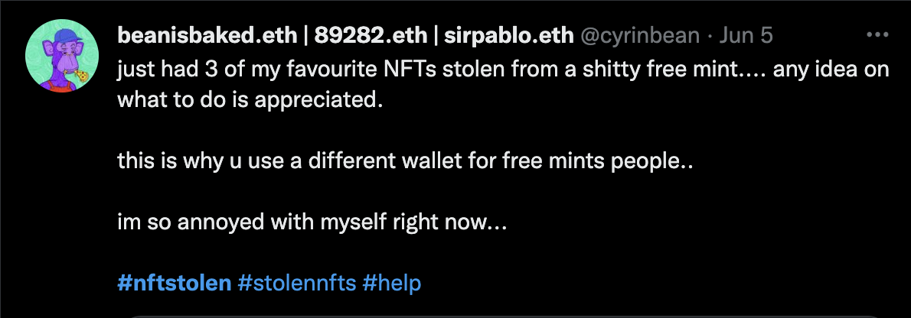
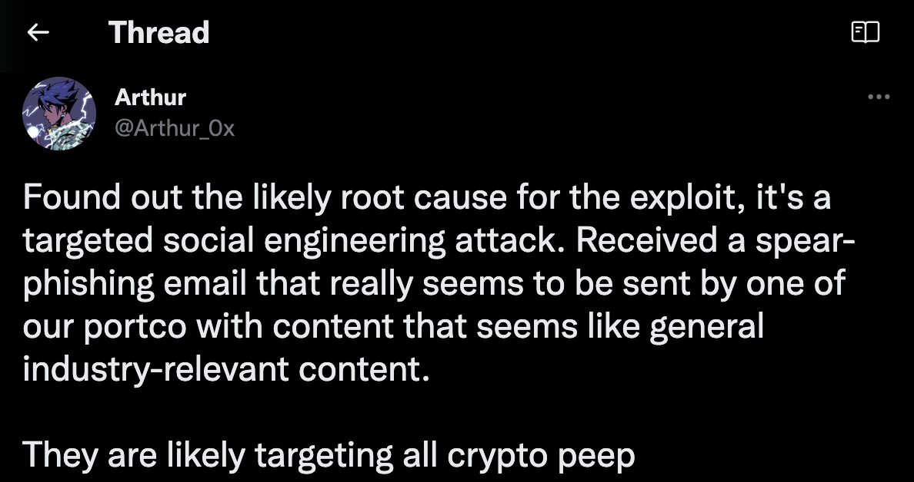
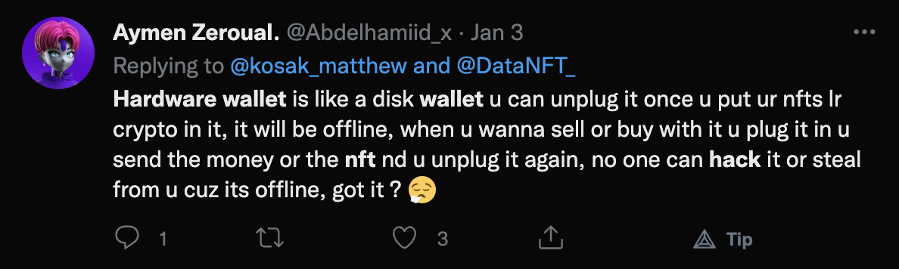
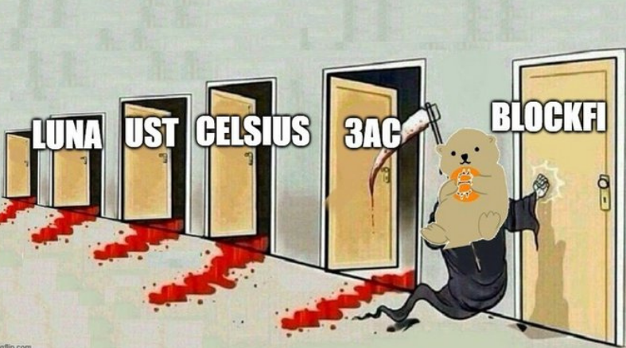
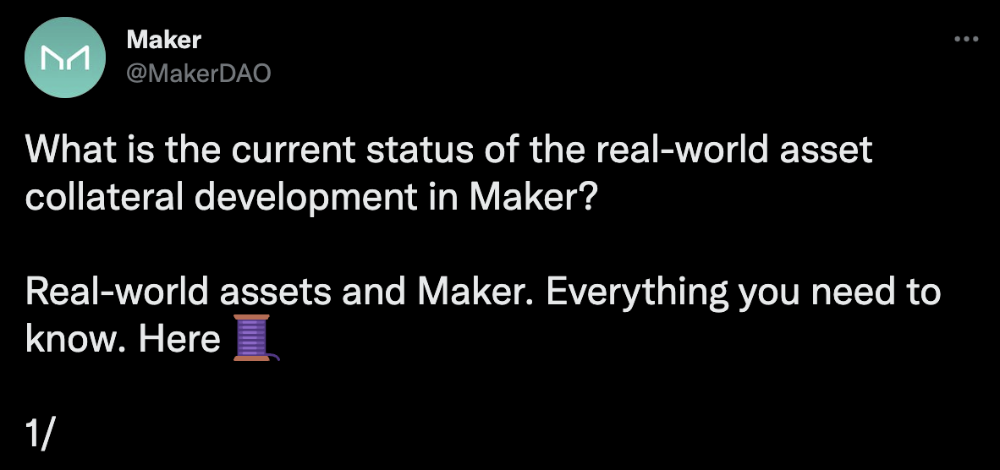

Technocrats have given bold predictions that decentralised finance will overthrow traditional finance. This sentiment has strengthened especially after the recent destabilising events in DeFi has seen the collapse of “CeFi establishments” like 3AC and Voyager while DeFi lending protocols like MakerDAO, AAVE, Compound held up.

While I’m a huge proponent of DeFi, I’m quite certain the future does not look like a great digital divide between the Web2 and Web3 or the death of banks (or “centralised technologies”). Here are 3 contrarian views I have of the future of DeFi & CeFi:

* Users will not handle their own keys
* DeFi will be regulated
* Diminishing divide of DeFi & TradFi

In turn, these big shifts will give rise to the following :

* The rise of custodian and trusted services
* Clear boundaries of crypto wilderness drawn
* The financial merge

# Users will not handle their own keys

One might think that it is only “dumb, stupid and greedy users” who are losing their assets all the time but it is far from the truth. Managing your keys is hard!

> *1.7M of NFT stolen from founder of DeFi fund*

Managing a private key and a wallet is a complex business that even people who are knowledgable about the intricacies can make mistake with. [Proper key management](https://cheatsheetseries.owasp.org/cheatsheets/Key_Management_Cheat_Sheet.html) goes beyond just using hardware wallets but also includes lifecycle management, key storage and audit logs.

> *This is exactly NOT how a hardware wallet works*

To make matter worse, you may not even need to lose the key to have your assets stolen from under your nose if you have accidentally signed a malicious payload from a phishing attack!

Cybersecurity is an [asymmetric warfare](https://www.exterro.com/blog/how-to-protect-against-asymmetric-cyber-warfare), that is the perpetuators have unfair advantages over their targets. The average user does not have the bandwidth to be able to understand the technologies enough to protect themselves from malicious actors in the space.

Also, most of us wants a phone number to dial when shit hits the fan and not be told “Sorry, there is nothing we can do”. This also means that for DeFi to reach general adoption, we will see the rise of trusted custodian services and not just [better visibility of what you are signing](https://twitter.com/freezer_boi/status/1528413819151831042).

**Rise of trusted custodian services**

> *A waterpark with all the fun and none of the danger. Terms & conditions apply.*

We will start to see services, especially from exchanges, that allow users to interact with safe DeFi protocols within a perimeters drawn out by these trusted services without handing the keys directly to the user.

These services will abstract complex operations away from users who does not want to know how everything really works under the hood.

While these services will likely hide residual risk behind complex “terms and conditions” the ease of use will likely attract more users who absolutely do not need the [extra cognitive load](https://mcdreeamiemusings.com/blog/2019/4/13/gsux1h6bnt8lqjd7w2t2mtvfg81uhx).

In fact, we can already see evidence of this shift with:

* Crypto.com’s DeFi Wallet which reliefs users of key management
* Yearn Vault which reliefs users of understanding complex yield strategies
* Hodlnaut which reliefs users of understanding how DeFi yield works

# DeFi will be regulated

DeFi is not the first decentralized technology the world have seen, and it will not be the one that escape regulation.

While I like to imagine what’s happening on the decentralized finance frontier as accelerated experiments of financial innovation, we know from financial histories that uncontrolled experiments at scale can result in brittle financial systems ([evident in the 2008 financial crisis](https://www.imf.org/external/pubs/ft/wp/2010/wp10164.pdf)).

> *A short story of financial crisis*

The collapse of Terra’s Luna gave the ecosystem a glimpse of how systemic failure could happen and regulators will continue to see that larger fault lines do not appear in the bigger financial system through some form of regulation and enforcement.

And governments have records of regulating and enforcing regulations on decentralized technologies before…

The internet is one of earlier examples of decentralized technology. Anyone from anywhere can serve and receive information from one another with the internet. Contents like child pornography, drugs marketplace and subjects related to terrorism started to proliferate the space and yet law makers and enforcers have been rather successful at [disconnecting them from the internet](https://citeseerx.ist.psu.edu/viewdoc/download?doi=10.1.1.536.8459&rep=rep1&type=pdf).

[Lawmakers are quickly making sense of technologies surrounding DeFi](https://guang-yi.notion.site/) and are starting to find the balance between creating space for innovation and protecting people from malicious actors in this space. With the growth of crypto-forensics sector, we can start to see law enforcers quickly catching up with bad actors in the space, just like how they disconnect illegal content on the internet.

My personal prediction is that regulation and enforcement will likely be targetted at the exchange points. Just like how internet censorship are targetted at the informational exchange point in Web2, we can expect heavier regulation at the value exchange point in Web3.

**Clear boundaries of crypto wilderness drawn**

Congruent to the first prediction of emerging custodian services, these services which commands high level of trust from the users will face stricter regulation. These services will likely receive similar level of scrutiny as regular financial services which require higher level of standards on governance, reporting and risk management.

> *Beware: You are now entering the DeFi Wilderness*

On the other hand DeFi protocol that do not sit at the exchange point will continue to operate in what is known as the “crypto wilderness”. These protocols can still be accessible through dapps with their wallet connected directly, not unlike the current scenario. However, they may be required to provide clearer signposting that they are venturing into an unchartered territory and are assuming all responsibilities of their actions.

This structure sets these regulated custodians up in a virtuous cycle where they are incentivised to uphold higher standards to present themselves as trustworthy custodians. They will pressure DeFi protocols to provide greater transparency and better governance structure as partners and reject the ones that have yet to prove themselves as well governed and viable experiments.

Over the long term, the difference in the level of usability and barrier to entry would push the DeFi protocols into the “deep web” and most users will use some sort of custodian services or another to access “surface level protocols” which are considered safer.

# Diminishing divide of DeFi & TradFi

The recent bear market in DeFi has caused the entire market to re-evaluate the idea of “sustainable yield”.

Similar to traditional finance where returns are generated from lending and borrowing and smart capital allocations, DeFi needs ways to interact with the physical world to be capable of generating real returns. Many protocols are coming to this realisation and are starting to embark on the “real world finance” journey.

MakerDAO is already leading in the space of [lending capital to fund real estate, freight invoices, trade receivables, bond refinancing, etc](https://twitter.com/MakerDAO/status/1544747494097174529).

Other protocols like Centrifuge, Goldfinch, Silta, TruFi & Credix are also starting to fill the [gaps for real world lending and borrowing](https://medium.com/bluejay-finance/bluejays-bet-on-real-world-asset-lending-734da39a358f) with many others popping out each day.

The move towards real world finance also means that the gaps are closing between DeFi and Cefi.

DeFi protocols need to start accepting tokenized assets or collaterals from the physical world issued through some kind of centralized entities. We can see [Centrifuge](https://centrifuge.io/) & [Backed](https://backed.fi/) as early examples of companies bridging the worlds on the DeFi side.

On the other side, CeFi companies would also need to both accept loans in tokens as well as issuing tokenized real world assets as tokens. We have recently seen Societe Generale issuing their OFH tokens which represents mortgage and corporate bonds and using them to [take a loan from MakerDAO](https://twitter.com/MakerDAO/status/1534577000349941761?s=20&t=kmKQddpcL215nhXD2cvGoA).

**The financial merge**

With the gaps closing between the DeFi and CeFi companies, it is not too far from the future that the lines will blur between them.

DeFi protocols will be demanded higher levels of governance and reporting, likely from regulatory requirements, from their CeFi counterparts.

CeFi companies will be demanded higher levels of transparency and composability, likely from governance participants, from their DeFi counterparts.

In fact, now that you see Centrifuge, Backed and Societe Generale playing similar roles in bridging the two world, how do you draw the CeFi/DeFi divide between the 3?

# Responsible DeFI as the competitive edge

Existing DeFi protocols will benefit greatly from self regulation and reporting to obtain greater trust from the users and to ride the wave when the next big shift comes.

Below are some ways that existing protocols can have that helps user differentiate run-of-the-mill protocols from those which are going to stay for the long term:

* Simple and explainable business model of protocol
* Accessible financial reports of the protocol (ie. Balance sheets, income statements, etc)
* Clear governance structure (ie Company Memorandum and Articles of Association)
* Clear capital structure to show debt seniority
* Proper risk management

In subsequent articles, either by me or colleagues at Bluejay Finance, we will be going in depth of our plans to lead in the area of responsible DeFi. Follow our accounts and subscribe to our newsletter to be in the know:

* <https://geeksg.medium.com/>
* <https://medium.com/bluejay-finance>