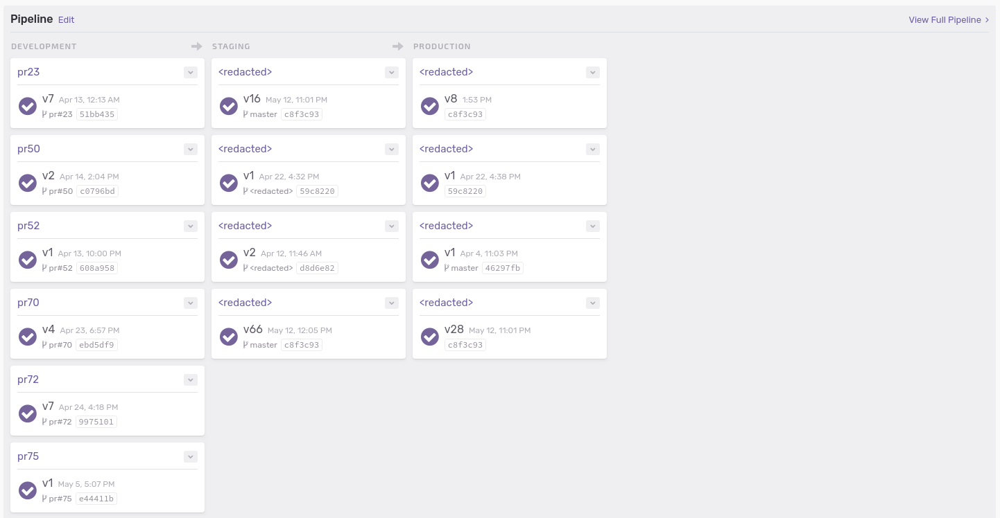
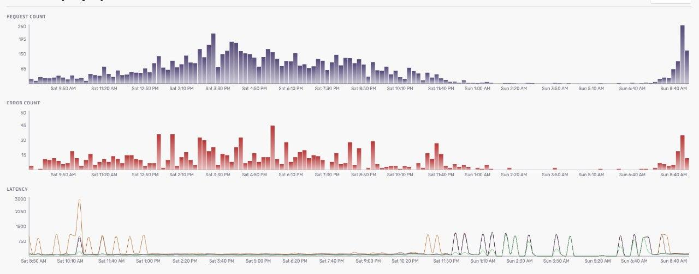
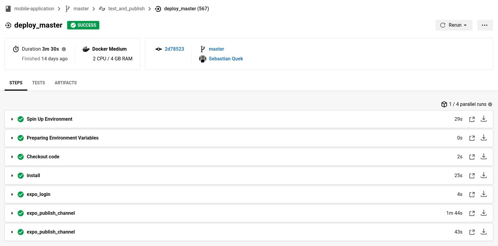
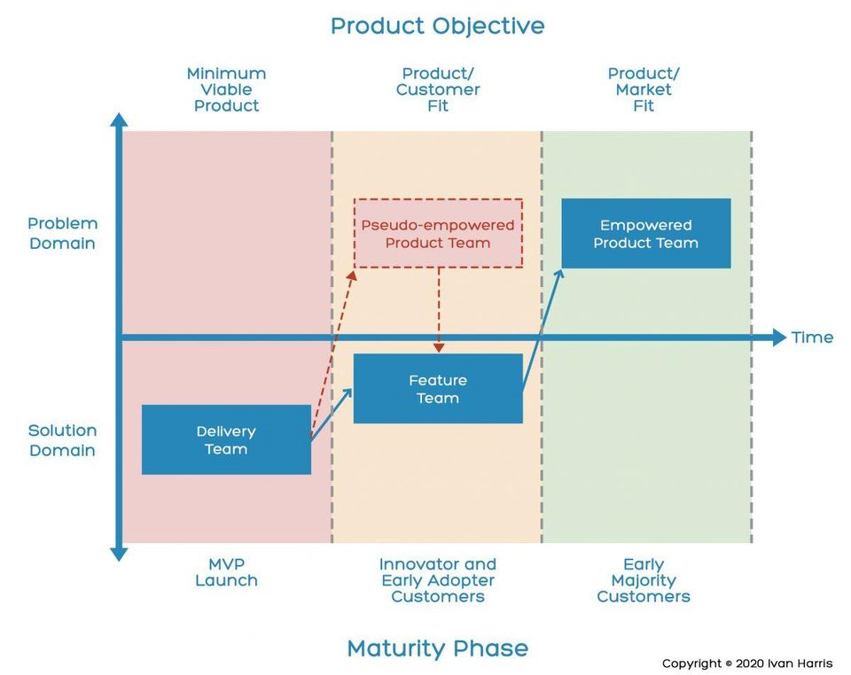
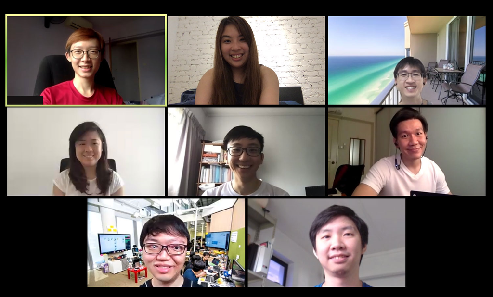

On 29th January 2020 (Wednesday), I received a call from Steven at 10:30 pm, asking for assistance on a product for distributing supplies to the whole of Singapore. The requirements were vague - "We need to distribute disposable surgical mask to our citizen. We need a system to track it. And we need it ready by Monday". I asked for more information but that was what I got. I've never received a call from him past office hours and understood the urgency and severity of the problem. Assembling a (crazy) team at midnight that day with RJ and Sebastian, we went on to build a product now known as SupplyAlly. An app used to maintain a central record of transactions across different distribution initiatives.

In this post, I will share different choices the engineering team has made throughout the early phase of the product development to navigate uncertainty, to the extent of building uncertainty within the product. For those curious about how life is like building a product for the government, you get a rare peek into how one team does it.

## Designing for Uncertainty

In the book Simultaneous Management, Alexander Laufer groups uncertainties into two categories: means uncertainty and end uncertainty. Means uncertainty refers to our uncertainty about exactly how we’ll design and develop a product; end uncertainty refers to uncertainty about exactly what a product will do.

For SupplyAlly, there was a high degree of end uncertainty, to begin with. We weren't certain about the different aspects of the end product, for instance:

1. what are the policies (product, quantity & reset period if any) for these distribution exercises
1. who are eligible to collect
1. do we know in advance the identity of these people distributing
1. how many distribution exercises are there

### Agile Policy Making with Invariance

Uncertainties like that tend to paralyse the entire product development. Instead, the team chose to bake most of these uncertainties into the product by making them configurable. This essentially decouples the product development from policymaking. However, this means that the product team has to present a set of invariances to policymakers.

Some of the decisions made very early were:

1. The policy is configurable and expressed as the set of products, quota reset period & quantity distributed.
1. The app will identify an entity with an identifier. This identifier can take the form of an NRIC or other types of identifiers which uniquely differentiates one entity from another.
1. Credentials will be pregrenerated and distributed to for app operators. We do not assume that they are known in advance.
1. The app can connect to different endpoints that have different policies in place. Each distribution exercise warrants a different set of environments and endpoints.

With this information, we form a contract where policymakers may navigate around these constraints and be certain that our application will deliver for them regardless of what they eventually propose.

### Communicate Certainties

> Speed is how fast something moves. Velocity is speed with direction.

Moving fast is a double edge sword. When a team moves fast in different directions, the net velocity is near-zero. The difference between that and a team that gets things done fast is the team's ability to communicate and synchronize on the goals, directions and approach.

On the midnight of 29th January, after a brief breakout, the team aligned immediately on a few designs:

- wireframe of the mobile app
- API of the backend

We communicated these clearly to one another through writing clear API Readmes and Architecture Decision Records (ADRs).

The team also agreed on who will work on what, so that we do not trip over one another:

- RJ will handle the backend API
- Seb will continue on the hi-fi app design and handle the frontend UI
- I will scaffold the frontend logic and mock the backend API

Within a few hours, we have a working mobile app which can be used to communicate our idea. The application doesn't make real transactions and it looks and feels wonky. That was enough to build our confidence that we will be able to deliver. With that minor victory, we reward ourselves by heading to bed.

### Prepare for Changes with Right Tools & Infrastructure

Here are some interesting facts about SupplyAlly's developer experience:

- From the developers' machines, it takes less than 20 minutes for changes on either the mobile app or backend to be deployed and made available to the end-user.
- Between deployments, the backend may delay API calls by up to 2 seconds, without dropping iti.
- Users who downloaded our application don't need to download the new version of the application from App Store or Play Store to have the upgraded applicationii.
- Our application can handle 4500 transactions per second without deterioratingiii.
- Every pull request on the frontend or backend will deploy a preview application or environment.
- A developer can test a preview mobile app against a preview backend deployment.

With these in place, developers can confidently test and deploy incremental upgrades and changes to the application. Sandbox environments can be created easily without fear of destroying the production environment.

The secret to achieving these feats is simply choosing the right tools & infrastructure (and not reinventing the wheels)!

#### Serverless Infrastructure

Choosing a serverless architecture means the team delegates non-functional requirements, such as security and scalability, to the platform provider and focus on building the right product. Some of the cloud infrastructure which we use (or abuse) are:

- Lambda for function execution
- Dynamodb for data persistence
- SNS for SMS OTP sending
- Xray for tracing
- Cloudwatch for logging
- WAF... for Web Application Firewall (duh!)
- GuardDuty for threat detection1

#### Deploying, Managing and Monitoring Serverless Applications

Deploying serverless application to a single endpoint is easy. Deploying to multiple production environments with different configuration and getting previews environments for every pull request is hard. Thankfully, we discovered Seed.run which simplifies the entire process, providing deployment, management and monitoring service out of the box.

This means every developer can have their live environments deployed without affecting one another and can get another developer to test against it.

The cherry on top? We get sexy metrics to show us how the application is performing live.

#### Mobile App Framework

With App Store deployment in days and Play Store deployment in hours, we need a way to deliver mobile updates to end-user without allowing the application review process from being our bottleneck. For that, we chose to deliver application updates over-the-air (OTA) using [expo.io](https://expo.io/).

With OTA update, users with our application gets the latest version of the app on next relaunch. Saving them a visit to the app store or play store. It also allows the developers to sign and publish new binaries of the application less frequently.

In addition, a simple script allows us to deploy preview versions of the mobile app for every pull request created using expo [release channels](https://docs.expo.io/distribution/release-channels/).

In the early phase of the development, before the first app release, we are also able to allow the different stakeholder to play with the application by using the expo mobile application.

### Agile Team Composition

> Every process has a constraint (bottleneck) and focusing improvement efforts on that constraint is the fastest and most effective path to improved profitability.

The theory of constraints explains that given a process, there is a limiting factor (constraint) that stands in the way of achieving a goal. We can systematically improve on the constraint until it no longer becomes the limiting factor.

In the case of a product team, these constraints could be the team members themselves. In designing a team, one not only has to be aware of the strengths and weaknesses of the different team but also understand how mature is the product.

In our case, as the team transitions from a Delivery Team to a Feature Team, the team's focus, composition and process changed.

Ivan Harri's model of Product Team Maturity explains this transition clearly.

#### Delivery Team

In the early phase of product development, the focus should be generating a solution or the minimal viable product. Here is the stage where the team requires people who can work with high end uncertainties and deliver a solution that roughly solves the problem. In Ivan Harris's model, this is the delivery team. This team is mainly made up of early-stage "hacker" who hack stuff together and their performance is measured by the outputs. These outputs are usually a set of requirements by a shipping deadline.

At this phase, the team must be laser-focused on the delivery and have the space to push back on requirements that distracts them from that. It is easy for the team to fall prey to the "scope creep" monster. Be careful of "The product would be complete if it has this one more feature". For the team to succeed at this stage, assess each request critically and ask "What happens if we don't have that?" instead.

This was the stage the team was in when there were only 3 engineers. Our top priority is to deliver a minimal set of features at a given deadline. Whenever a request falls outside of that category, it immediately goes into the bin of "distractions", until the product was first "shipped".

#### Feature Team

Once the initial product has been shipped, or in our case, used nation-wide for the mask distribution exercise, the product team can explore better product-market fit by looking into the "distraction bin". Items in the distraction bin will form user stories in the product backlog, something familiar with agile practitioners. It is also appropriate, at this time, for the team to introduce more formal team governance structure, compliance-related requests and naturally team members of a wider variety of skills.

In the case of SupplyAlly, we added a few key personnel who took on different roles where original members do not excel in:

- Imma (Engineer)
- Zui Young (Product Delivery)
- Ming (Product Delivery)
- Barry (Product Delivery)

During this phase, our team starts to deal with more integration work with different systems, more thorough security requirements and a wider variety of use cases. Feature requests from different users, or customers, will also start to stream in.

To succeed from this point on, the team needs a product owner who can prioritize the different features and make tradeoffs between building a generic product which serves a wide range of customers but not have all features or a highly customized product which fits the needs of a smaller set of customers to the T.

## Ending Notes

Pause and reflect on your current project for a moment.

Despite the uncertainties the team may have:

- Have you communicated invariance to your customers (or in our case policy owners)?
- Has your team communicated and agreed on certainties like designs, contracts, and responsibilities?
- Is the team crippled by some of the choices of tools?
- Is your team configured for the level of product maturity?

If any of the answers is no, your team may likely have more room to be more agile.

---

  i
 We know this because RJ did a live backend deployment while the mask distribution is ongoing.
 

  ii
 They simply refresh the application. Seb has upgraded this to even allow running applications to upgrade themselves.
 

  iii
 We do not know the upper bound since we can process the entire population in an hour at that throughput rate.

---

References

- [The Certainty of Uncertainty](`https://www.mountaingoatsoftware.com/articles/the-certainty-of-uncertainty`)
- [Theory of Constraints](https://www.leanproduction.com/theory-of-constraints.html)
- [Which Product Team Phase Is Your SaaS Startup In?](https://www.forbes.com/sites/forbestechcouncil/2020/02/20/which-product-team-phase-is-your-saas-startup-in/)
