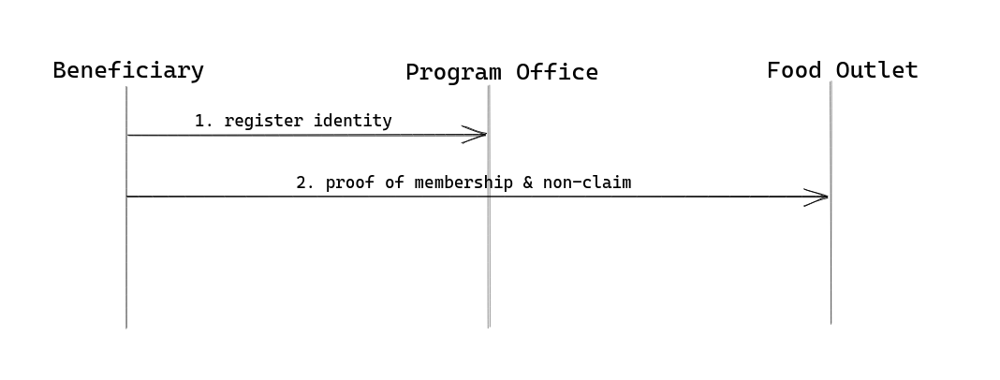
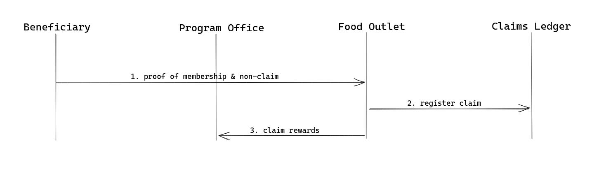
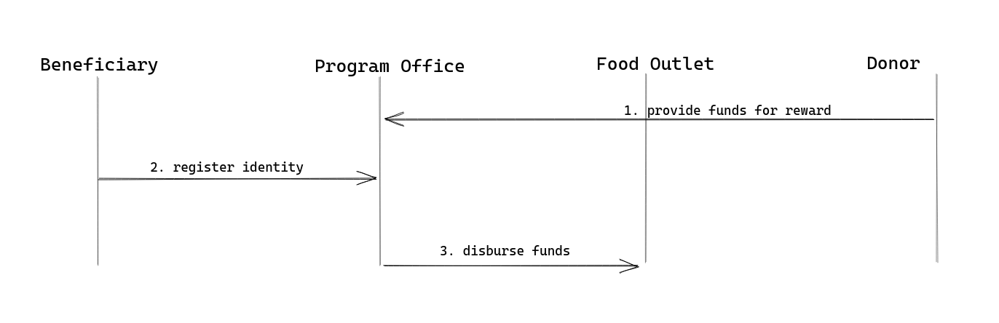
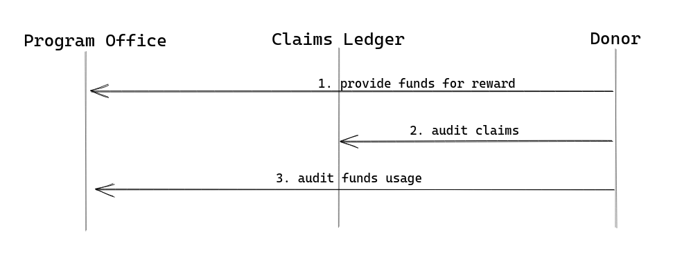
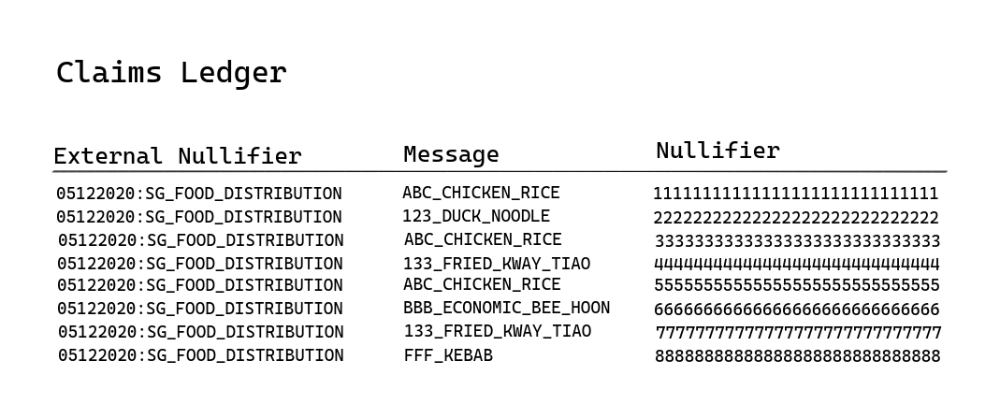

Food insecurity is a problem that plaque even the richest cities in the world. In 2018, Lien Centre published a report “[Hunger in a Food Lover’s Paradise](https://ink.library.smu.edu.sg/cgi/viewcontent.cgi?article=1011&context=lien_reports)” which sheds light on those experiencing food insecurity in Singapore and identified gaps in food support provision.

This post is a thought experiment of how we might design a scalable food distribution program that encourages philanthropy, protects the identity of the vulnerable and be resistant to fraud.

What if we can provide free lunches to all members of our society who suffers from food insecurity? What if we can maximize the transparency of the program to know exactly how many meals are claimed everyday? What if we encourage individual and corporate philanthropy by providing tax rebates to the giver? What if we can prevent fraud in the program? What if we can protect the identity of the beneficiaries at the same time?

Let’s look at how we can design this program by describing it’s various stakeholders and the technology involved.

### Stakeholders

**Beneficiary**

The beneficiaries of the food distribution program are the different individuals who are suffering from food insecurity programs. These individuals will be eligible to claim at most one free lunch every day from any of the participating food outlets.

**Program Office**

The program office is an entity that administer the entire food distribution program. It’s only role is to maintain the set of identities of the beneficiary. That is to decide who are eligible to be part of this program. These individuals may be enrolled into the program for a short period of time to tide them through the time they face food insecurity.

**Food Outlet**

The role of the food outlet is to provide food at a fixed reward decided by the program office. The dollar value of the reward is the same across the board for all food outlets.

Upon successful lunch claim by a beneficiary, the food outlet is eligible to receive the reimbursement of the cost of food from the program office. For instance if the reward is $2.50, a chicken rice stall which participated in the program will receive $2.50 for each plate of chicken rice claimed by beneficiaries.

**Individual & Corporate Donor**

Individuals and corporates may donate directly to the program office to fund for the food distribution program. Food outlets themselves may also take on dual role to be a corporate donor, essentially giving away free lunches when beneficiaries claim lunches from them. These donors will be given full transparency of how many lunches were claimed against the total amount of funds donated.

In this manner, the program office and donors may project how long the existing funds will last. When the funds are low, donors will be more incentive to give. When there are excesses in the funds, donors can choose to give their funds to other programs which may need the funds more.

### The Program from Beneficiary’s perspective

For individuals who are facing food insecurity issues, they may register their identity with the program office to be part of the free lunch program. Here, they will undergo means-testing by the program office which requires full disclosures. This ensures that only the most needy individuals are enrolled to prevent overburdening the entire program with support for individuals who are not facing such problems.

Here, the beneficiary will self-generate a digital identity which the program office will enroll into the set of individuals who are in the program. The program will then publish some information publicly (let’s call this a merkle root) to allow beneficiaries to prove that they are part of the program. Here, we use zero-knowledge proofs to ensure that:

1. Beneficiary enrolled in the program may generate proof that they are in the program
2. Entities not enrolled in the program cannot generate such proof
3. No one may derive the identity of the beneficiary from information available

Once the individuals are enrolled into the program, they may approach any of the participating food outlets to claim one free lunch everyday. When doing so, they are presenting a proof to the food outlet to prove that:

1. The individual is part of the food distribution program
2. The individual has not made any claim for that day (no double-dipping)
3. The individual is claiming from said food outlet

During this process, the food outlet will not be able to gain more information such as history, frequency of claim, or even length of membership on the program of individual.

The claim proof is then published onto a publicly readable and writable ledger and the beneficiary walks away with his free meal for the day.

Here, the beneficiary may not defraud the program by making multiple claims in a single day.

### The Program from Food Outlet Perspective

From the food outlet perspective, they will receive the claims (which is just the proofs) from the beneficiary and checks the validity of the claims. These proofs are published onto the claims ledger to allow full transparency and disallowing the beneficiary from making repeated claims that day.

At regular intervals, a settlement will occur between the program office and the food outlet to allow the the food outlet to claim the rewards based on the number of meals claimed during that period.

For instance, if a chicken rice stall has served 100 meals in a month, it will claim a total of $250 from the program office if the reward for each meal is $2.50.

Since the claims can only be signed off by the beneficiaries, the food outlet may not submit fraudulent claims to receive more funds than what the beneficiaries actually claimed during that period. And, since each claim is addressed to the food outlet, the food outlet may not masquerade claims for other food outlets as their to claim additional shares of the rewards.

### The Program from Program Office’s Perspective

The program office’s role is to pool the funds from the different donors and disburse the funds to the different food outlets participating in the program. The program office will also perform means testing on the beneficiary to ensure eligibility of the program. Other than that, it will also have to decide on the reward for each meal claimed.

The program office, however, do not have to screen food outlets who wish to partake in the program. This is allow beneficiaries a large number of choices of what “meals” they will like to claim. Since the quantum for the reward is the same across food outlet and the beneficiaries will naturally gravitate towards outlets which provide the best value for money, outlets which exist to defraud the system will not attract rational beneficiaries.

### The Program from Donor’s Perspective

From the donors’ perspective they will be funding the program and be given full visibility into the both the claims and the fund balances of the program office.

This means that they can be certain that every dollar donated to the program is going directly to someone who needs it.

With the zero knowledge proofs, they will received the guarantee that none of the other stakeholders are able to defraud them without given information on the identity of the receiving beneficiary (since the identity are hidden) or the food outlet given the reward (since the funds are pooled).

### The Role of Zero-knowledge Proof (ZKP)

The use of ZKP is central to the implementation of the entire project, it allows the beneficiaries to generate proofs which are used as the claim and be published publicly for anyone observing the claims ledger to audit the process.

This method of food distribution gives never before accountability and traceability to the funds without compromising the privacy of the beneficiaries.

### High Level Technical Implementation

[Semaphore](https://github.com/appliedzkp/semaphore) can be used to implement the proposed solution. Once the program office enrolled the beneficiaries’ identity commitment into the food distribution program, the beneficiaries can prove that they are part of the program.

Since Semaphore prevents an individual to broadcast multiple endorsements given a single external nullifier, we can make use of this property to prevent double spending, yet allowing new quota of claims to be available each day.

We can also use the ability of the beneficiary to sign on any arbitrary string to record the food outlet that should be credit the rewards. This way we can be certain that food outlets can be credited the right amount of reward correctly.

Finally, since for each endorsement comes with one nullifier which is an deterministic output of the function of external nullifier and the beneficiary’s identity, we can be certain that the beneficiary may only claim one meal per day (or more specifically per external nullifier).

### Join Me

I’ll be working on a proof-of-concept (POC) project to showcase how the food distribution program can be implemented. If you are:

* Non-Governmental Organisation (NGO) running food (or other necessities) distribution program
* Government looking to better support NGOs on the program
* Food establishment owners who wish to be part of the program
* Individual or corporate who wish to donate to the cause
* Researchers & volunteers in the space

Do [reach out to me](https://geek.sg/contact/) to see how we might work together.

---

If you like to be the first to be informed of the progress of the project, you may [subscribe to my mailing list](https://geek.us2.list-manage.com/subscribe?u=bfcc21792349f4f0eaff4a2a3&id=694896a0df).