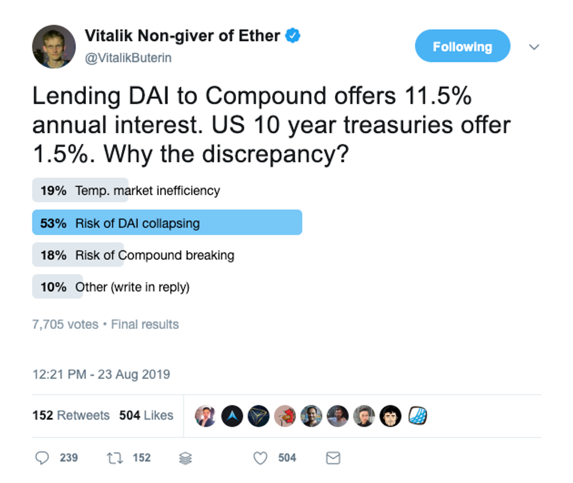
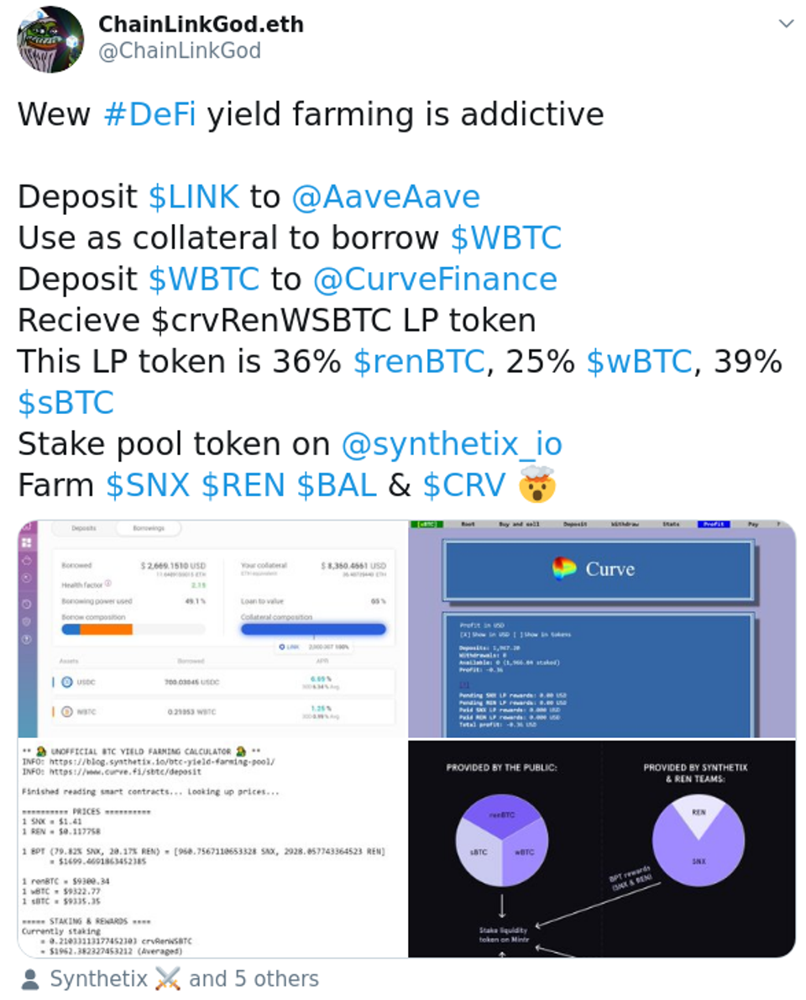
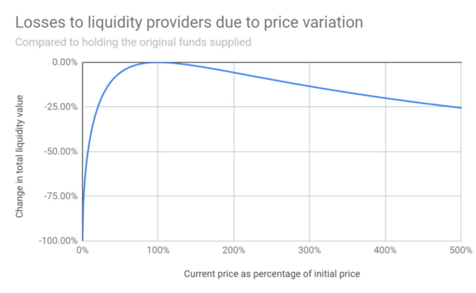
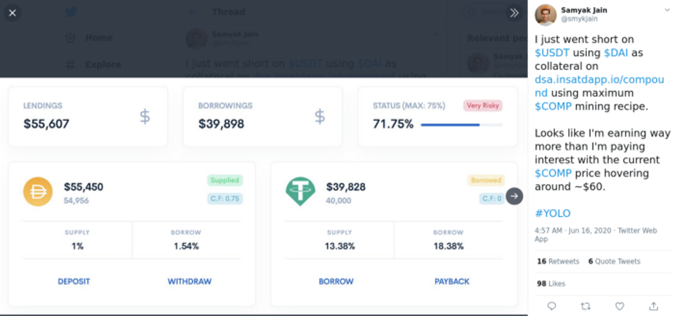
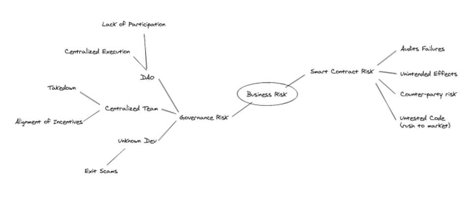
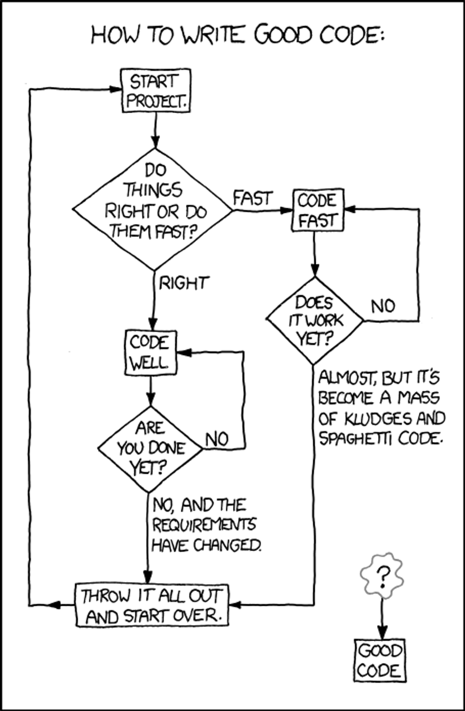

Yield farming is the newest kid around the block in the decentralized finance (Defi) space right now. With interest rates (or yield, or APY) over 100% on every other projects, one might overlook the level of risk associated with investing in Defi projects.

In fact, that was how [I lost $5000 a couple of weeks ago](/blog/ive-lost-5000-over-the-last-two-weeks-in-decentralized-finance-farming-yield-heres-my-story)…

Unlike investing in traditional financial products, Defi investors are not protected any laws and rules around traditional securities market. Instead, in the wild wild west blockchain space, where code is law, investors are expected to do-your-own-research (DYOR).

But, how many investors understood the risk associated with investing in Defi projects? Or the source of the "yields"? Or if the yields are sustainable? 

In this post, I will explain breakdown different components of risk associated with Defi products, using models and theories borrowed from business finance. 

## Yield as indicator of risk

> DAI collapsing? But that's impossible!

Interest rates (or yields) has a intimate relationship with risk. A high interest rate is often an indication of high risk. 

Here's why.

Consider a market with two Defi products with similar risk profiles:

- Product A has 5% interest rate
- Product B has 10% interest rate

This means that investors in Product A are better off if they remove their liquidity on Product A and placing it with Product B since they do not incur additional risk by doing so.

This movement will cause demand for Product A to fall and demand for Product B to rise. The result will be a change in price of capital, in the form of interest rates for your investments in both products.

Eventually, the interest rate for both products will be the same, at a value between 5% to 10%.

This means that asset of similar risk profile will have similar yield in the long term. This is explained by the [Arbitrage Pricing Theory (APT)](https://www.investopedia.com/articles/active-trading/082415/arbitrage-pricing-theory-its-not-just-fancy-math.asp).
An asset that yields 10x more than the US 10 year treasuries will mean an additional order of risk. Or else, everyone would have sold their treasury bills in favor for vegetable coins!

## Types of Risk

The excess return above the risk-free rate that investor require as compensation for the higher uncertainly associated with risky assets is the [risk premium](https://www.investopedia.com/ask/answers/05/componentsriskpremium.asp). The main components in the risk premium in traditional business finance are:

- Country-specific Risk
- Exchange Rate Risk
- Liquidity Risk
- Financial Risk
- Business Risk

## Country-specific Risk (& Blockchain Risk)

Blockchains are decentralized, however the different actors on the blockchains are citizens and businesses residing in different countries. 

While one might say that code is law on the blockchains, laws in different countries may not be in full agreement with that. 

In this category we are looking at risk associated with how current laws treat assets and activities in the Defi space as well as how these laws might change in the future. 

One of the biggest risk in this area is the tax treatment of income and capital gains from cryptocurrencies - and this differ from country to country. 

In addition, some law makers are still playing catch up and do not have clear laws on tax treatment of cryptocurrencies yet. This may mean that gains from cryptocurrencies might be taxed more heavily in the future, which can greatly reduce the overall investment yields. 

Another major risk of being a participant in the Defi space is the difficulty in seeking restitution if thing goes south. This is especially so if law makers are considering [legal recognition of digital signatures](https://cointelegraph.com/news/us-new-bill-would-legally-recognize-digital-signatures-on-a-blockchain) or behaviors of smart contracts.

If you are a victim of a hack (or rug pull), it can be very hard for local law enforcers to help you with your case.

## Exchange Rate Risk

> With exposures on 9 cryptocurrencies, what can go wrong?

With every project creating their own tokens on Ethereum. Whether one participates in the Defi space as a lender, borrower or liquidity provider, they are likely to be exposed to one or more cryptocurrencies. 

In a simple case where one converts USD to ETH to lend ETH on Compound, the user earns interest in ETH and gets COMP as a reward for his participation. At the same time, the user gains exposure to both ETH and COMP, where a negative price change for any of these 2 cryptocurrencies will greatly affect his expected returns.

> A 100% price increment only cause ~5% of loss… But, did anyone ever looked at the left side of the curve?

In a slightly more complex case a user can converts USD to both ETH and DAI to become a liquidity provider on Uniswap exchange. On top of gaining exposure on ETH and DAI, he will be further penalized on the change in relative price of ETH to DAI due to the mechanics of the bonding curve. This phenomenon where liquidity provider might end up with less than what they have put in is often misleading termed as impermanent loss but is [far from the truth](https://cointelegraph.com/news/report-impermanent-loss-on-uniswap-and-other-amms-is-always-permanent). 

Investors need to account for the possibilities that vegetable coins may not ever return to the same relative pricing against stablecoins when providing liquidity for such pairs. 

## Liquidity Risk

Liquidity risk refers to the risk associated with uncertainty of exiting an investment in terms of timeliness and cost. While one might say that with the various Automated Market Maker (AMM) protocols on the blockchain, liquidity is not a problem, but it may not always be the case.

The fragmentation of the liquidity pool among many different protocols may actually result in a thinner market with low liquidity in individual pools. That might result in large slippages, where the quoted price and executed price is different, in single trade, or if the user prefers to route it though various protocols, a much higher transaction fee will be incurred.

In addition, where a bank run occur for a protocol, transactions to sell off underwater assets may be front-runned by other transactions causing even higher price slippages. At this point, security mechanisms, originally created to protect the users, can revert the transaction when excessive slippage occurs, consuming even more gas and sets the user up for worse price points.

## Financial Risk

Many Defi projects does not deal with borrowing directly and does not face the risk of not being able to pay debt obligations. However, some participants are encouraged to borrow to be rewarded, and as a result, be exposed to financial risk directly. 

In the case of MakerDao, participants may borrow against certain pledged collateral to mint the DAI token. In doing so, users are exposed to the interest rate of borrowing as well as the risk of liquidation when the value of the collateral fall below that required by the collateralization ratio. Both of this will impact the participant's ability to maintain his debt obligation and may result in his position being liquidated at a discount to current market prices. 

> &#35;YOLO

In the case of Compound, "smart" Defi investors learnt that they could in theory [recursively borrow against supplied collateral](https://thedefiant.substack.com/p/comp-frenzy-continues-with-leveraged-2aa) to maximize on the COMP token reward. These investors are essentially in leveraged position where they are more likely to be liquidated at a loss if the value of collateral falls just slightly. 

Investor needs to exercise caution on over-leveraging when their investments involves debt. 

## Business Risk

> Because it's decentralized, there are no risk!

The reason I've placed business risk last is because there is simply so much to talk about! In this section, I'll only touch on some of the peculiarities of Defi projects, if you like to learn more assessing a Defi projects like business, a quick search on "business valuation" will set you on the right track.

Broadly speaking when we examine traditional businesses we look at aspects such as the leadership & product visions of the company and also their ability to execute against that vision. In the Defi space, we can also assess Defi projects in similar fashion, starting with the governance model. 

### Governance Risk

One of the major difference with financial products is that anyone can launch a Defi project from his garage. That means that you have a wide range of project leadership, from scammers, to individuals who wants to do good, to traditional businesses and even DAO. 

And there are different types of risk associated with it! 

#### Unknown Developers
The risk associated with projects ran by unknown developers are the largest in my opinion. 

- Unknown intention - Is the developer here for some quick bucks? 
- Unknown product vision - What's the developer next step?
- Unknown execution ability - Will the code be bug-free? Will there be marketing (oops, shilling)? Will there be community support & moderation?

While one can say that code is law on the blockchain, it may not be enough to justify for the risk on trusting an unknown developer. I have seen cases where legitimate smart contract codes from audited projects can be misused by their contract deployer to steal funds from participants. 

There is a lot of due diligence needed when dealing with projects ran by unknown developers, of which will be covered by subsequent posts on due diligence. In addition, I will be working on a series on "How I steal your funds" to show you how some innocent looking smart contracts can be used to steal your funds.

[Subscribe](https://geek.us2.list-manage.com/subscribe?u=bfcc21792349f4f0eaff4a2a3&id=694896a0df) to my mailing list to be the first to receive them.

#### Centralized Teams

Most projects in the Defi space seemed to be launched by a team of people identifiable to certain degrees (stolen profiles and fake team doesn't count).

For projects falling into this category we face other types of problems. 
One of it is the misalignment of incentives between the company's investor or founding team and the public. After all, we need to assume that the business is ultimately set up to make profits. 

Another problem with projects where team members can be identified can also be taken down by governments or be fraudulent. In the case of Tether (USDT), we see several claims that: 

- [Stablecoin is not fully collateralized](https://thenextweb.com/hardfork/2019/05/01/controversial-stablecoin-tether-is-only-74-percent-backed-by-cash-and-other-assets/)
- [Used for price manipulation of Bitcoin (BTC)](https://www.bloomberg.com/news/articles/2018-06-13/professor-who-rang-vix-alarm-says-tether-used-to-boost-bitcoin)
- [Seizure of reserves](https://www.forbes.com/sites/stevenehrlich/2019/05/02/after-an-850-million-controversy-what-everyone-should-know-about-bitfinex-tether-and-stablecoins/#28f6e4ee492f)

All of these are factors of how Tether may collapse, or lose the dollar-to-dollar pegging. Similar risk with the management or brushes with the law applies to other projects ran by centralized teams as well. 

#### Decentralized Autonomous Organizations (DAOs)

DAOs are touted as the silver bullets to failing organizations. However, getting a working DAO up and running is not as simple as creating a voting page, there are many problems related to a project with "decentralized governance":

- Uncertainty of  rewards- Individuals may not be incentivized to work on the project without certainty of rewards.
- Bureaucracy - Organisations may be stuck and unavailable to move forward if consensus is not achieved. Look at different parliaments in the real world for a simulation of this
- Apathy of voters - Voters are overwhelmed with the different projects and proposals and may not or are unable to vote on all of them, especially if it's an on-chain vote which cost Ethers.
Centralization of power - Certain projects are driven by few accounts with large amount of voting rights. Similar problems are faced in the Capitalism world. 
- Tragedy of the commons - Voters are incentivised to vote for what benefits them in the short term rather than what is most beneficial to the collective in the long term.
- Centralized execution rights - Several projects does not have on-chain "settlement" process where the governance module manages the smart contracts of the project directly. Instead smart contract execution is done by the team separately. Participants didn't "manage" the DAO but were simply polled for what they preferred. 

### Smart Contract Risk

Finally, we get to the topic of misbehaving smart contracts. There are many smart contracts designed, or cobbled together, such that the deployer could steal funds from participants. In the following blog post, I'll show how it is impossible for non-developers to realize how funds can be stolen. So in this section, we will simply focus on how smart contracts that were not designed to fail can still fail. 

> … and you can't fix bad code in production on Ethereum

If you have written programs, you would understand how hard it is to produce code that not only perform correctly according to your expectation of how users will interact with your program, but also not it does not perform incorrectly when users do not interact with your program as intended!

Some of the reason why Defi smart contracts may not perform exactly as we like them to are: 

- Untested code - Pressure to ship products might result in code being written and not tested thoroughly before being shipped. This risk is amplified if the developers on the project have not been trained on smart contact vulnerabilities and design patterns.
- Unintended effects - Some code may have unintended effects when used together with other components (see [STA](https://defirate.com/balancer-sta-hack/)), initialized with different parameters, or used in a specific manner not considered by the developer (see [ENS](https://medium.com/the-ethereum-name-service/ens-registry-migration-bug-fix-new-features-64379193a5a)).
- Counter-party risk - Many Defi projects are dependent on other Defi project functioning correctly. The project could be at risk of collapsing because one of the dependent project is at risk. For instance, someone participating in Curve staking pool might find himself underwater if any of the stablecoin in the stablecoin pool looses their pegging for whatever reasons.
- Audit failure - While smart contract audits help to iron out some bugs with extra pair of eyes, they are not panacea to bug free code. Participants cannot be certain that a smart contract is bug free, even if multiple audits have been performed, exemplified by [Bzx hack](https://news.bitcoin.com/defi-protocol-bzx-loses-8-1-million-in-third-hack-this-year/).

Unlike traditional applications, faulty smart contract are hard to fix unless disaster recovery functions have been built into it in the first place. This is because smart contract codes cannot be changed once they have been deployed.

## Navigating Risk
 
The purpose of this post is not to discourage investing in Defi projects but to help investors to more accurately estimate the risk of different Defi projects - and understanding the different sources of risk would be a great start.

With the ability to better estimate risk, one can even build a risk parity portfolio of assets to maximize returns on a mix of traditional financial products and Defi products, but that will be a subject for another day.

If you are interested in understanding how to allocate capital for a single product given its risk parameters, check out my [interactive post on applying Kelly Criterion to limit risk and maximize returns](https://legacy-geeksg.netlify.app/blog/bet-sizing-with-kelly-kelly-criterion).

Again, remember to subscribe to my mailing list if you would like to be notified of the upcoming series for "How I steal your funds" where I demonstrate how innocent looking smart contracts can be used to steal users fund.

In the meanwhile, stay safe!