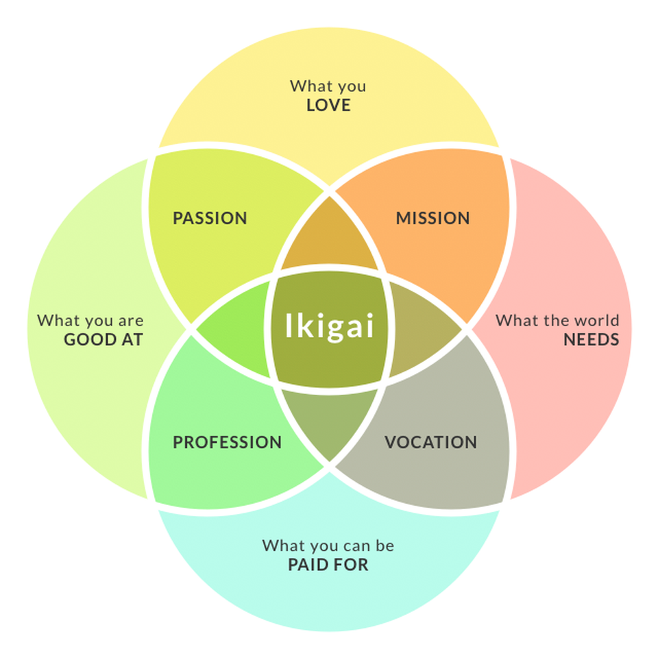

You’ve probably read many articles about ditching the $5 coffee, getting the right brokerage, bank, utility account, etc, and buying the right stocks. This article will tell you if you want to reach financial independence, ignore those articles.

When I first started on my path on financial freedom I mistook financial freedom as a destination. That it can simply be defined as having [25x my annual expenditure](https://www.forbes.com/advisor/retirement/25x-rule-retirement/). Looking back, financial freedom is more a journey than a destination.

True financial freedom comes from the freedom to do the things I like whenever I like. And not having to exchange more time for money.

So the rest of the article talks about how to not only sweeten the journey for yourself but also pacing yourself sustainably in this long marathon — by breaking all the “rules” to financial freedom.

### Buy that thing

I bought a new pair of running shoes and a badminton racket a while back and I didn’t even look at the price tag.

That very night I took them out for a game of badminton with my wife and had one of the best exercises in weeks. In that purchase, I found out that I enjoyed badminton more than I thought I would and have been exercising more since.

> The road to financial independence is not a sprint — its a marathon.

Financial discipline does not mean for you to give up on everything pleasurable to shave a few months or years off your retirement age.

If you deprive yourself of paying for the simple things that make you happy, you might be stretching yourself too hard. The danger of that deprivation over a long period of time might lead you to give up on the journey or even overcompensate by overspending irrationally — just as [how people who under-consume to lose weight find themselves gaining weight when their metabolism falls](https://www.healthline.com/nutrition/calorie-restriction-risks#TOC_TITLE_HDR_3).

All of us are different. Some derive pleasure from a well-crafted $5 coffee, some from a good workout, some from a well-deserved break in another country. Find out the things you derive a disproportionately large amount of pleasure from and permit yourself to splurge on them.

Remember that self-care is the key ingredient in keeping you focused on your marathon to financial independence.

### Don’t bother getting everything right

Here’s my secret:

* I don’t have the highest interest on my savings account
* My brokerage does not have the lowest commission fee
* The cryptocurrency account I use is hardly reviewed or used by anyone else in Singapore
* My credit card probably does not give the best rewards
* No financial blog reviewed or recommended my utility provider

There are tons of articles reviewing different financial products and how one can optimize their returns. While I know how I can further “optimize” my returns, I have to give up convenience. That means constantly switching from products to products or reading up excessively on every single thing I spend on.

Being more financially independent for me means that I reduce the amount of time I trade for money. When I read up tons of blogs to add that 0.2% interest on my savings accounts every 6 months, I’m trading time for money. When I sign up for the investment mastery workshop that teaches me how to trade for astronomical returns and then actively trade after the course to show the instructor I’m one who “takes action”, I’m trading time for money.

> You don’t become financially independent when you quit your job only to be a slave of another mean to make ends meet.

The most important aspect of the financial independence journey is to take action. In fact, [done is better than perfect in all scenarios](https://www.planningmindfully.com/done-is-better-than-perfect/).

Perfect creates paralysis.

Settle with a bank account with an okay interest rate but good customer service. Get that first brokerage account that you feel safe about. [Buy your first Bitcoin or Ethereum on the simplest cryptocurrency exchange at any price](https://geek.sg/blog/complete-guide-to-buying-bitcoin-ethereum-or-other-cryptocurrencies-in-singapore). Switch to any low-cost utility provider. Get any of the low-cost SIM-only data plans for your mobile. Get a random term life insurance if you can’t commit.

At the end of the day, once you have got the basics of how FI works, you can always optimize!

### Have fun & experiment

Most of my articles do not make any money, some might make 20 cents if I’m lucky. Most of the side projects or experiments I stayed up late and spent countless hours on are bleeding cash — wife can attest to the insanity. However, every once in a while, a gem will be produced and catapult my progress towards financial freedom…

> You are not the authors you read.

I believe that everyone who achieved financial independence is privileged. Most of them are lucky. A majority of them cannot replicate their success in other circumstances. And a handful is simply self-serving charlatans. Most of that described me and all the other financial bloggers out there.

Take everything you read about finance with a pinch of salt. Just because it worked for someone else doesn’t mean it will work for you. And just because it worked in the past doesn’t mean it will work for you now.

Find out what you are naturally good at, what you love to do, what the world needs, and what you can be paid for. That’s Ikigai — [the Japanese concept of finding purpose in life](https://savvytokyo.com/ikigai-japanese-concept-finding-purpose-life/).

I’m a builder and I like to build software to test theories and models I have about the world — and I make money from it at my day job and occasionally on my side project. That could be different for you. Your love for baking, comic drawing, writing, cleaning, or exercising could be your Ikigai.

Also, do not make your portfolio all work and no play. Want in on the latest wallstreetbet meme stocks? Do it. Want to FOMO into cryptocurrencies at an all-time high? Do it. Want to be [a degen in the DEFI space](https://geek.sg/blog/ive-lost-5000-over-the-last-two-weeks-in-decentralized-finance-farming-yield-heres-my-story)? Do it!

I allocate 3% of my portfolio into non-indexed funds to try my luck and generally have fun. Also, those are great conversation pieces. No one wants to hear me talk about index funds.

In short, have fun and try different things out. Who knows which one of the fun things you do will propel you forward in the journey to FI?

### Change your goal

On your path towards financial freedom, you might meet an amazing woman, or perhaps considering starting a family with your spouse, or simply yearning for a year-long sabbatical to try to fix your broken soul from the burnout from the grinding.

Maybe what you need is to do it!

All of that, marriage, kids, and self-healing will probably “derail” you from your initial goal of retirement by a certain age. Part of you wants to reach the financial freedom status at a set age — ahead of your peers. Part of you wonders what else there is in life beyond financial freedom.

Here’s the dark side of financial freedom.

Many who has achieved financial freedom early in their lives find themselves in states of depression or burnout:

* [“The 2021 Early-Retirement Update](https://livingafi.com/2021/03/17/the-2021-early-retirement-update/)”
* [“How Do You Know If You’re on the Road to Burnout Recovery?”](https://medium.com/age-of-empathy/how-do-you-know-if-youre-on-the-road-to-burnout-recovery-56698e7a83a7)
* [“Depressed after FI”](https://www.reddit.com/r/financialindependence/comments/bhp8p1/depressed_after_fi/)
* [“Early Retiring Made Me Depressed”](https://www.reddit.com/r/financialindependence/comments/863pe4/early_retiring_made_me_depressed/)
* [“Depression due to being on AutoPilot”](https://www.reddit.com/r/financialindependence/comments/8nb77k/depression_due_to_being_on_autopilot/)

In the book [The Second Mountain: The Joy of Giving Yourself Away](https://amzn.to/3scXd7E), David Brooks spoke about life as a two-mountain shape.

When people get out of school, they start a career, and they begin climbing the mountain they thought they were meant to climb. Their goals on this first mountain are the ones our culture endorses: to be a success, to make your mark, to experience personal happiness. But when they get to the top of that mountain, something happens. They look around and find the view . . . unsatisfying. They realize: This wasn’t my mountain after all. [There’s another, bigger mountain out there that is actually my mountain](https://www.nytimes.com/2019/04/06/opinion/sunday/moral-revolution-david-brooks.html).

If the first mountain is about building up the ego and defining the self, the second mountain is about shedding the ego and losing the self. If the first mountain is about the acquisition, the second mountain is about contribution. If the first mountain is elitist — moving up — the second mountain is egalitarian — planting yourself amid those who need and walking arm in arm with them.

Maybe what you are looking for all along is not money, not time, not fun, not even happiness.

Maybe it’s joy.