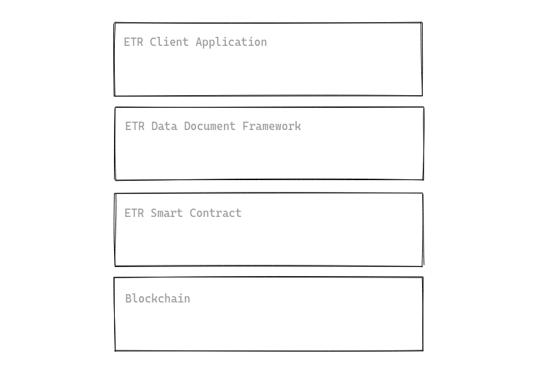
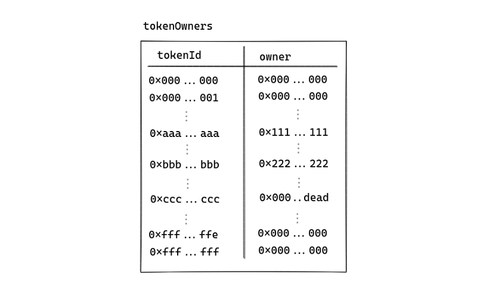

The United Nations Commission on International Trade Law (UNICITRAL) have [published a paper in 2017](https://uncitral.un.org/en/texts/ecommerce/modellaw/electronic_transferable_records) on the Model Law on Electronic Transferable Records ([MLETR](https://www.uncitral.org/pdf/english/texts/electcom/MLETR_ebook.pdf)) to enable legal use of electronic transferable records domestically and across borders.

The paper was significant in outlining how we can represent and accommodate instruments like title deeds, bills of lading, bills of exchange, promissory notes and warehouse receipts

Accordingly, such Electronic Transferable Records (ETRs) must fulfills the following criteria:

1. identify that electronic record as the electronic transferable record
2. render that electronic record capable of being subjected to control from its creation until it ceases to have any effect or validity
3. retain the integrity of that electronic record

In this paper I outline how we can built an application leveraging on consensus mechanisms of blockchain to fulfill said requirements.

### Overview of Electronic Transferable Record on Blockchain

Implementing ETRs on the blockchain will require multiple key components to work together to meet the requirements set out by MLETR. The application can be broken down into 4 major components with the following roles:

1. **Blockchain** — At the fundamental level, we have a blockchain to ensure that transactions were verified according to basic rules and there is consensus among all the blockchain software connected to the same network. This provides an infrastructure for a single source of truth for all the components built on it.
2. **ETR Smart Contract** — Smart contracts designed according to the ETR requirements set out in MLETR are deployed onto the blockchain to provide a registry of owners (aka controllers) of different ETR issued. This extends the functionality of the blockchain to provide a single source of truth for according to business requirements.
3. **ETR Data Document Framework** — A document framework is required to ensure that ETR documents’ integrity & provenance can be verified and every ETR has a globally unique ID for use in the ETR smart contract. Additional functionalities such as data presentation or selective disclosure of data may also be provided with this component.
4. **ETR Client Application** — Finally, client applications are applications with user interface (UI) to allow different stakeholders to interact with the entire stack of components easily. These applications can be generalized decentralized apps, or highly customized components interacting with the existing IT infrastructure of the different stakeholders. This component will not be discussed in the rest of the document.

In this paper, we discuss the roles, responsibilities, requirements and implementation brief of the major components starting with the blockchain layer.

### Introduction to Blockchain

A blockchain is an open, distributed ledger that records transactions between parties, in a verifiable and permanent manner. In all blockchain implementations, participants work together to validate and append new records according to the rules defined in the open-sourced blockchain software and the shared historical records.

Essentially this forms a global finite state machine where the current state on the blockchain can be derived from the entire history of state changing events and the content of the genesis block itself. The consensus mechanisms written in different blockchain client softwares ensure that it is hard for malicious actors to convince honest actors to rewrite historical transactions to change the current blockchain state. For that reason, transactions on blockchains are thought of as immutable.

### Types of Blockchain

There are two main types of blockchains, public and private blockchains.

Public blockchains like Bitcoin and Ethereum are networks where anyone can participate in reading the current state, writing a state transitioning transaction, or participate in the consensus mechanism by proposing and validating new blocks.

Private blockchains like Hyperledger Fabric or Quorum, on the other hand, have access control settings that restrict the type of actions different actors may perform on the blockchain.

### Blockchain Selection Criteria

Since blockchains are capable of providing immutable records of transactions and the current state, they can be used to provide a rail for keeping records for Electronic Transferable Records (ETRs). However, there are several considerations for selecting an usable blockchain.

1. **Public** — The blockchain should be permissionless to allow any entities to participate in reading the current states, writing valid state transiting transactions and partake in adding new valid blocks. Selecting a public blockchain prevents fragmentation of the network by discouraging solution providers to use a private network which locks their end user into a small ecosystem and encourages interoperability of softwares from different solution providers to agree on document schema, valid state transition actions and best practices. In addition, the public blockchain provides a [strong economic guarantee](https://www.crypto51.app/) on the immutability of the state as opposed to a private blockchain where it is possible to “buy-out” enough players to mount an attack on the blockchain.
2. **Support for Smart Contract** — The blockchain should be programmable to allow actors to define a valid set of state transitioning transactions and their pre-conditions. An example of such action is a transfer action where an entity may transfer its ownership of an ETR from itself to another entity *if and only* if the following conditions are met:

   * the ETR has been issued by the ETR issuer.
   * the entity is currently in control of the ETR.
   * the transaction has been signed by the entity proposing the transaction
3. **Withstood the test of time** — The blockchain, like any usable encryption schemes, should be open source and available for public review. In addition, the blockchain should ideally be running on a network which has stood against the test of time where other transactions involving large values are being processed, and have shown resilience against malicious actors. As the foundation of the application stack as a global state provider, a failure at this layer is catastrophic.
4. **[High developer mindshare](https://consensys.net/blog/blockchain-development/ethereum-has-4x-more-developers-than-any-other-crypto-ecosystem/)** — The blockchain should be developed and maintained by a sizable group of developers to ensure continuous improvement on the blockchain through different proposals and upgrade to prevent scenarios where ETR records are at risk because of obsolete technologies.

### Electronic Transferable Records Smart Contract

Programmable blockchain allows for users to define custom logic for state transitions using scripts known as smart contracts. Once a smart contract has been deployed, the contract code will never be changed and all participants on the network will be able to verify the code of the contract before interacting with it.

These smart contracts allow different entities to interact with it by sending state transiting transactions to modify and store application states through its functions. All the clients connected will be able to execute a set of ordered state changing transactions deterministically, and arrive at the same subsequent state, an important attribute to ensure that all the clients in the world agree on a single state related to ETRs.

ETR issuers, such as shipping lines, would be able to deploy smart contracts to maintain a single global record for the following purposes:

* Keeping records of the statuses of ETRs issued by the issuer
* Keeping records of the current owners of the different ETR
* Defining the function and preconditions for issuing a new ETR
* Defining the function and preconditions for transferring an ETR
* Other functions required by the users or the issuer of the ETR

### Smart Contract API Standards

To promote interoperability between different solution providers and implementations of ETR softwares, a standard API should be defined for ETR transactions to allow ETR holders and recipients to transfer and receive ETRs as well as anyone to query the status of an ETR.

The Ethereum Improvement Proposal, [ERC-721](https://eips.ethereum.org/EIPS/eip-721) provides a widely-used smart contract API used for non-fungible token (NFTs) or deeds. The interface is widely used by smart contracts on the Ethereum blockchain to represent digital assets from [digital cats](https://www.cryptokitties.co/), to [digital art pieces](https://rarible.com/) and even [title deeds of virtual world](https://decentraland.org/). Other than being used for representing assets on the blockchain, the API also enables other entities to build applications such as marketplaces to allow participants to buy, sell and auction these tokens.

Aside from the API specifications, there are concrete implementations of the smart contracts, such as [OpenZepplin](https://github.com/OpenZeppelin/openzeppelin-contracts), which are widely used and have been audited. This allows ETR issuers to deploy these audited smart contracts or extend them with custom logic should they require additional functions in the smart contract for ETR record keeping.

One can extend the API specified in the ERC-721 proposal to implement the ETR smart contract for tracking the status of the various ETRs issued by an ETR issuer.

In the non-fungible token standard, every unique asset is represented by a unique identifier, and stored in a data structure that maps the unique asset id to an owner value which is an Ethereum address.

One can imagine the data structure as a gigantic table with 2256 rows, with all values set to the 0 value.

To issue an ETR, the ETR issuer may call the *mint* function to issue an ETR with its unique identifier as the *tokenId* to an entity who owns a given wallet address. This action will assign the wallet address to replace the 0 value for the owner value on the corresponding row.

For instance, the ETR issuer may issue ETR *0xaaa…aaa* to an entity in control of the wallet *0x111…111*, which will result in a change in state to the figure above. At this point, anyone with the ETR document ID *0xaaa…aaa* may query the smart contract for the owner of the ETR and be presented by the current owner of the ETR who is *0x111…111*.

To transfer an ETR, the current ETR owner may call the *transfer* function to change the current value of the *owner* to the ETR receiver’s wallet address. This will replace the *owner* value of the ETR with the new value and anyone who queries the smart contract for the owner will now receive the new owner of the ETR.

### Electronic Transferable Records Data Document Framework

Physical transferable records such as bill of ladings are documents with lots of data and with document schemas that varies from one issuer to another. As a result there is a need for a framework to not only digitize the document but also allow it to be safely represented on the blockchain with a single unique document ID.

Some of the considerations for the selection of framework for the data document:

1. **Open sourced** — The code for the framework must be open sourced and ready for public review. This is to ensure correctness of the functions.
2. **Universally Unique ETR ID** — The output of the document framework must produce an universally unique ID for use in the ETR’s smart contracts to be associated with an owner. The implementation must ensure that it is impossible for collision of these ETR IDs given that the contents are different.
3. **Extensible Data Schema** — The document framework must allow for the issuer of the ETR to extend the document schema to suit the data structure of the ETR.
4. **Tamper-proof** — The document framework must be able to detect if the content of the ETR has been tampered with to give assurance of the integrity of the document to the recipients of the ETR.
5. **Identity Binding** — The document framework must provide a method for recipients of the document to identify the ETR issuer.
6. **Selective Disclosure** — The document framework may provide additional features for the presenter of the ETR to make fine-grained decisions about what information to share without affecting the integrity of the document.

### Data Document Framework Reference Implementation

The [TradeTrust framework](https://tradetrust.io/), created by the Singapore government, provides a reference implementation of a document framework suitable for use with a smart contract to track ownership of an ETR on the blockchain. The framework makes use of [OpenAttestation](https://openattestation.com/) which is used to power [OpenCerts](https://opencerts.io/), Singapore’s largest digital education credential, for processing the document to assert document integrity and provenance.

The OpenAttestation framework provides utilities to “wrap” a JSON document up to produce a globally unique hash, compatible with Ethereum’s smart contract. In addition, it provides important verifiable metadata to allow recipients of the document to verify the issuer of the document via their DNS name.

Out of the box, the framework allows issuers of the document to define a “renderer” to render the content of the data on web and mobile to allow the document to be viewed by humans easily.

In addition, the framework allows the holder of the document to show a subset of the document data through its selective disclosure functions without requiring the issuer of the document to reissue the document with another hash.

Combined with the ERC721 smart contract, the framework is capable of supporting all ETR use cases.

### Satisfaction of MLETR Requirements

With the overview of how ETR can be created and managed on the blockchain, we can examine how the requirements listed in MLETR can be achieved.

**Singularity**

Considering that every individual ETR document can be represented by an unique ID which cannot collide with another document, the association of the ID to a single \`owner\` property in a smart contract ensures that there must only be one owner of the ETR at any point in time.

The data document, however, can be copied and shared with as many entities as the receivers of the ETR document would like. This is similar to physical TR where copies of the original TR can be made by all receivers of the TR to be forwarded to anyone whom they wish to share with. The main difference between that and an ETR created in above manner is that all the recipients of the ETR will be able to verify the authenticity, integrity and provenance of the ETR as well as query for the current owner of the ETR.

To facilitate the transition of a physical TR to ETR, the issuer must also provide a service to perform bidirectional swaps.

For a physical TR to be exchanged for an ETR, the recipient of the physical TR must surrender the physical TR to the issuer who will then proceed to destroy the physical TR and issue an ETR to the recipient. For an ETR to be exchanged for a physical TR, the owner of the ETR must surrender the ETR back to the issuer who will then proceed to issue a physical TR to the recipient.

In both swaps, we rely on the business process of the issuer to ensure that only one TR is in circulation to fulfil the singularity property. Issuers of TR are incentivised to ensure that to prevent having additional liabilities on themselves when two TRs are in circulation.

**Control**

The implementation of the ETR smart contract will be implemented such that the listed owner of the ETR will have exclusive control over the ETR. This means that only when the owner of the ETR invokes the transfer function of the ETR will the record update the existing owner to the new recipient. The signature of the transfer transaction is being checked to assert the constraints.

Whenever an entity claims to be the owner of the ETR, the entity may use the private key corresponding to the wallet address listed as the owner of the ETR to sign on a message to prove that he is indeed the controller of the owner wallet. This will allow one to identify a person as the person in control of the ETR.

**Integrity**

The integrity of the document can be verified through the unique document ID. Since the document ID is the hash of the content of the document, any attempt to modify the contents of the document will result in the document hash to change. Since the hash algorithm guarantees that there will not be a collision of hash for different inputs, the new hash will correspond to one that has not been issued by the issuer, therefore showing an invalid document.

### Product Demonstration

The TradeTrust framework includes a working technical implementation of how ETRs can be represented, owned and transferred by different entities.

For a demonstration of how the technology works, you may watch the [first episode](https://www.youtube.com/watch?v=NcR1M9NJ-PE&feature=emb_title) of [TradeTrust webinar series](https://www.tradetrust.io/resources).

- - -

[Subscribe to my mailing list](https://geek.us2.list-manage.com/subscribe?u=bfcc21792349f4f0eaff4a2a3&id=694896a0df) if you like to learn more about how distributed ledger technology can be used for public goods.