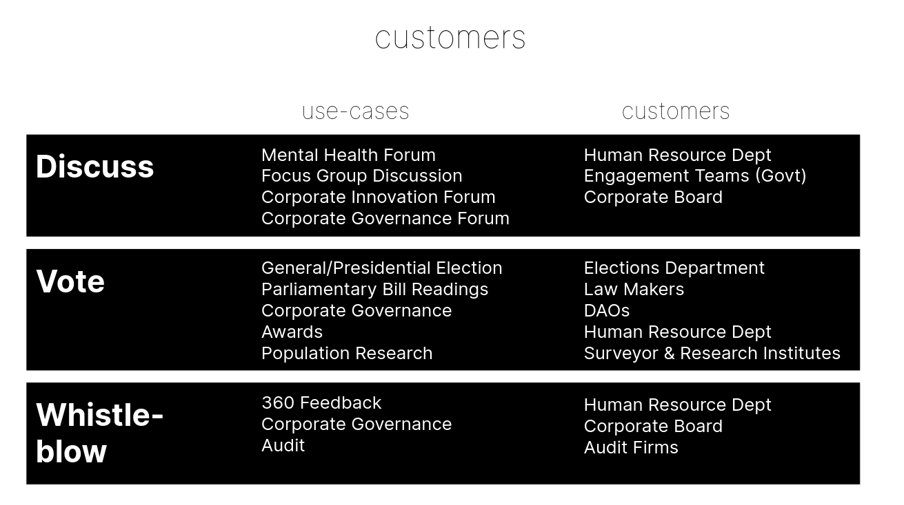
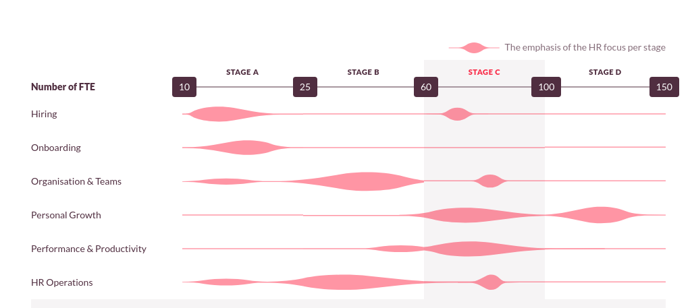

### Initial Idea

In the last half months, the main business idea had gone through lots of pivots from speaking to many people.

The initial idea was to create a privacy-tech consultancy firm with both a consultancy arm as well as a product arm. The consultancy arm will be serving companies and governments to implement privacy solutions while the product arm will go about creating a “deliberation forum”. The aim is to cash in on the identity mixer research I’ve worked on previously as a RadicalXChange fellow. I’ve even made a deck for the products:

[Get Deck](https://docs.google.com/presentation/d/1svE4UqOW_qEbfvnA1FDLVUja-vQeBcFqIY3VGbTf43Y/edit?usp=sharing)

Since then I’ve entered into a few meetings with the ProofOfHumanity DAO’s developer team to build a privacy layer allowing their dependant applications to prove that a specific Ethereum address is a unique human, without being able to link it to an actual profile submission. Basically, tornado.cash for humans. However, the [proposal](https://gov.proofofhumanity.id/t/hip-15-privacy-layer-to-unlink-public-profile-from-address-while-providing-sybil-resistance-list-of-humans/724) received lukewarm response from the team and there wasn’t momentum to continue pushing it forward — even though privacy concerns have been brought up in the community chat multiple times.

### Pivot #1

The next idea was to look at how privacy can help create a safe space for employees to discuss mental health in the company. The idea was to create a reddit-style forum except that the members are anonymous, but verified to be employees. The platform would allow employees to discuss the challenges they are facing either at work or outside of work and help them find solace in a community without fear of judgment from bosses.

During this time, I’ve also spoken to 30+ individuals who have experienced burnout during their employment and found some interesting findings:

* Some of them lie on employee engagement survey because they do not want to be singled out by superior or be involved in more work arising from the survey
* Many reported that they do not trust that the existing employee engagement survey is anonymous
* Most people do not use counseling service provided by the company because they fear that their names or case information will be made available to the company
* Many feel uncomfortable sharing their stories, even anonymously, on a new platform and will want to observe how safe is the platform before interacting with it
* Many feedback that unless their work environment change, no amount of counseling or other types of treatment

Also, during the same time, I’ve experienced firsthand(from responses to [my burnout story](https://geek.sg/blog/im-29-burned-out-and-leaving-my-job%E2%80%8A-%E2%80%8Aheres-my%C2%A0story)) how being anonymous can empower malicious actors. Additionally, from the corporate point of view liability can also become a huge issue as seen from [this reddit thread](https://www.reddit.com/r/humanresources/comments/mqic5q/ca_seeking_feedback_on_a_tool_cypherchat_that/).

I learn that organizations will not pay for something that could potentially blow up in their face.

Time to pivot again.

### Pivot #2

With the insights from the research, I see potential gaps in two areas:

* privacy-first employee engagement survey, and
* employee wellness (or assistance) program

Existing employee assistance programs are generally offered by insurers as an add-on and cost around $1–4 in US/CA market ([source 1](https://www.reddit.com/r/humanresources/comments/nzh6vx/question_about_employee_assitance_program_eap/), [source 2](https://webcache.googleusercontent.com/search?q=cache:JxMS68NPH1UJ:https://go.boarddocs.com/mabe/hcpssmd/Board.nsf/files/BPTPW9658462/%24file/05%252028%25202020%2520Bids%2520and%2520Contracts%2520BR.pdf+&cd=6&hl=en&ct=clnk&gl=sg)). Smaller companies outside of US/CA does not have access to affordable EAP programs as insurers. For instance in Singapore, mental health addons are still [uncommon](https://www.todayonline.com/commentary/making-mental-healthcare-more-affordable-singaporeans) and [expensive](https://www.channelnewsasia.com/news/singapore/employee-workplace-mental-health-insurance-tripartite-advisory-13586244) for insurance.

The intuition is if I can create a platform that, instead of focus on spreading out the cost of mental health support using a pool like how insurer does it, allow smaller organizations to plug in mental health support for their employees using consumption-based billing while still keeping employees data (even names) confidential. In addition, expanding product offerings from just “assistance” (such as counseling, coach, etc) to also other wellness products (such as yoga studio, online program subscription, etc) to provide more comprehensive support for not just struggling employees but also those that are thriving too.

From the perspective of organizations, they can see this not just as an EAP that helps struggling employees but also form part of their employee benefits. For businesses that are moving away from physical offices, this could also be a replacement for a “cool office”.

From the perspective of the individual, there may be less stigma from the utilization of services like counseling or coaching from the company if it was packaged with other offerings and rebranded away from “assistance”.

### What’s Next

I’ll be validating my hypothesis by speaking to companies in the range of 60–150 full-time employees in Asia and US to find out more about how they approach employee assistance and employee benefits.

It will be great if you can [connect me](https://geek.sg/contact/) with HR leaders or the CEO of companies of that size for the research.

- - -

The market size for EAP is around [3.5bn in US](https://www.ibisworld.com/industry-statistics/market-size/employee-assistance-program-services-united-states/) and in Asia [around 3.4bn in Asia](https://hrmasia.com/asias-corporate-wellness-market-to-more-than-double-by-2024/). The wellness market is expected to grow to 7.4bn in Asia by 2024.

Covid has also created [additional stress for the employee as they work from home](https://www.mercer.com.sg/content/dam/mercer/attachments/asia-pacific/singapore/sg-2020-benefit-trends-in-asia-pacific.pdf) while accelerating the adoption of digital health solutions.