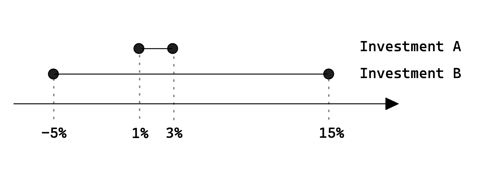
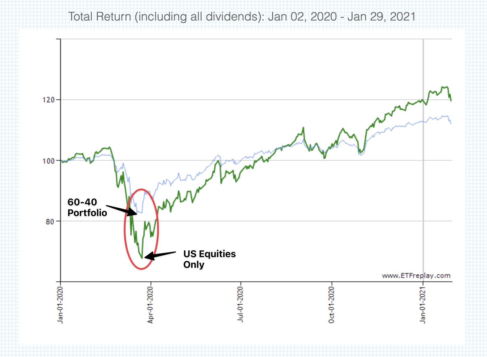
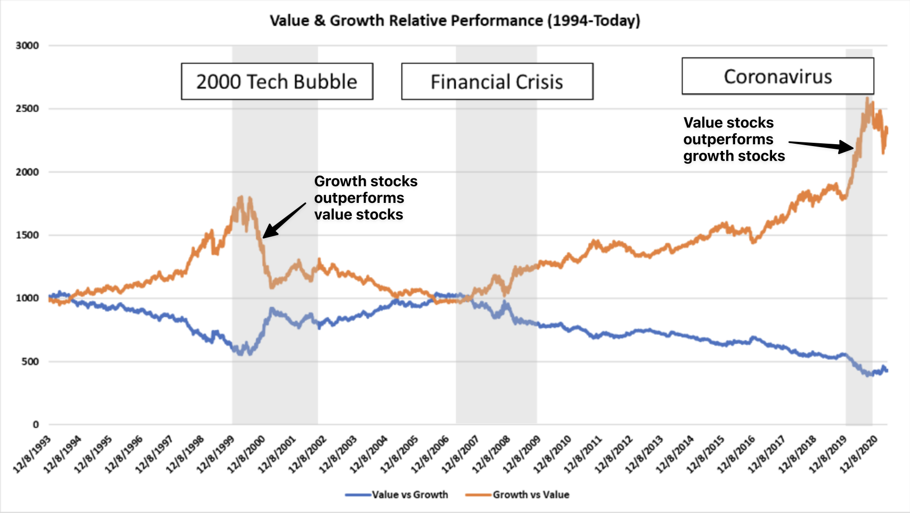
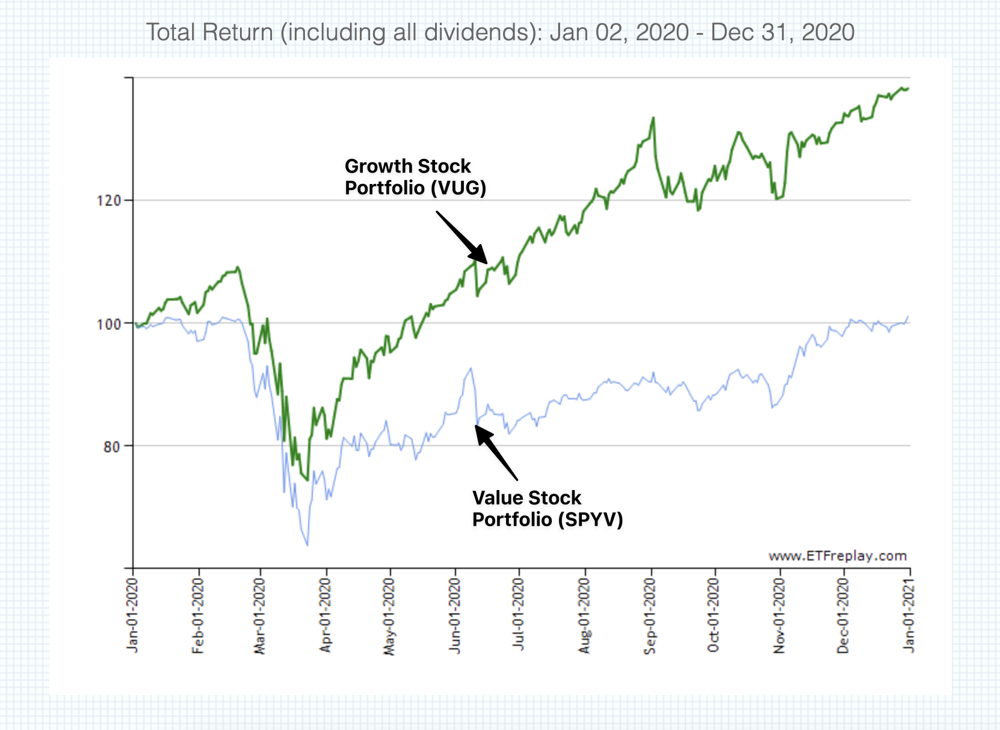

## **What Does "High Risk, High Reward" Really Mean?**

In the world of personal finance, you've probably heard the phrase "high risk, high reward". This saying is a cornerstone of investment philosophy, often thrown around in discussions about stocks, bonds, or real estate. But what does it really mean, and how does it apply to you as a busy professional?

Should you therefore avoid all investment opportunities with high returns because they are riskier and can lead you to financial ruins? Read on and find out how you can have your cake and eat it!

## **Deciphering Risk and Variance in Returns**

Let's start with the basics. The term "risk" in finance isn't quite the same as the everyday use of the word. When we talk about a "risky" investment, we're not just talking about the possibility of losing money. We're also referring to the variance of returns—an investment's potential to swing wildly in value. A high-risk investment could bring you a windfall, but it could also lead to substantial losses.

Let's illustrate this with two hypothetical investments: Investment A yields a return of 1-3%, whereas Investment B offers returns that could range from -5% to +15%. Investment B is considered to have a higher variance in returns because the returns are dispersed over a broader range, hence making it more risky.

High variance implies a broader spectrum of potential outcomes—there's a possibility of losing money, but there's also a chance of realizing significant gains. This is the crux of the 'high risk, high reward' concept.

## Higher Expected Returns for Larger Variance in Returns

Yet, it's important to highlight another key principle in finance: the risk-return tradeoff. Generally, riskier assets are expected to provide higher returns to compensate for the additional risk taken by the investor. The expected return, in essence, is the average of an investment's possible returns, each weighted by the likelihood of that return happening.

Therefore, while Investment B in our example is riskier due to its higher variance, it also has a higher expected return compared to Investment A. This is the investor's reward for tolerating the additional risk.

However, the complexity doesn't stop there. It's vital to remember that risk and reward dynamics can substantially shift depending on broader economic factors. They are not solely determined by the range of potential outcomes.

## **Different Investments React Differently to Economic Changes**

Various asset classes respond uniquely to economic changes such as interest rate fluctuations, inflation, and shifts in market sentiment.

Understanding these dynamics can help investors construct a balanced portfolio that is capable of weathering different economic scenarios. By combining assets that react differently to the same economic event, an investor can reduce the overall risk of their portfolio and potentially enhance returns. This is the fundamental principle of portfolio diversification, a strategy that seeks to manage risk without necessarily sacrificing potential returns.

## **Diversification Across Different Asset Classes**

Historically, the dynamics of risk and reward can be seen when we look at how different investments react to economic changes.

For instance, [when interest rates rise, it's actually been good for stocks overall](https://www.institutionalinvestor.com/article/b1x5mtck8yh7fb/a-historical-look-at-equities-during-rising-rate-environments). According to Dow Jones, since 1989 during a Fed rate-hike period, the average return for the Dow Jones Industrial Average is nearly 55%, that of the S&P 500 is a gain of 62.9%, and the Nasdaq Composite has averaged a positive return of 102.7%.

> Example portfolio with only US Equities vs 60-40 benchmark showing 16% difference in drawdown

Im another example, during the COVID-19-driven bear market in early 2020, a basic portfolio mix of 60% stocks and 40% core bonds would have [lost about 16 percentage points less](https://www.etfreplay.com/combine.aspx?s=VTI&w=100.000&bm=BNCH&st=2020-01-02&ed=2021-01-29) than an equity-only portfolio during the market downdraft.

This means you could sleep much better in the worst of the market if you simply add 40% of bonds in your portfolio!

## **Diversification Across Sector within the Same Asset Class**

Sector diversification can also be beneficial. For example, during the tech/media/telecom meltdown that started in March 2000, value stocks held up remarkably well, while growth stocks suffered deep losses.

However, the pattern was the [exact opposite](https://www.etfreplay.com/combine.aspx?s=VUG&w=100.000&bm=SPYV&st=2020-01-02&ed=2020-12-31) in the COVID-19-driven bear market in early 2020. This shows the value of diversifying even within the same asset class.

## **Conclusion: Making Informed Decisions**

Remember, while diversification can help spread risk, it does not guarantee profits or protect against all losses. The idea is to manage the risk and keep it at a level you're comfortable with, and this will depend on your individual financial goals, your tolerance for risk, and your investment timeline.

In conclusion, the phrase "high risk, high reward" doesn't have to intimidate you into having only low performance investments. Once you understand what risk means in financial terms and how to manage it through diversification, you're well on your way to making informed decisions about your personal finance journey. And as a busy professional, making smart