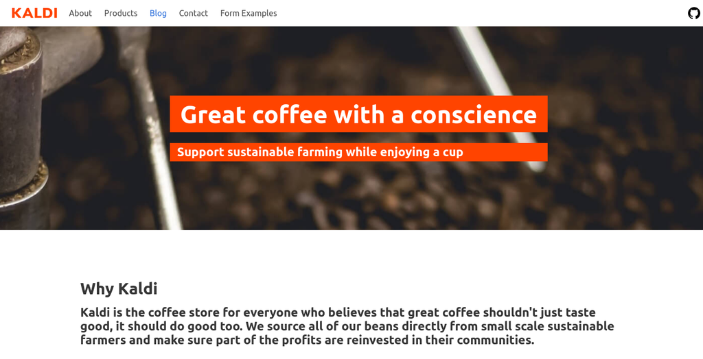
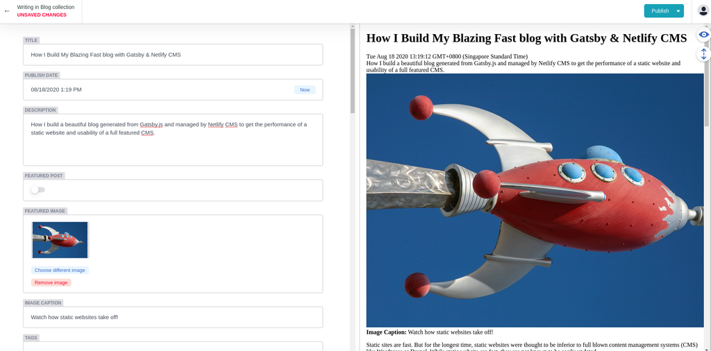
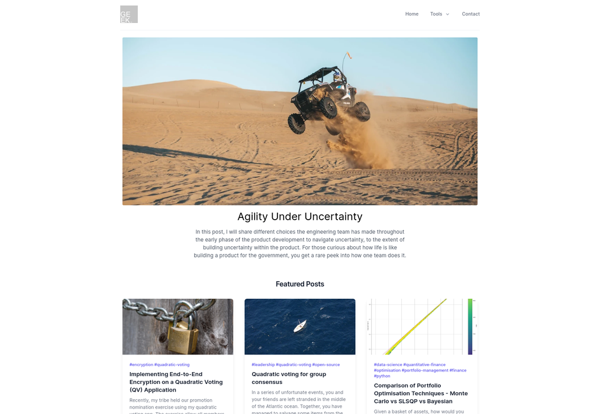
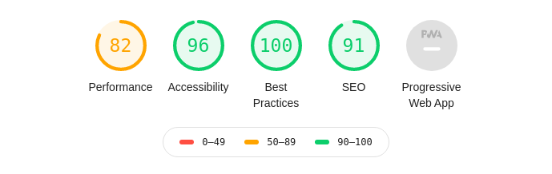

Static sites are fast. But for the longest time, static websites were thought to be inferior to full blown content management systems (CMS) like Wordpress or Drupal. While static website are fast, they are not known to be easily updated. 

That was before static site generators meet the headless CMS. 

## Maintainability issue with plain-o static site generator

I've previously been running my [previous blog](https://github.com/yehjxraymond/geeksg) on Next.js. As a static website generator, I was very happy with its performance. However, having been a user of Wordpress I wonder if I can make the process of updating the blog less painful but yet keeping the blog blazing fast. 

With Next.js, the process of adding a single blog post looks like this:

1. Create a new markdown file in the blog's directory
1. Scaffold the blog layout within the file
1. Insert a new entry into a .json file which indexes all my blog posts
1. Start writing my content

That is a lot of things to do before even writing the sentence!

## The ideal blog

Thinking about my idea blog, I've narrowed down the the few criterion:

1. Blazing fast serving and rendering of website
1. Adding new post will be simply adding one new file
1. SEO as top priority (meta, sitemap, tags, images, etc)
1. Ability to add interactive content

## Inspired by a Blog Template

Looking around for solutions that will allow me to build my ideal blog from, I stumbled upon the [Gatsby + Netlify CMS Starter](https://templates.netlify.com/template/gatsby-blog-with-netlify-cms/). The template is one of many Jamstack templates hosted on netlify to showcase the possibilities of [Jamstack](https://jamstack.org/).

  I love the stack but hated the design

With the one-click deploy feature, I was able to test drive the stack in a few minutes! 

I love how the blog generates blog pages from the markdown files and how the other parts of the website falls into place.

Out of the box, Gatsby give you everything from create-react-app, server-side rendering and smart image loading. 

What really set Gatsby apart from other static site generators like Next.js is the graphql server. You can programatically generate content from different data sources, which could come from your markdown files as well. This means that I will not only be able to create individual standalone blog posts, but also automatically generate a page for each blog post tags linking to other post with same tags. You can also generate a section after each blog post to show "similar articles" using the query server. 

  Watch how I write this post

What was really cool was that the deployed blog was using Netlify CMS to manage it's content. While it is certainly not a full featured platform like Wordpress, I can create and edit blog posts without writing a single line of code! 

Netlify injects the CMS at the `/admin` path once you've setup the site to use Netlify CMS from the [configuration file](https://www.netlifycms.org/docs/gatsby/) defined in `/static/admin/config.yml`. 

Upon submitting a new blog post or changes to existing posts, the CMS will use the github gateway to commit the change and automatically build and deploy the new version of the blog with your changes. 

## Building my own blog

With the starter site as a guide, I began customizing the blog to my liking. Some of the things I've done:

1. Use Typescript
1. Use Tailwind (with TailwindUI) as my CSS framework
1. Added storybook to develop and showcase my components
1. Generating tags pages from the blogs' tags
1. SEO component
1. Smart image loading to speed up page load on slower networks, using WebP image whenever possible

The result was a cleanly designed blog with a layout similar to medium so that reader can focus on the content without distractions. 

  Acing the test right out of box!

On top of the beautiful design the site was acing [Google Lighthouse](https://web.dev/measure/) site audit!

## Get your own blog

If you like to run a copy of the blog, you may simply click on the link below to automatically deploy my stack with your Netlify account:

[Deploy to Netlify](https://app.netlify.com/start/deploy?repository=https://github.com/yehjxraymond/static-blog-template&stack=cms)
