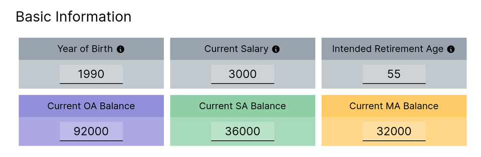
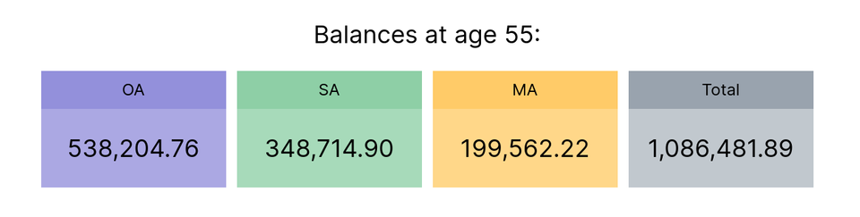
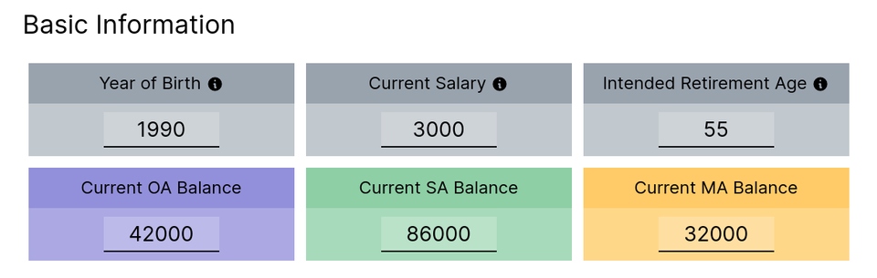
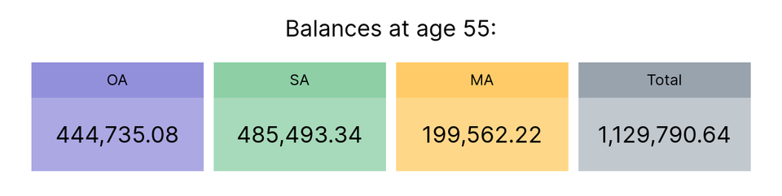
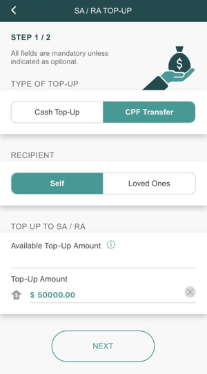

My fiance and I have just booked our resale flat. Amidst the chaos and haste, we've accidentally ended up with too much money in our CPF Ordinary Account (OA)¹.

Having read many articles on CPF, we knew the best we can do now transferring monies from our OA account to the Special Account (SA) to yield better interest rates.

We knew the action is irreversible so I wanted to find out the value of action of transferring our balance from OA to SA. How much more is the interest?

Turns out, it is more than what we thought.

> Transferring 50k now gives us more than EXTRA 40k in interest when we retire

## Scenario

Let's imagine the scenario, for a fictitious CPF account with the following balances:

```txt
OA - $92,000
SA - $36,000
MA - $32,000
```



We enter those information on the [CPF balance forecast calculator](/tools/cpf-forecast), using the default figures for rest of the fields.



Immediately we can see that this person will be retiring with **\$1,086,481** in total across all his accounts.

## Effect of Transferring \$50k to CPF Special Account



Repeating the same calculation for the scenario where $50k was transferred from OA to SA, we can see that the final amount is now **\$1,129,790**.



That's a whopping **\$43,308** for just pressing a button!

## What sorcery?

The reason this happens is simply due to the difference in the interest rate in the SA and OA accounts.

Monies in the SA account will yield **4%** interest while monies in the OA account will only yield **2.5%** interest.

By transferring your balance to the SA account, you yield extra 1.5% interest, at the cost of losing liquidity (you cannot touch the balance until the CPF withdrawal age).

While 1.5% seemed to be a small amount, the difference is compounded each year. In the example you can see the effect over a span of 25 years (our character is 30 this year).

## Let's transfer all the balance to SA then!



Before you smash the transfer button, evaluate what is an appropriate amount to be transferred. Some key considerations should be:

- Do you have enough emergency funds to pay off mortgage if you lose your income?
- Are you considering to upgrade your flat in the future?
- Do you foresee your kids using the balance for studying in the future?

If after these considerations you realized that you have excess monies in the OA account, smash that button!

## Simulate other scenarios

I've created the CPF forecast calculator to help me simulate different financial scenarios. It acts like a crystal ball for me to gaze into the future to see how bright or gloom it is. If you will like to try it for yourself, you may [head over to the calculator](/tools/cpf-forecast).

Ps. The calculator is [open-sourced](https://github.com/yehjxraymond/geeksg-blog/blob/master/src/components/interactive/cpf/index.tsx) and does not share your private information with anyone else.

---

¹ This happened because we loaned too much money from the bank. In addition because we got a relatively cheap flat. The CPF payable after the resale & proximity grants was only under \$10,000.
