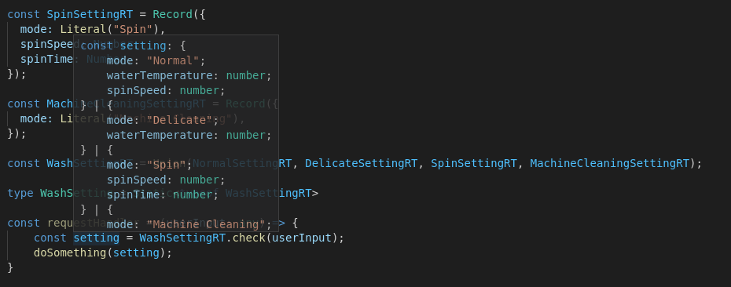

As a junior developer I was very concerned about getting things done. With any task, how to make things work concerned me the most. Learning to do test driven development (TDD) comes a long way to help me make sure the code works as I intended - for both positive and negative examples. However, as I come across the "Representable/Valid Principle" introduced in [James Koppel's Advanced Software Design Web Course](https://jameskoppelcoaching.com/advanced-software-design-web-course/), I found out that I can write code that that not just does the right thing but also can't do the wrong thing.

## It starts with representable states

The idea is simple:

> You eliminate an entire class of bugs by making sure that your program state space cannot represent invalid states and invalid transitions through states cannot happen.

I'll use an example to illustrate this:

Imagine you are a developer working an interface on a washing machine to receive inputs from the user. There are multiple modes on the washing machine:

* Normal Mode - User may adjust `waterTemperature` and `spinSpeed`.
* Delicate Mode - User may only adjust `waterTemperature`.
* Spin Only Mode - User may adjust `spinSpeed` and `spinTime`.
* Machine Cleaning Mode - No other parameters required.

With these peculiar user requirement (like all user requirements), represent the state in your program.

## How I ~~use to~~ occasionally do it

At first glance we probably will want to represent the state like this (using Typescript here):

```ts
type Setting = {
  mode: string;
  waterTemperature?: number;
  spinSpeed?: number;
  spinTime?: number;
};
```

The problem with this is there are multiple ways invalid states can be represented. Let's look at 3 examples:


It's possible that the machine can be set on the `Donkey` mode like this:

```ts
const donkeySetting: Setting = {
  mode: "Donkey",
};
```

It's also possible that we set the water waterTemperature on the `Spin Only` mode which doesn't use water at all:

```ts
const saunaSetting: Setting = {
  mode: "Spin",
  spinSpeed: 20,
  spinTime: 30,
  waterTemperature: 40,
};
```

It's also possible we get really awkward `Normal mode` washes without `spinSpeed` set:

```ts
const akaSoakSetting: Setting = {
  mode: "Normal",
  waterTemperature: 40,
};
```

## How to not be wrong

You probably could think of more ways that invalid states could be represented with the type definition above. It's one thing to think about the hidden Donkey washing mode or how we can steam-dry our clothes but another to deal with invalid states in our own code.

Here's an attempt to get rid of **some** invalid states in the washing machine settings above, using out-of-the-box Typescript:

```ts
type NormalSetting = {
  mode: "Normal";
  waterTemperature: number;
  spinSpeed: number;
};

type DelicateSetting = {
  mode: "Delicate";
  waterTemperature: number;
};

type SpinSetting = {
  mode: "Spin";
  spinSpeed: number;
  spinTime: number;
};

type MachineCleaningSetting = {
  mode: "Machine Cleaning";
};

type WashSetting =
  | NormalSetting
  | DelicateSetting
  | SpinSetting
  | MachineCleaningSetting;
```

With the [union type definition](https://www.typescriptlang.org/docs/handbook/unions-and-intersections.html) we can now represent a smaller set of the entire state space, giving less room for invalid states.

In the example above, we can see that `mode` is used to discriminate between the various settings and that there is no longer optional properties on any of the settings. You can definitely expect a `spinSpeed` on a setting object with Normal `mode`.

There are also some nice things that comes with this type definition, for example, developers get automatic completion on the the `mode` property:


And, developers will receive a compile time error when attempting to construct an invalid state:


## How not to be wrong in more scenarios

Of course, we all know that Typescript only enforces the types on compile time and it's offers no protection during runtime against invalid states (ie from client POST request). So how might we have runtime validation too?

We can represent the same state space using runtypes as well!

```ts
import { Record, Literal, Number, Union, Static } from "runtypes";

const NormalSettingRT = Record({
  mode: Literal("Normal"),
  waterTemperature: Number,
  spinSpeed: Number,
});

const DelicateSettingRT = Record({
  mode: Literal("Delicate"),
  waterTemperature: Number,
});

const SpinSettingRT = Record({
  mode: Literal("Spin"),
  spinSpeed: Number,
  spinTime: Number,
});

const MachineCleaningSettingRT = Record({
  mode: Literal("Machine Cleaning"),
});

const WashSettingRT = Union(
  NormalSettingRT,
  DelicateSettingRT,
  SpinSettingRT,
  MachineCleaningSettingRT
);

type WashSetting = Static<typeof WashSettingRT>;

const doSomething = (setting: WashSetting) => {
  // Do something with setting here.
};

const requestHandler = (userInput: any) => {
  const setting = WashSettingRT.check(userInput);
  doSomething(setting);
};
```

In this example, we create the same `WashSetting` type definition by generating it from the runtype objects using `Static<typeof WashSettingRT>`. This can be used in other parts of the program which does not require runtime validation of the settings object such as in the function signature of `doSomething` in the example above.



At the same time, we also have the `WashSettingRT` object which can be used to validate any inputs, allowing it to throw an descriptive error about the inputs should the input validation fail. Should the input passes the check, the returned value will also receive a [typeguard](https://www.typescriptlang.org/docs/handbook/advanced-types.html). This should be used in places where we can expect inputs that may represent invalid states in runtime such as in `requestHandler` function.

## And you can still be wrong...

In the examples above, we took great effort to reduce the representable state space in compile-time and subsequently during runtime, but even so, the program can still be wrong!

* What if the temperature can only be between 30°C to 70°C in increment of 10°C?
* What if the spin speed can only be either 1200, 1400 or 1600 rpm?

Take a stab at further reducing the state space so that invalid states cannot be represented!