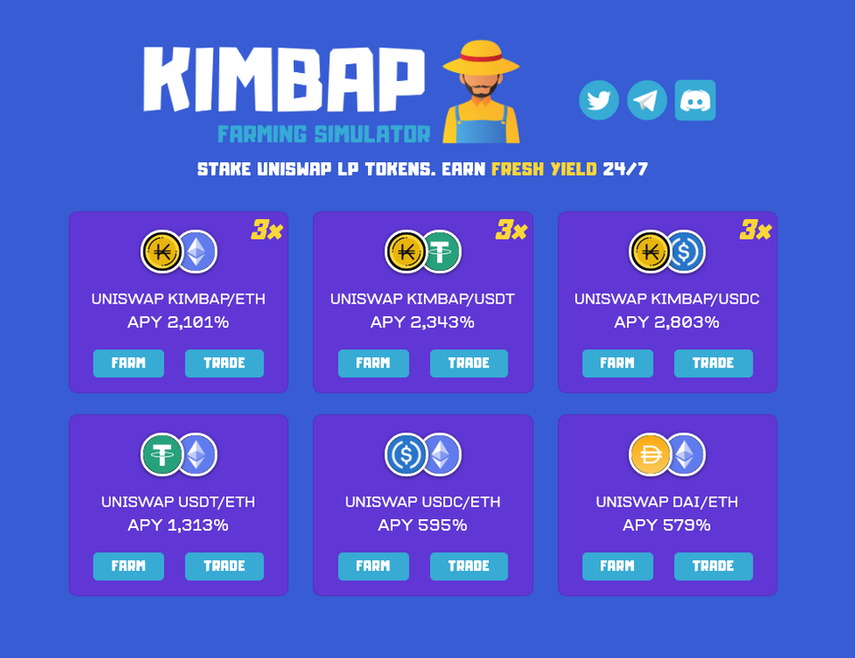
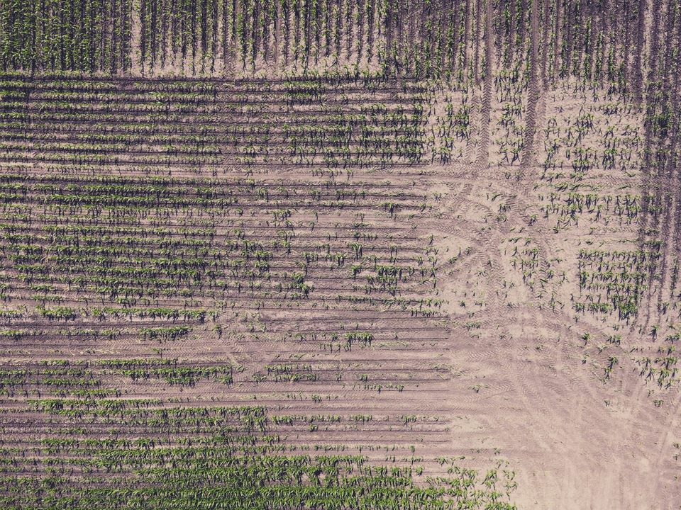
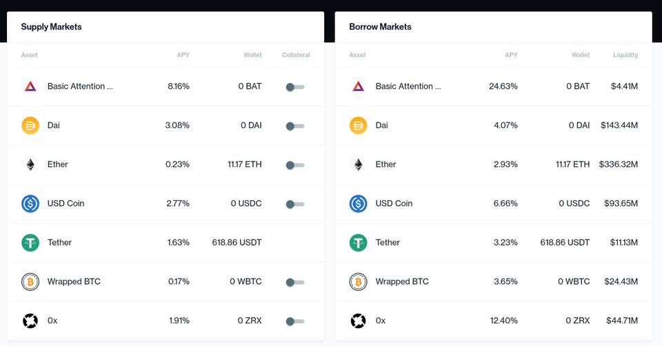
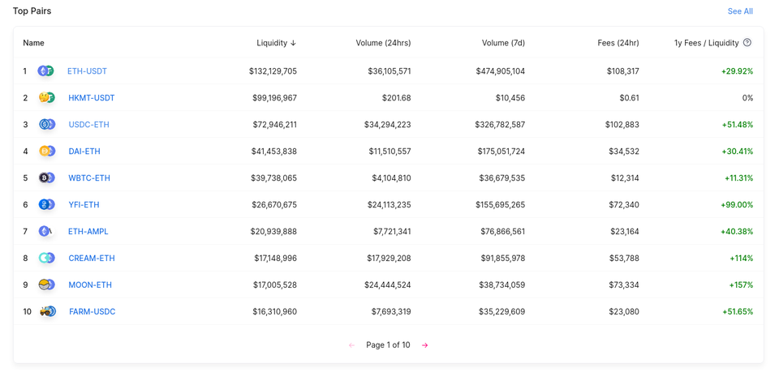

Decentralized finance has been quite the hype for the past few months and I've finally decided to get my feet wet two weeks ago after my friend repeatedly prompted me to. Here's what I've learned after losing ~\$5000 on yield farming.

## Yield Farming

Yield farming is one of the must-do in the defi space right now. The concept allows one to stake some token, usually liquidity providers' tokens, in a smart contract and be rewarded some native tokens for it. There are multiple forks and clones of farming applications. To list a few:

- Sushiswap
- Kimbap.finance
- Ulu.finance
- Pickle.finance

In the case of an application like Kimbap.finance, you can deposit Uniswap's liquidity provider tokens and be rewarded \$KIMBAP as you continue to hold the liquidity token within the kimbap's masterchef contract.

### Farming Inc.

Seeing a Kimbap farm for the first time was daunting for me. Lots of questions were going through my head then:

1. The annual percentage yields are over 1,000% are they real?
2. How do I get the token required to put it in this farm?
3. Can my staked tokens be taken away from by the smart contract owner or through a smart contract bug?

With interest rates above 1000%, I certainly can't wait for all questions to be answered. I decided to get the answer to the most important question:

> How do I get in?

With some research, I found out that I will first have to get two sets of tokens to place them in the Uniswap pool. I've chosen USDC and ETH for my token pairs. Depositing them into Uniswap will give me liquidity tokens which I can use to either:

1. Redeem my share of USDC & ETH (why will I do this?)
2. Stake it in the farm for profits!

Being a very cautious investor, I take a look at the smart contract and decided it's safe because:

1. I read codes and the codes read clean.
1. I've compared it to another safe contract and nothing stood out.
1. There are plenty of people who've invested in this, it must be safe.
1. It has not been hack yet. And I'll be out before that happens.

Without further ado, I staked my first USDC-ETH UNI-V2 LP token in the Kimbap farm. Right away I see my Kimbap balance ticking away.

Do you know how therapeutic it is to be able to watch my money make more money in real-time?

I do.

I spend the next few minutes watching the numbers tick.

That was the gateway drug to something more sinister...

### Maximizing Yields

In a world where 1000+% yields is the norm, I feel like losing out with just 300% APY. If I can achieve 1000+% APY, I will be able to make the same amount of money work 3 times as hard! To do that, I simply have to buy some of those native tokens off the exchange to stake it in the "bonus pools".

In my mind, I thought: "If I buy some Kimbaps now, pair it with ETH, and stake it back in the pool, I'll amass Kimbaps faster than others could and sell it off to recover my initial investments.".

Not long after patting myself on the back for devising such genius plans, I went on Uniswap to buy some more Kimbaps to fund my yield farming venture. I paired the newly purchased Kimbaps with some Ethers, deposit them in Uniswap, and staked the corresponding liquidity token into the pool.

Seeing that the Kimbaps are accumulating at the fastest rate possible, I thought I'll leave the money to work for me while I turn in for the day.

### Crop Destruction

Waking up to the smell of a great smelling coffee and great returns on Kimbaps is one of the best things that could have happened.

Only neither happened.

Prices of the Kimbap token has fallen more than 100x through the night. I never thought that was even possible. With over 60,000 Kimbaps with their value less than the gas cost to convert them back to ethers, I realized something...

I am the yield for the other farmers.

### Do not be the yield.

The basic building blocks in decentralized finance are from various sources like loans & liquidity provider fees. We can look at two examples of the source of yield, one through providing loans via Compound and another through providing liquidity via Uniswap.

In the case of Compound, you can get 3% APY by borrowing your excess DAI tokens. In return, Compound will award you with an accounting token cDAI which serve as the IOU for the DAI you have lent to the protocol as well as the accrued interest rates.

In the case of Uniswap, you can get 29% APY by providing liquidity to a pair like the ETH-USDT pair. By providing liquidity, you essentially allow others in the market to swap ETH to USDC in either direction, with each swap costing 0.3% fees paid to the entire pool. In return for providing liquidity, Uniswap award you with an accounting token, the `UNIV2 USDC/ETH LP` token, to track your shares of the entire pool, as well as the trading fees payable to you.

As we can see, the "honest" yields are in the range of 0-30% APY. So, how did these farms report yields above 1000%?

> If you don't know where are the yields, you are the yield.

The answer is simple.

The honest farmers are simply eating up the yields of other more honest farmers.

In the case of providing liquidity or loan, you are adding value to the ecosystem, and you should be duly be rewarded for that value you've added to the community. However, in the case of farming, you're not adding more value to the ecosystem whenever you stake your liquidity providers' tokens. In this case, you would have been rewarded with something worth exactly zero value.

Every one of the farms' native tokens should have zero value. Regardless if it's Kimbap, Moon, Sushi(v1), Ulu, Kimchi, etc.

If the native token should be worth exactly \$0.00, assuming 0 transaction fee, then why is the price above that on the exchange?

The reason is greed.

When farmers refuse to believe that the (future) price of the native token is worth exactly $0.00 and think that they can farm faster than others by providing liquidity for the native token to stablecoin pairs becomes the yield. These farmers provide the gateway for other farmers to sell what will be worth $0.00 in the future for a price above that now.

While some farmers are ignorant to the fact that the native tokens will eventually have \$0.00 value, others understood the laws of physics, but have decided to take the plunge in providing liquidity for the native token, because they are confident that they will not be [the greater fool](https://en.wikipedia.org/wiki/Greater_fool_theory).

So long as there are fools in the market, there are additional yields. So long as there are additional yields, there will be the [degenerate (degen) farmers](https://au.news.yahoo.com/defi-degens-gaming-ethereum-money-201333873.html).

### The Accession to Degeneration

> Make hay while the sun shines

The defi games will not go away for a long while. So long as there are greed, there will always be a greater fool. Your aim is not be the fool.

Here are some tips to not be the yield:

1. Never buy a native token. The price will always return to zero in the long run.
1. Never buy into a new type of farm. New farms tend to be forks of previous 'successful' farms.
1. Always check the permissions of the smart contract controller. Even previously safe farms might be dangerous when permissions are misconfigured.

Ps. Following this set of rules strictly over the next few days, my portfolio has since crawled out of the reds.
