Projects on Ethereum get hacked every single day. In fact, you have an [entire publication dedicated to hacked projects](https://www.rekt.news/) with a [leaderboard](https://www.rekt.news/leaderboard/) of the greatest losers.

If you have been a programmer, you know it is extremely hard to not introduce bugs into your software. Writing code is not just thinking about how to get a program to do what it’s supposed to, but also not to do what it’s not supposed to. Immutable and publicly viewable code adds to the pressure of getting the code right.

# An accidental find

As I worked on releasing my first set of smart contracts on [Bluejay Finance](https://bluejay.finance/), I was leveraging existing libraries to avoid introducing bugs into the code. In fact, higher code reuse makes me feel a lot more comfortable with my code. [OpenZeppelin’s Contract Wizard](https://docs.openzeppelin.com/contracts/4.x/wizard) goes one step further to write the code and made it extremely easy for me to get the code up for our governance token.

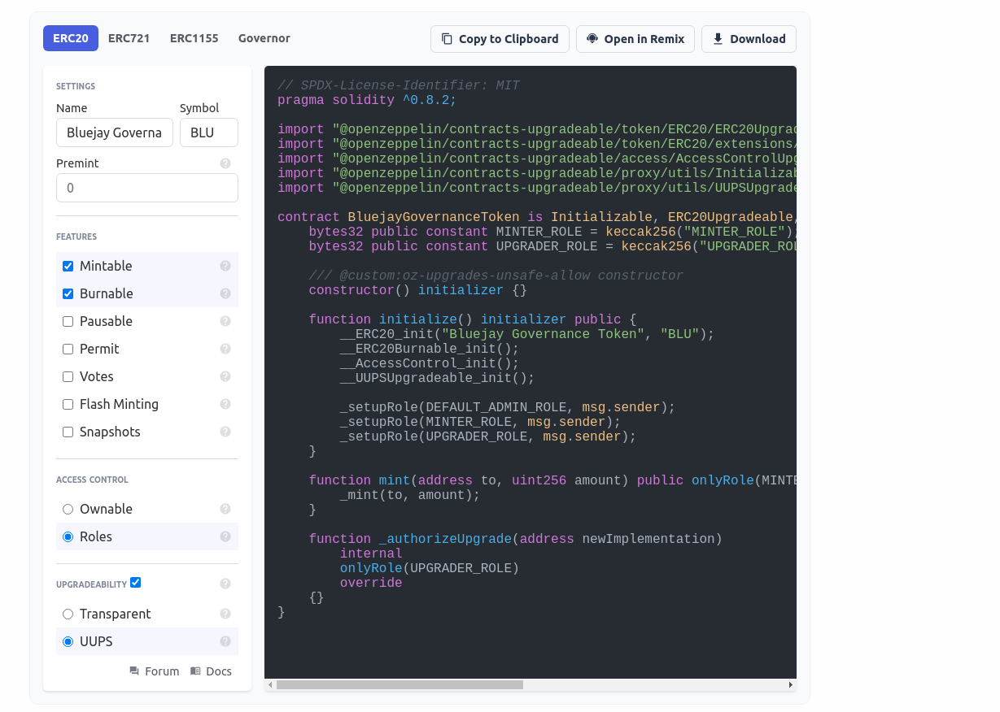

Watching OZ’s video on [Deploying More Efficient Upgradeable Contracts](https://www.youtube.com/watch?v=kWUDTZhxKZI) I’ve decided to choose the UUPS Proxy over the Admin Upgradeable Proxy for gas efficiency as well as customizability reasons.

If you are unaware of proxies, they are a method to create upgradeable smart contracts since code on Ethereum is immutable (well, until create2 + selfdestruct changed that). Proxies work by delegating the heavy lifting to a separate logic contract, changing the logic contract address allows you to upgrade the contract to a whole new implementation. UUPS allows you to implement the upgrade logic in the logic contract while Admin Upgradeable Proxy has the upgrade logic built-in (and checks each smart contract call if it's from the proxy admin, resulting in higher gas cost).

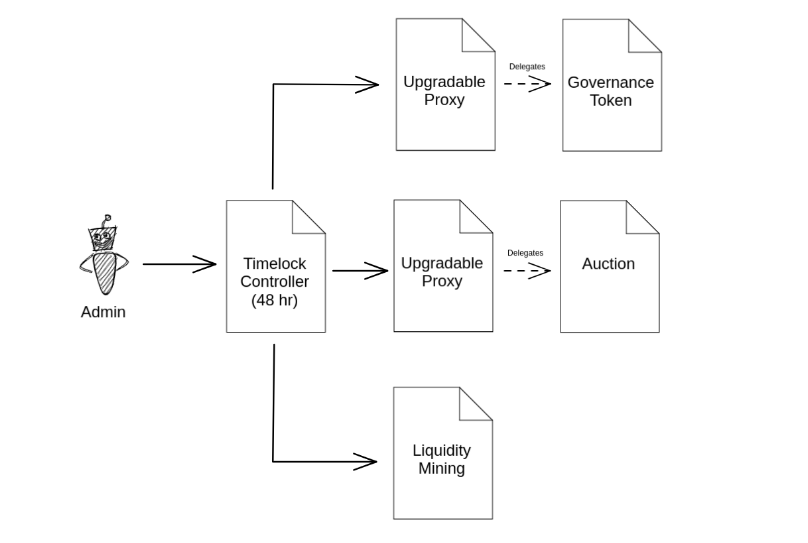

In the end, the code from the first launch was simply OpenZeppelin’s ERC20 code, Sushiswap’s Masterchef code, and writing my own custom auction contract for price discovery of our governance token, all of these behind the UUPS Proxy. Sounds really easy to get it right, right?

No.

I was feeling super uneasy launching a live project and was running test after test, and even wrote a deployment script and a deployment verifier to make sure things doesn’t go wrong. I was running my own audit on the set of seemingly straightforward smart contracts with different properties.

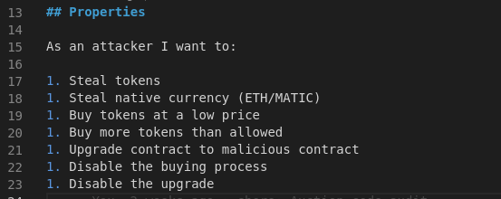

As I was invalidating these properties and working down the list, I realized something is wrong.

If I can upgrade the proxy contract because the upgrade code is in the logic contract, can I also upgrade the logic contract? Can an attacker upgrade the logic contract? Can an attacker run arbitrary code on the logic contract?

# Wait… what? How?

Turns out an attacker could run arbitrary code on the logic contract with the `upgradeToAndCall` method if the logic contract has not been initialized!

The method allows the contract to upgrade its implementation and then run some code immediately (usually initialization, setup, or migration sequence). While state changes on the logic contract do not affect the proxy contract, code changes on the logic contract will be used by the proxy. Turns out, there is an instruction that can perform an irreversible code change… `selfdestruct`. Executing that on the logic contract will not only delete the logic contract code but also prevent any fixes. Remember that the upgrade code resides on the logic contract for UUPS Proxies, unlike the Admin Upgradeable Proxies.

# The First Failed Attempt at the Exploit

Logically, the exploit should be easy — write a simple contract that has a function that runs `selfdestruct`, then run `upgradeToAndCall`.

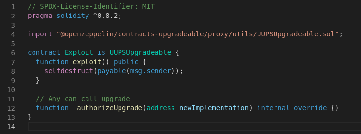

However, that code didn't work! And I cannot figure out why. At that time it’s already 1 am and the brain isn’t working. I figured the best approach is to sleep on it and revisit it in the morning.

# Sleep is magic

I woke up the next morning deciding to dig further into the UUPS upgrade sequence and found that there exist a check in `ERC1967UpgradeUpgradeable` that checks that it is possible to rollback the proxy to the previous implementation after the upgrade.

What a genius implementation to prevent people from upgrading accidentally to a flawed implementation!

All I need to do is to falsely declare that the test has been performed successfully when upgrading the contract to bypass that check.

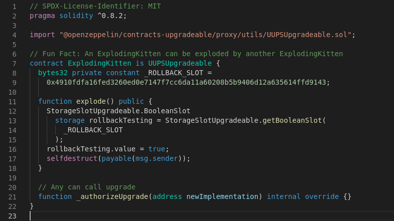

By setting the right flag, I can now perform the upgrade without the base contract running the rollback test.

The exploit worked!

The target logic contract code is set to `0x` after the exploit runs, disabling the proxy contract with it.

# The Disclosure

At this point, I’m super excited that I’ve found a vulnerability, but a few questions also come to mind:

* How should I disclose this? (Definitely not in an “[I accidentally killed it](https://elementus.io/blog/which-icos-are-affected-by-the-parity-wallet-bug/)” way)
* What is the damage if this lands in the wrong hand?
* Is this vulnerability fixable?

Looking up OpenZeppelin’s Twitter I see that they have recently worked with a whitehat to fix [the TimelockController bug](https://twitter.com/OpenZeppelin/status/1430999829748932614). That is a super good sign to show that the team is working with whitehats to fix vulnerable contracts safely. I’ve decided to entrust them with the vulnerability.

The next step is to really present the vulnerability and the POC exploit in the most useful way to their developers so they can immediately run and verify the exploit. I’ve decided to write a trusty ole test to do the job:

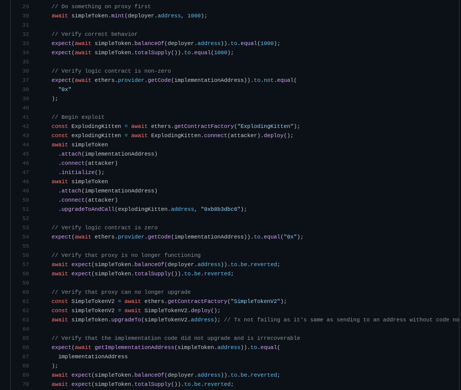

Breaking that down, it’s simply to:

* Show that something is working
* You run your exploit
* Show that something is not working
* Show that something cannot recover from the fault

Pairing that with a short and succinct readme, it helps to get the security team to quickly verify the issue:

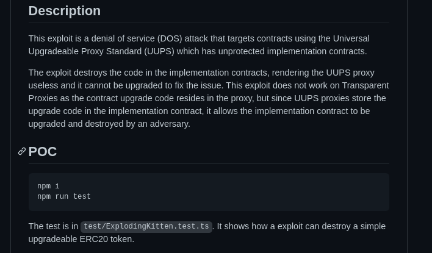

Once I have that on my **private** github repository, I dropped OZ’s security team a message:

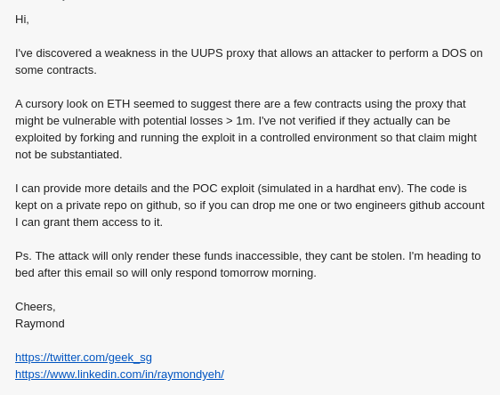

Within minutes, 3 to be exact, I received a reply to add their engineers to the repository for them to review.

In another 30 mins or so, the team was able to confirm the issue and updated me that they are setting up an action plan and will keep me posted.

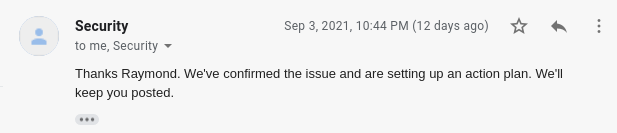

Knowing that the situation is now in good hands, I went to bed for that night.

I woke up the next morning with a very detailed brief of what they have done through the night (alright, my night, their day).

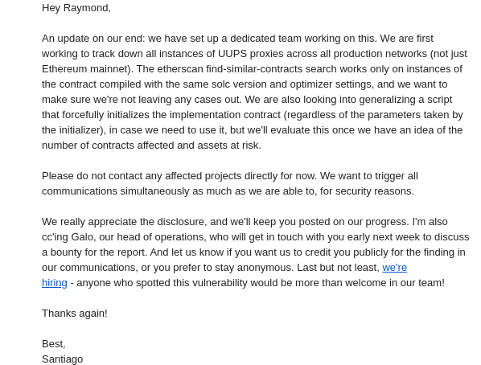

I love how the team communicates by letting me know that:

* they have dedicated resources for this issue
* they have a well thought out plan
* I should leave them to coordinate the fix
* they are appreciative of my work and also privacy

In the next few days, they have continued to send me updates on the progress as well as their disclosure plans.

On Sep 10, one week after initial contact, the team managed to setup a script to run a fix for 170 contracts across different chains and announce [the initial fix on Twitter](https://twitter.com/OpenZeppelin/status/1436069545022836738) (for projects they might have missed):

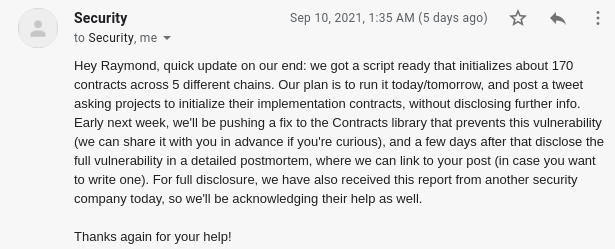

I appreciate that the team updates me regularly on their progress and offers to keep me involved in the process of looking at the fix (which I receive on the same day).

On Sep 14, the team published a fix for the vulnerable contract and [announced it publicly](https://twitter.com/OpenZeppelin/status/1437888943199068164) on Twitter, promising a post-mortem in a few days.

During the same period of time, I gave the team feedback that I really enjoyed the process of working with them on the vulnerability disclosure and am happy to write about the process and encourage more whitehats to work with security companies like OpenZeppelin for vulnerability disclosure as well as to set an example for other companies to what makes a great experience for the whitehat during the disclosure process — and of course, a bug bounty really tops it.

# Reflection on the Security Maturity of the Landscape

Having been through the experience of being part of the action I have only become more confident of the entire ecosystem in the Ethereum blockchain space.

Beyond just having mature [best practices](https://consensys.github.io/smart-contract-best-practices/), [security considerations](https://docs.soliditylang.org/en/latest/security-considerations.html), and a whole arsenal of tools (like [slither](https://github.com/crytic/slither), [echidna](https://github.com/crytic/echidna) & [manticore](https://github.com/trailofbits/manticore)), the ecosystem has the support of companies and independent developers/researchers who are dedicated to security.

The next time someone asks me “Why Ethereum?” again, I’ll not only point them to my Blockchain Selection Criteria section on my post on [Electronic Transferable Record on Blockchain](https://geek.sg/blog/electronic-transferable-record-on-blockchain), but also to this experience.

The POC exploit is available publicly at <https://github.com/yehjxraymond/exploding-kitten>