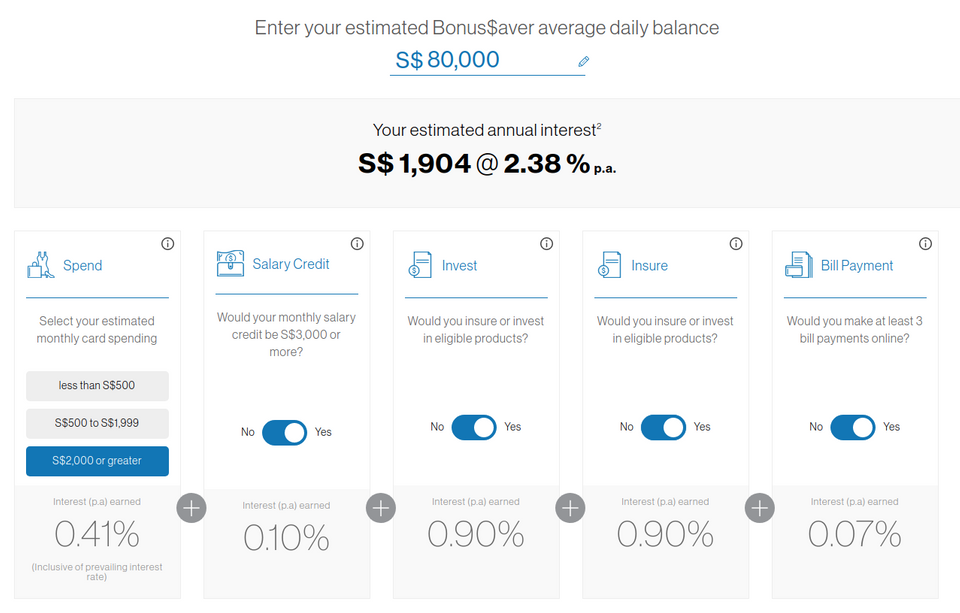
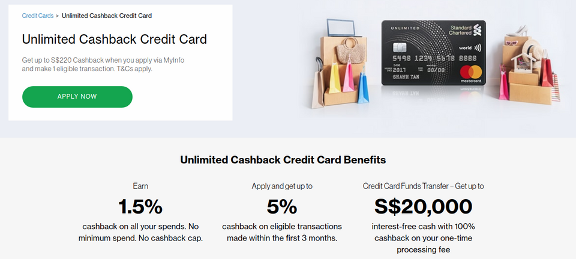
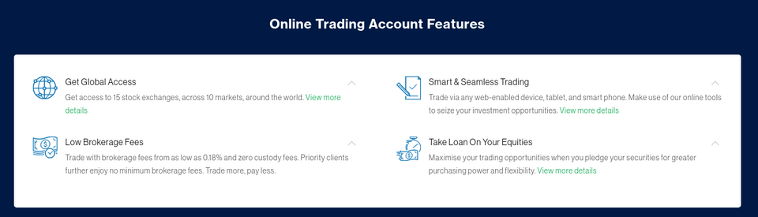
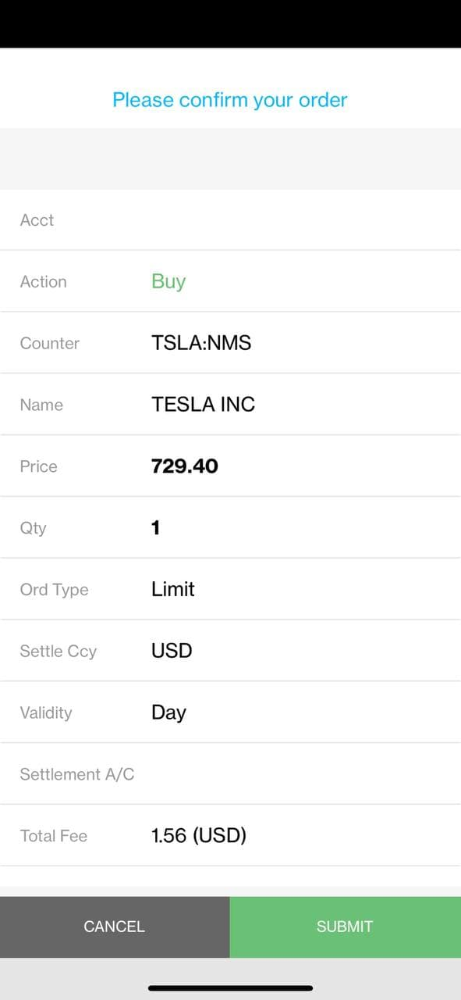
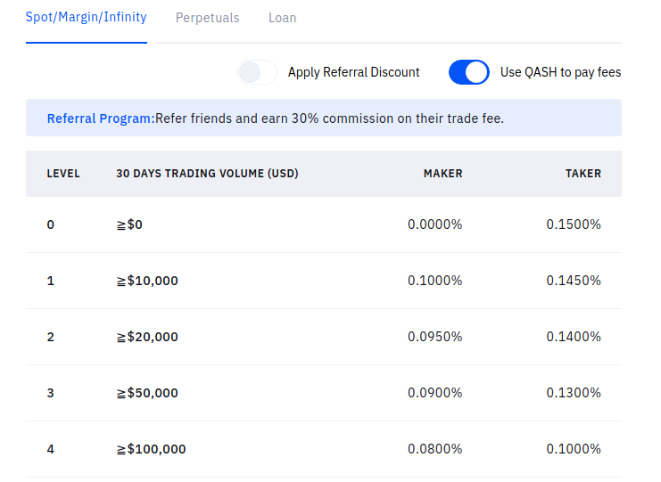
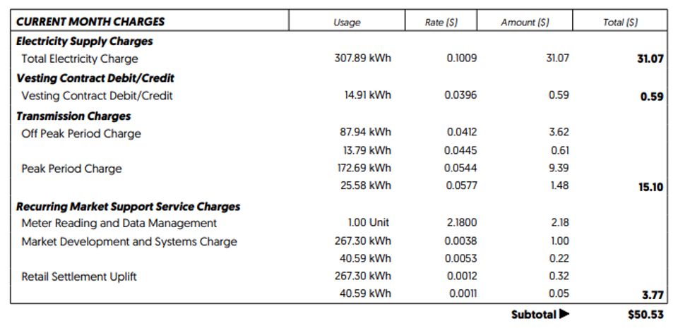
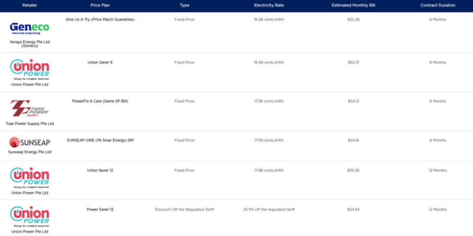

> “Don’t tell me what to do, just show me your portfolio”

That is what Nassim Nicholas Taleb said in his book [Skin in the Game](https://amzn.to/2PneDkM) to anyone in the business of advising what others should invest in. If you trust the advisers’ judgment, you will copy his portfolio. This means perfect skin in the game for the adviser.

In this post, I share the list of tools, products, and services that I’ve been using for myself and the rationale behind using them. It covers everything from a savings account, credit card, brokerage, cryptocurrency exchange, mortgage, and even utility account.

> The problem with financial independence advice is it always feels like it’s written for someone other than you.

Before I begin, I’ll establish some background about myself:

* I’m a millennial living in Singapore
* I’ve worked in a job (what society defines) for close to 4 years — as a software engineer
* Many people might describe me as a cypherpunk — I’m basically a blockchain engineer, I’m a sucker for [privacy tech](https://geek.sg/blog/zkp-in-civic-tech%E2%80%8A-%E2%80%8Are-imagining-identity-infrastructures), and I’m [invested in cryptocurrencies](https://geek.sg/blog/passive-investing-strategies-with-cryptocurrency)
* I rather spend my time doing something I enjoy or has the potential to make tons of money, [rather than fretting about the little things](https://themakingofamillionaire.com/dont-sweat-the-small-things-on-your-path-to-financial-independence-a0bfd3c4b8d6)

My main philosophy in personal finance is to optimize and automate the boring stuff while leveraging on your talent to yield disproportional returns. That said, here’s my personal financial stack — or #SGFINSTACK:

# Savings Account

I use [Standard Chartered’s Bonus$aver Account](https://www.sc.com/sg/save/current-accounts/bonussaver/) for my savings account. While it boasts a 2.38% interest rate, I’m probably getting only 0.58% on my balances since I do not have eligible investments or insurances with the bank.

So why do I still use this account? Here’s why:

* I keep my balances in my savings account really low (few months of living expenses), so the low interest rates don’t really bother me. Most of my money is plowing the land in my investment account.
* I can walk into any branch, do my thing, and walk out in under 20 minutes (as a non-priority customer) since they do not serve as many customers as DBS or OCBC.
* It synergizes with my brokerage and mortgage.
* It’s relatively easy to become a priority customer compared to other banks. You will see how this is important in the brokerage and mortgage segment later.

# Credit Card

I used to hold [Citibank’s PremierMiles Card](https://www.citibank.com.sg/credit-cards/travel/premiermiles-card/) to get airline miles but I found out that I hate to spend my time figuring out how to maximize the miles accrual and spending the miles. In this end I spent all my miles to offset my credit card charges and left for a simple and straightforward cashback model.

I now use [Standard Chartered’s Unlimited Cashback Credit Card](https://www.sc.com/sg/credit-cards/unlimited-cashback-credit-card/) for my only credit card. I love the simplicity of the cashback model. It’s much simpler to understand I pay 1.5% less on my bills.

To prevent missing out on credit card payments, I’ve also automated the credit card bill payment by setting up a GIRO instruction with the bank to automatically pay off the card bill at the end of the money. That’s how I do not get slapped with random credit card late payments which will affect my credit score and really expensive.

I free up a couple of minutes and am less stressed about remembering to pay off bills each month.

# Brokerage

Using [Standard Chartered’s Online Trading Platform](https://www.sc.com/sg/wealth/investment/online-trading/) should not come as a surprise to you if you’ve read this far.

Again, the platform does not have the lowest brokerage fees across all the platforms. If you are looking for the lowest fee, go look at Interactive Broker or something.

I like the platform because:

* It has access to all major markets
* Fees are decent — I get 0.18–0.20% fee with no minimum fees (it’s 0.20–0.25% with $10 minimum for non-priority customers)
* It’s extremely easy to move money between my accounts. It takes less than 2 mins to convert SGD from my savings account to USD and buy stocks on the LSE market.

Buy 1 share of TSLA? No problem!

# Cryptocurrency Exchange

Having compared the [best cryptocurrency exchanges in Singapore](https://geek.sg/blog/complete-guide-to-buying-bitcoin-ethereum-or-other-cryptocurrencies-in-singapore), I’m settled on [Liquid](https://www.liquid.com/sign-up/?affiliate=-YNsiS2d28178).

Being a cypherpunk who has been in the space since 2017, Liquid has shown to be consistent and [secured](https://www.liquid.com/security/#asset-protection). Also, it meets my needs by being able to:

* The lowest fees in the market with direct fiat deposit!
* Withdraw up to $30k SGD a day (and $300k SGD a month)
* Allows you to [loan your fiat or cryptocurrencies for passive income](https://geek.sg/blog/passive-investing-strategies-with-cryptocurrency)

For traders with smaller volumes, my recommendation will be using what I used previously, [CoinHako](https://www.coinhako.com/affiliations/sign_up/RAYMONDYEH_4046), for ease of use and friendly interfaces.

# Mortgage

I’ve bought an HDB apartment for under $400k SGD in 2020 with my wife. We use the [Standard Chartered’s HDB Home Suite loan](https://www.sc.com/sg/borrow/mortgages/hdb-home-suite/) to borrow ~$290k at a fixed interest rate of 1.5% for 2 years and 1% over [3-month SIBOR](https://www.abs.org.sg/benchmark-rates/rates-sibor) thereafter.

As we are borrowing a small sum of money (compared to many home buyer maxing out on their first home purchase), [most of the listed rates of the banks](https://www.redbrick.sg/blog/best-home-loan-singapore/) does not apply to us. Even Standard Chartered initially quoted a much higher rate.

However, because of the priority status, the bank was able to remove the minimum loan amount for us and for us to enjoy one of the lowest mortgage rates on the market for a small sum of money.

In addition, my friend who got a loan from SC “referred” me to the loan and we ended up splitting the referral fees midway. Do [reach out to me](https://geek.sg/contact/) if you like similar arrangements¹

Since I’m on the topic of priority status, once you have a saving account and brokerage account with the bank, they both count towards the minimum deposits, so it’s not that hard once you have stashed up some money in the brokerage account. There is no need to purchase fixed deposits or other financial products to meet that requirement.

# Utility

With the Open Eletricity Market, Singaporeans can choose which electricity provider to subscribe to. Many have hopped over to retailers like Sembcorp, Senoko, Tuas Power, etc because of allures like credit card rebates, referrals, promo codes, amongst all other financial shenanigans. I chose to have the simple SP Wholesale Electricity Plan. Do note that is NOT the default electricity plan Singapore Power provides!

The SP Wholesale Electricity Plan is basically hidden away from the consumer because:

1. The price is good, there are no incentives for SP to advertise it to cannibalize their existing subscriber to the default plan.
2. There is no referral program so most financial bloggers and product comparison platforms do not even talk about it. They simply do not earn from referring their reader that way.
3. Information on the charges is limited. The best you’ve got is [this fact sheet for non-standard price plan](https://www.spgroup.com.sg/wcm/connect/spgrp/ef571fe9-86f4-4bea-a491-e5dc2eb8f1aa/%5BInfo%5D+Fact+Sheet+on+Purchase+of+Electricity+from+Wholesale+Electricity+Market+through+SP+Services+Ltd.pdf?MOD=AJPERES). The price information is not even on the [Open Electricity Market Comparison Tool](https://compare.openelectricitymarket.sg/#/pricePlans/list) since it fluctuates every 30 min depending on demand and supply.

Since the wholesale pricing fluctuates every 30min depending on the demand and supply, it is impossible to get the future rate, but here’s my bill for Apr 2021 for your reference.

10.09 cents/kWh for my bill in Apr 2021

And in comparison the estimates if you’ve gone for other plans for the same usage (data from <https://compare.openelectricitymarket.sg/>):

The cheapest on the market is 16.98 cents/kWh

To help you understand how the rates looked like in the previous months for my household, here are some references:

* Jan 2021–6.82cents/kWh
* Feb 2021–7.92 cents/kWh
* Mar 2021–8.70 cents/kWh
* Apr 2021–10.09 cents/kWh

A nice thing to add is that SP’s app allows you to add a credit card as the payment method and charges to the card automatically every month!

If you like to switch to the wholesale plan from the regular SP plan, check out this [blog post](https://community.whatcard.sg/t/how-you-could-save-money-by-switching-to-sps-wholesale-electricity-rates/861).

# Disclaimer

This article is not sponsored by any of the companies mentioned (Standard Chartered, Singapore Power, Liquid, CoinHako, etc) and does not constitute financial advice. The numbers and figures are correct as retrieved on the date 25 Apr 2021 and may change at the discretion of the different companies. Do your own research.