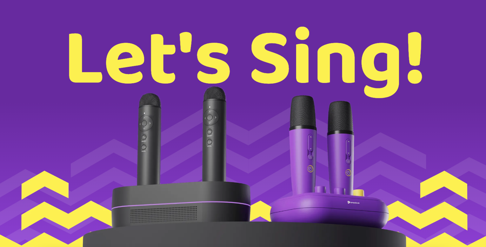

As a business you sell "products" to "customers". If the business cannot define what that product is or who their customers are, it has failed. 

To understand what a "product" means to a "customer" we can take a look at an example of a wireless karaoke set that be setup at home:

At first glance, we see the wireless microphone. Is that the product?

Of course, the microphones does not work alone, it needs the accompanying mobile app that allows you to select songs and control the karaoke system. Is the mics + the app the product?

If you dig deeper, the customers who wants the product wants to be able to sing at home with their spouse or when hosting friends. So is "singing" the product?

Why do people want to expel air through their vocal cords which vibrates and create sound waves, especially when most of us sound so bad? The answer is "fun". So is "fun" the product? 

Why do we bother to have fun with friends or loved ones? Maybe there is a deeper need for love and belonging! So is "love and belonging" the product? 

Maybe. 

**What we put in the box:**

Let's consider what the company can put into the box on the shelves. It's simply the microphone set and the instructions to download the mobile app. So in the most basic way you can say "the microphone set is the product".

**How we tell people what's in that box:**

However, the website uses a combination of vibrant colors and simple messages such as "Let's Sing" & "Make your living room your stage" to sell the idea that you can have tons of fun with this product. So in a slightly more abstract way you can say "to have fun singing at home is the product". 

And that creates an [emotional response to the purchase](https://www.inc.com/logan-chierotti/harvard-professor-says-95-of-purchasing-decisions-are-subconscious.html)!

- - -

## Parallels with Bluejay

Let's take a look at what is the product at Bluejay. It is not:

* The BLU token - That's like Tesla saying their stocks is the product
* The stabilizing bond - That's like Heinz saying their canning machines is the product
* The bluSGD stablecoins - That's like Interactive Broker saying your deposit if their product

A litmus test is that "If you have to ask why people wants this, it is not the product".

So what IS the product for us? The "what we put in the box" answer could be one of the following:

* A business loan with a high interest rate of 18%
* A bundle of business loans with moderate risk and an interest of 12% 
* A savings product with higher-than-bank interest of 8%
* Microloans to farmers in Indonesia
* etc

Now, before we think about the "how we tell people what's in the box", we need to think about who the customer is. 

> You can never have a product without understanding the customer first.

It is likely that there is not just a single archetype of customers in this case when a myraid of products are offered on the Earn marketplace. In that case, it's important to figure out who wants what, instead over overgeneralizing the range of products offered and the segments of customers. 

So the first stab at segmenting the customer could look like:

* A "DeFi Degen" having fun investing in a range of risky products who doesn't mind if some investments goes to zero
* A early careerist who is looking to grow his money quickly but not getting into risky products
* A "boomer" who is used to only using savings or at most fixed deposits at the bank. Alternatively, a "financial optimizer" who is always on the look out for the next marginally better product and always willing to make the switch for a 0.15% interest difference. Alternatively, a Burmese professional who is actively looking for ways to protect his assets in Myanmar Kyat from eroding in value.
* A ESG conscious investor who wants to make an impact with his investment, with altruistic goals as the priority (perhaps even a customer of Kiva)

Once we've a better understanding of the different segments of customer that fits the range of product, the "how we tell people what's in the box" answer might therefore be:

* A degenerate investment that allows you to bet on businesses you like and make up to 18% on. 
* A high quality investment that doubles your capital in 6 years that spreads out concentration risk on single business. Also, other rich and successful individuals or funds are also participating in the same deal.
* A safe fixed deposit program, but on steroids.
* A way to make someone's dream come true while keeping your capital and earning interest. It's a loan, not a donation!

So, there you have it, Bluejay is offering `<insert how-we tell-people-what's-in-the-box answer>` to you as a `<insert corresponding customer-segment answer>`.

Yes, it will be a different statement for different people. 

- - -

### A footnote on Ideals

As a company we also want to be careful about not trying to sell ideals such as "access" or"financial inclusion" early on. 

The reason is that the customers do not have an immediate need for these, at least until your brand identity has been established.
To sell "Access" early on is like:

* Grab trying to sell "convenience" instead of "get to somewhere without the unpredictability of trying to hail a taxi" or "get food to your busy ass".
* DBS trying to sell "financial freedom" instead of "a safe place to keep your money and send them to someone else".