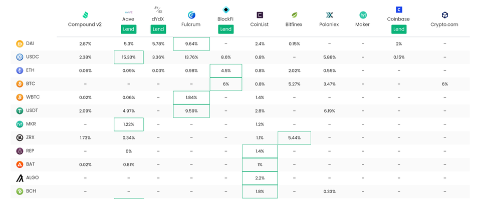
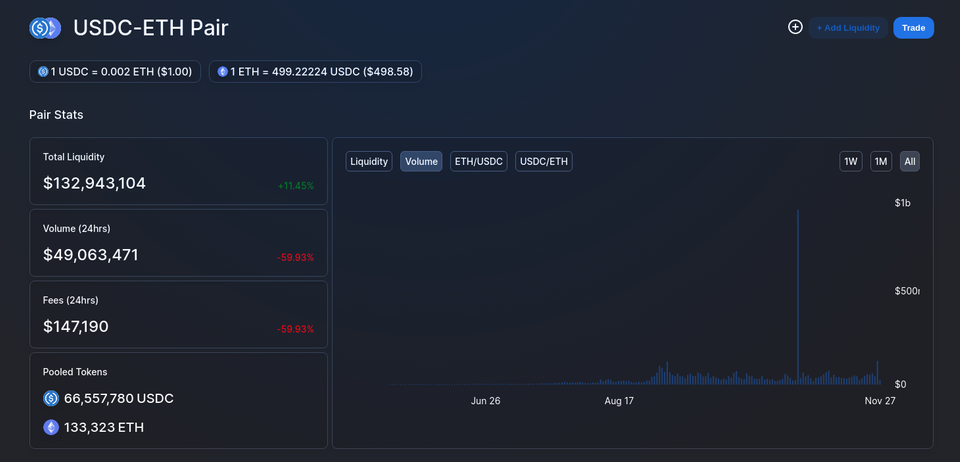

You have purchased your first Bitcoin or Ether, now what?

My relationship with Bitcoin & Ethereum began back in 2017 after figuring out [how to buy cryptocurrencies in Singapore](https://geek.sg/blog/complete-guide-to-buying-bitcoin-ethereum-or-other-cryptocurrencies-in-singapore). Since then, I’ve tried all kind of strategies to rake in extra dollars with crypto. The strategies that outperforms the rest are all simple passive strategies — the only exception is arbitrage trading.

In this post I’ll share some of my favorite ways of making the cryptos work for me. In each section, I’ll also discuss the associated risk and suitable environment to employ the strategy.

### Long Term Investment Horizon

Your crypto investment strategies cannot truly be passive when you are exposed to underlying asset which you do not believe to succeed in the long term.

For that reason, I’ve kept my portfolio really simple. I own only cryptocurrencies I believe in.

My crypto portfolio consist of only two cryptocurrencies, Bitcoin and Ethereum. Bitcoin’s role in the portfolio is digital gold — providing hedge against inflation and other asset classes in the long term. Ether on the other hand represents my optimism on the programmable blockchain. With the largest developer mindshare and greatest thought leadership, I believe that the platform will continue to outperform other platforms in the long term.

You will have to find your own reasons in believing in the cryptocurrencies you are buying into. These reasons will help you make rationale decisions in the midst of panic buying & selling and help you sleep at night while your cryptos work for you.

Without further ado, here’s the top passive investing strategies:

### Buy & Hold

The simplest strategy is to do nothing with the purchased cryptocurrencies. With cryptocurrencies like Ethereum where large amount of work is done to bring in more users, applications and use cases by the community, you can simply do nothing and simply benefit from the long term growth of the project as a whole.

In fact whenever I look back at period of time where I traded actively, I regret selling some asset and not being able to find good entry point after those transactions. If I had done nothing or even dollar-cost-average into the market during the period my profits would have been much more.

**When does this work?**

This strategy works best when the price of the cryptocurrency is trending upward in the long term. This is also best if you would like to store your cryptocurrencies on a hardware wallet like a [Ledger Nano](https://www.ledger.com/) to prevent it from being stolen in a [exchange](https://www.ledger.com/academy/crypto/hacks-timeline) or smart contract hack.

### Lending on Cryptocurrency Exchanges

If you would keep your cryptocurrencies on exchanges, you might want to lend these cryptocurrencies to other traders on that platform for margin trading. In return, you earn interests on the amount of cryptos that were borrowed.

For a long period, I was offering BTC, ETH and SGD for loan on [Liquid](https://www.liquid.com/sign-up/?affiliate=-YNsiS2d28178) and [Poloniex](https://poloniex.com/signup?c=7GPSYYY7). The annualized interests typically ranges from 2–5%.

**Risk**

These lending tend to be relatively safe as exchanges will forcibly liquidate positions which are unable to finance their debt positions. However, in the case of huge market movements, the debtor might be able to default on the debt. In addition, as the funds are stored with the exchanges, you are also vulnerable to funds loss if the exchange is hacked.

**When does this work?**

This works best if you like a simple way to earn interest on your assets and you trust the exchange as a custody to your funds. The additional interest rate on top of capital appreciation on the underlying asset is really nice.

### Lending on Decentralized Platforms

> Discover lending rates on <https://defirate.com/lend/>

For the folks holding on ETH, you may also choose to lend them at various lending platforms. The rates on these decentralized lending platform typically outperforms the rates on centralized exchanges as supply for assets are typically lower as more lenders favor the simpler interfaces for centralized exchanges.

In addition, for some platform like [Compound](https://compound.finance/) you may choose to [enter a leveraged lending position](https://thedefiant.substack.com/p/comp-frenzy-continues-with-leveraged-2aa) where you supply and borrow asset at the same time to earn the difference between the lending rate and borrowing rate (assuming lending rate exceeds borrowing rate) and any reward token such as COMP.

I’ve personally provided a loan at Compound and have found that the transaction fees for setting up loans can be quite hefty. The entire setup cost came close to $100 and the cost to unwind my lending position was around $30. I figured that for this approach to even make sense, one has to provide loan for at least $10k worth of assets.

**Risk**

In the case where you are simply lending, there is the platform risk and credit risk. The platform could be hit with an unknown exploit or that the users fail to repay the loan due to a huge market movement like the [black Thursday](https://medium.com/aave/crypto-black-thursday-the-good-the-bad-and-the-ugly-7f2acebf2b83). However, the chance that a bug exist on the platform decreases as the platform is battle tested across time.

In the case where you are borrowing and lending, there are additional interest rate risk where the lending rate falls below borrowing rate, resulting in a net negative interest rate.

**When does this work?**

This strategy works best when you are comfortable in the DeFi space. It can squeeze out additional yield compared to lending on exchanges on the long term.

In addition, if you know that the value of the borrowed asset will depreciate against the lent asset, the leverage position is essentially a [long/short strategy](https://www.investopedia.com/terms/l/long-shortequity.asp) used by hedge funds to profit from relative price movements instead of absolute price movements. That means, making money even in a downward trending market.

### Providing Liquidity as Market Maker

In the DeFi space, many players are constantly exchanging one asset for another. To facilitate these swaps, decentralized exchanges like uniswap and balancer have emerged. These exchanges allow users to supply liquidity for two or more tokens to allow other traders to swap between the tokens. In exchange, these liquidity provider earns the exchange fees, a percentage of the value exchanged.

To do so one simply have to add two (or more) token to the liquidity pool. For instance, to provide liquidity to the Uniswap’s USDC-ETH pool, I’ll have to add equal value of USDC and ETH token to the pool. This enable other traders to swap their USDC to ETH or vice versa. In return, fees equal to 0.3% of the trade will be shared equally to all liquidity provider of that pool, proportional to their share of the pool.

In the diagram above, we can see that $147k of fees were shared among liquidity providers for the USDC-ETH pool. That means if I added a total of $10k liquidity, I’ll be earning ~$11 (10,000/132,000,000*147,000)in a single day. Extrapolate that earning for a year and we get around 40% yield for providing liquidity.

My favorite platform to provide liquidity are Uniwswap and Balancer. Uniswap is one of the largest pools which naturally collects the more fees than platforms which fewer people trade on. However, Uniswap does not allow you to configure the ratio of assets in the pool — two tokens will always be 50% of the value.

Balancer on the other hand is more flexible with the allocation, allowing you to configure both the exchange fees and asset allocation. In addition, providing liquidity to Balancer earns you extra BAL token which can be claimed every week for some extra earnings.

**Risk**

Other than platform risk, liquidity provider are also subjected to loss of asset value due to impermanent loss. When you provide liquidity you are exposed to two separate assets and there is continuous re-balancing when price deviates from that of your entry position. You will be worse off than if you had held both assets separately. However, if the relative price returns to the previous levels, you do not suffer from this effect (therefore “impermanent” loss).

There is [a reddit thread](https://www.reddit.com/r/UniSwap/comments/eza8u4/how_to_calculate_uniswap_impermanent_losses_fees/) that explains this and provides tools to do the calculations.

**When does this work?**

This strategy works best when the market is moving sideway and worst when the price of the cryptocurrency is increasing or decreasing rapidly.

When the market is moving sideway, you earn the exchanges fees without being affected by the impermanent losses. When the price is going up or down rapidly, the exchange fees accrued may not cover the impermanent losses.

I’m currently providing liquidity for WBTC-ETH. This allows me to have an auto-balancing portfolio of equal value of Bitcoin and Ether which earns me exchange fees whenever someone trades WBTC for ETH or vice versa. As both assets are strongly correlated in terms of price movement, I’m not too concern with impermanent losses as the relative price between them changes.

- - -

These are all the different passive investing strategies I’ve tried. If you have any other ideas, feel free to contact me.

As always, always do your own research on the risk associated with investing in crpytocurrencies. You may check out my article on [breaking down the different types of risk associated](https://geek.sg/blog/dissecting-risk-in-defi-projects).

If you would like to start buying cryptocurrencies but don’t know which exchanges to go to, I’ve written a [review of cryptocurrency exchanges in Singapore](https://geek.sg/blog/complete-guide-to-buying-bitcoin-ethereum-or-other-cryptocurrencies-in-singapore) based on my own experience.

To be notified of more articles like this, [subscribe to my mailing list](https://geek.us2.list-manage.com/subscribe?u=bfcc21792349f4f0eaff4a2a3&id=694896a0df).