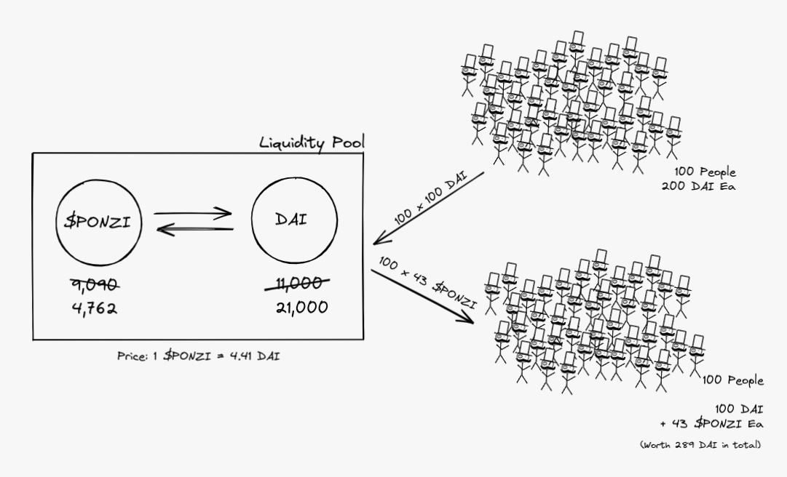

The story starts simply with a developer launching a new project. With some initial capital of 10,000 DAI (a USD stablecoin), he minted 10,000 new $PONZI coins and created an Uniswap liquidity pool where anyone can buy and sell the coin for DAI.

Each $PONZI can be bought or sold for 1 DAI at this point in time.

10 of the friends of the developer received words about the project and decided to support it. Since they have 200 DAI each, they decided to be prudent and only invest 50% of their bags. Each of them swaps 100 DAI for 91 $PONZI. Now they have 100 DAI and 91 $PONZI each.

Since the supply of DAI raised and $PONZI dropped on the liquidity pool, the spot price for $PONZI is now 1.21 DAI. Each of these friends found that their net worth is now 210 DAI. They each made $10 on the purchase!

They begin to tell other friends and different communities about this project and how early is everyone to the game.

Very soon, a large community gathered around the project. Similar to the first 10 supporters, they each have 200 DAI and swap 100 DAI for the shiny $PONZI coin. They receive 43 $PONZI for their DAI, pushing the spot price of $PONZI to 4.41 DAI on the liquidity pool.

While they did not receive as much $PONZI as the initial group, they were satisfied because their net worth is 289 DAI now. They made 89 DAI on this purchase itself!

In their mind, the coin must drop half of its value before they lose money on their smart investment. Since they are super early to the project, if the value drops, they will simply buy the dip!

“WAGMI” echos through crypto Twitter and various discord groups.

While new members found themselves 89 DAI richer, the OGs of the project found themselves sitting on huge bags. Without any trades, their holdings are now worth 501 DAI each!

With the spotlight on the $PONZI project, members of the community managed to secure a partnership with a lending pool to use $PONZI as collateral to lend other assets at a 120% collateralization ratio. This is a no-brainer since it generates more income for the lending protocol and brings the two communities together.

The new lending facility allows anyone with $PONZI to lock them up as collateral and lend approx 80% of the value as DAI. The 10 OGs decided this is the best time to rack up another bag of $PONZI before more people hear about the project, discord explodes and $PONZI mooned.

Each of the 10 OG locks up 50 $PONZI (worth 220 DAI) to borrow 183 DAI.

Using the borrowed DAI, they bought another 41 $PONZI on the liquidity pool each. Now they each have 83 DAI, 82 $PONZI, 50 $PONZI locked in the lending pool, and a debt of 183 DAI to the lending pool.

Since the purchase of $PONZI drove the price to 5.29 DAI on the liquidity pool, each of them has a net worth of 589 DAI now. Not bad for starting out with only 200 DAI.

Of course, they are not the only ones who made money here. The other community members who are in the (3,3) game also find their net worth mooning!

While the OGs have nearly 3x their initial investment, the new community members are now sitting on more than 150% of their initial assets.

In a weird way, everyone made money! With 110 members bringing 200 DAI (a total of 22k DAI) into the system initially, their combined net worth is now 38k!

No one asked where did the extra DAI come from. It’s such an unimportant question compared to…

To be continued…

- - -

The article serves to show how “investors” in a valueless project can find themselves making a ton of money in a frothy market.

The story sets the scenario up to exaggerate the lack of understanding of liquidity in the DeFi space and how risk is being built up with the use of margin trades. Stay tuned to the next part to see how it plays out for our “investors” when the market turn (hint: someone got a lambo).

- - -

I’m a developer working on [Bluejay Finance](https://bluejay.finance/), a project focusing on creating efficient non-USD stablecoins.

If you like to follow my work or be updated when the next part of this story is out, feel free to [sign up on my mailing list here](https://geek.us2.list-manage.com/subscribe?u=bfcc21792349f4f0eaff4a2a3&id=694896a0df) or [follow me on Twitter](https://twitter.com/geek_sg).

- - -

Some calculations have been aggregated and simplified for readers. If you are keen on the math behind it, read into Uniswap’s constant product formula that is used in most liquidity pools. For the lending pools, you may look into the whitepaper for Compound, Aave, etc.