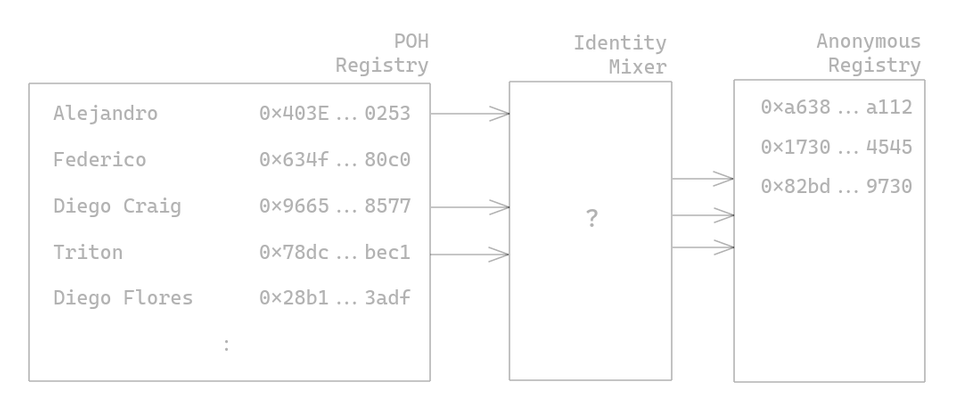
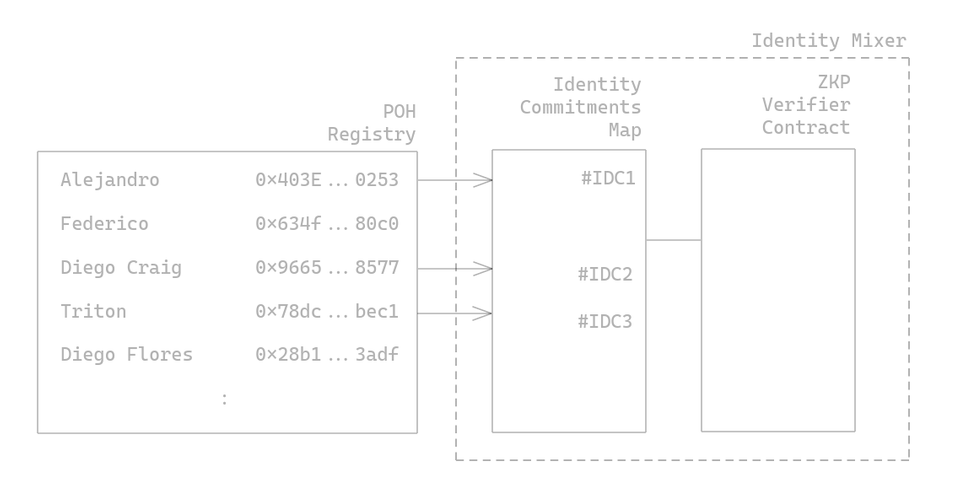
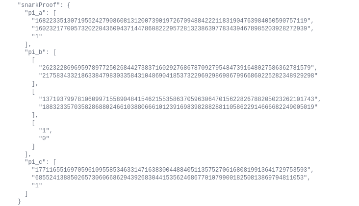

- - -

### Introduction to POH

[Proof of Humanity](https://www.proofofhumanity.id/) is a great project to create a Sybil-resistant registry of humans. By ensuring each human gets registered to the registry at most once, the project can become a core infrastructure for applications that are more vulnerable to Sybil attacks in the decentralized world. One such use case is to [prevent dishonest funding activities on Gitcoin](https://twitter.com/JimmyRagosa/status/1389604000635424769) which uses a quadratic funding model which is vulnerable to Sybil attacks.

The cherry on top of the registry is getting a [free Universal Basic Income (UBI) token](https://blog.kleros.io/introducing-ubi-universal-basic-income-for-humans/) dripped to your wallet every hour for just being a human on that registry!

### The Problem

Your face, name are publicly linked to your wallet address

The registry works in a way that people can challenge any registration on the registry that they deem to be flouting the rules (ie. duplicate submissions). If found “guilty” the registrant flouting the rule will be penalized and have their deposits confiscated.

> “Honestly, I do not want to challenge the wrong person and have my face used against me.
>
> Privacy is the chief concern. Challenges can cause vendettas and social pressure should not deter challenges.” — Voices on the ground

The problem with the challenge process is that if a person uses an address on the registry to challenge another person (or bot in some case), the fear for retaliation, intimidation, or public scrutiny could become a big deterrent factor for honest actors to penalize and remove dishonest actors in the network.

Looking forward to the future where the project is [used by Gitcoin for funding round 10 for more matching bonuses](https://twitter.com/JimmyRagosa/status/1389604000635424769), more privacy problems might arise. The recent crypto boom has made many individuals in the ecosystem millionaires and they may not have the intention to reveal their newfound net worth to family, friends, and the taxman!

> “Ring signatures to protect privacy sir?” — Voices on the ground

The community has been discussing various strategies around the privacy problem but it's non-trivial. The problem is not simply set membership — which ring signature could solve — but also maintaining Sybil-proof.

How might we ensure that one human in the registry has at most one address on the registry?

I’ve created a POC, [VeilOS](https://veilos.io/), previously during my [fellowship tenure with RadicalXChange to solve exactly this problem](https://www.radicalxchange.org/fellowship/veilos/), using [Semaphore](https://semaphore.appliedzkp.org/). Two variants of the POC can be used to solve the problem:

### Solution A — Identity Mixer

Overview of solution

One of the simplest solutions to the problem is using an identity mixer contract (built with Zero-knowledge proof) to extend the current registry.

Users who would like to have an address not tied to their public profile can insert their address to the new anonymous registry through a two-step process:

1. Registering an identity commitment¹ for the mixer — and nullifying their registry entry in the original POH registry. Ie `isRegistered(0x403E…0253)` returns false after registering his identity commitment while `isRegistered(0x634f…80c0)` returns true when no identity commitment is registered.
2. Once the anonymity set is sufficiently large, individuals who have submitted their identity commitment can create a proof that asserts that they are a member of the set and that they have not submitted a prior address to the anonymous registry.

(In the image above, 3 users have chosen to anonymize their address while 2 users will remain using their public address.)

On external smart contracts, there will not be any need for any changes to the [ProofOfHumanity Interface](https://github.com/Proof-Of-Humanity/Proof-Of-Humanity/blob/master/contracts/ProofOfHumanityProxy.sol#L12).

One problem with this solution is that an address on the anonymous registry can never be removed in situations where an individual is removed from the original registry because his profile is challenged and removed (deceased, duplicate, etc). This is because it is impossible to identify and link the entry in both registries (well if you could, then it really isn't anonymous).

If that is not a problem, this is one of the most elegant solutions for the problem. If that is a problem, then we might need a solution that requires new proof for every transaction.

### Solution B — Proof of Membership & Non-participation

Identity Mixer gadget in detail (kinda)

In the previous solution, the internal workings of the Identity Mixer mechanism can be abstracted away from external smart contracts (ie Gitcoin). However, if finer controls are needed for per-transaction verification — you are part of the POH registry right now — the gadget can be taken apart where external contracts can call the ZKP Verifier contract directly to verify that a given address belongs to one of those in the POH registry who has registered an identity commitment.

This means that the external contract & web application will have to:

Proof required to be submitted via external dapp & contract

1. Deal with the proof submission which could look messy (see above)
2. Additional gas cost for **every single transaction** that is validating the proof (ouchie)
3. Manage & store additional states on their smart contract like the `nullifier` to prevent duplicate submission from a single address

Basically, it offloads the complexity of the address shielding to external contracts in return for a more accurate representation of the current registry (which potentially include profiles that were registered but were removed if they have submitted their identity commitment AND registered an anonymous address)

### A Problem Close to Heart

Privacy is an interesting problem for me and is a topic close to heart. Hence, the fellowship project with RadicalXChange and also these articles:

* [Why should you care about privacy — even if you had nothing to hide](https://geek.sg/blog/why-should-you-care-about-privacy%E2%80%8A-%E2%80%8Aeven-if-you-had-nothing-to%C2%A0hide)
* [VeilOS — Preview of Privacy Preserving Application Engine](https://geek.sg/blog/veilos-preview-of-privacy-preserving-application-engine)
* [Decentralized Food Distribution Organisation](https://geek.sg/blog/decentralized-food-distribution-organisation)
* [ZKP in Civic Tech — Re-imagining Identity Infrastructures](https://geek.sg/blog/zkp-in-civic-tech%E2%80%8A-%E2%80%8Are-imagining-identity-infrastructures)

I’m currently in the midst of launching my own project to solve privacy problems, not just on-chain but also real-world applications like deliberation and governance platforms for corporates and governments.

If the POH DAO would like to collaborate to tackle the privacy concerns, I’m open to working out a consultation proposal on the [governance board](https://gov.proofofhumanity.id/).

In the meanwhile, if you are excited about privacy technology, or want to stay tuned to be the first to hear about my project launch², feel free to [sign up on my mailing list here](https://geek.us2.list-manage.com/subscribe?u=bfcc21792349f4f0eaff4a2a3&id=694896a0df).

- - -

¹ Think of an identity commitment as a public key in an asymmetric keypair, but not.

² P.s. Did I hear tokens?