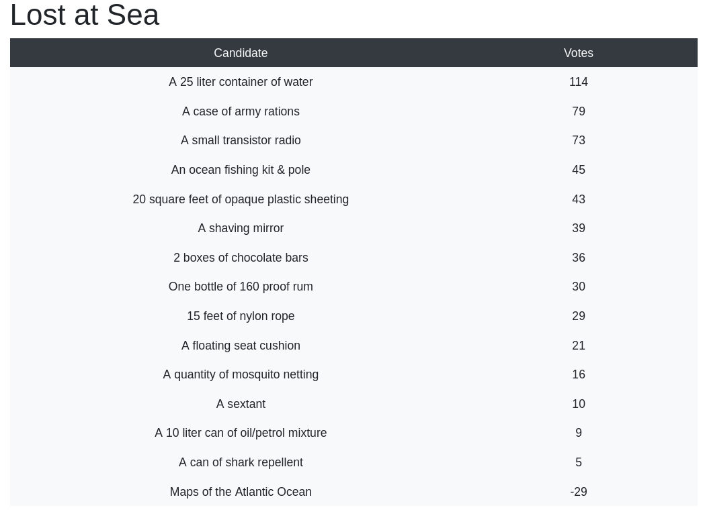
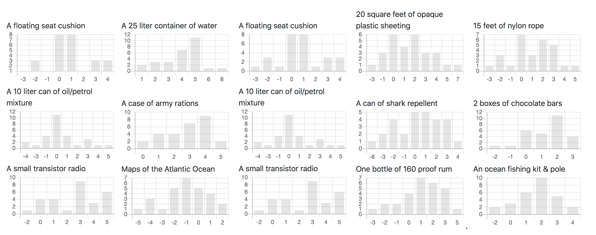
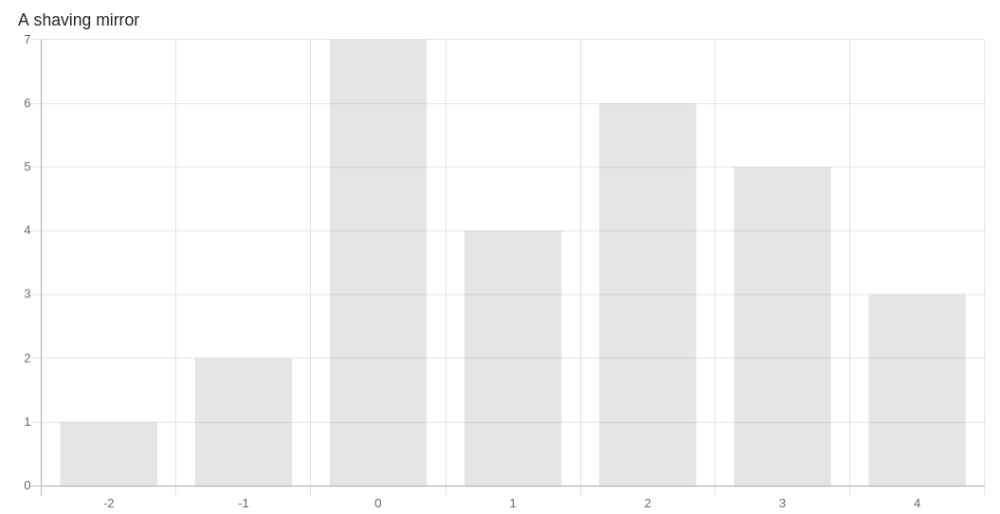
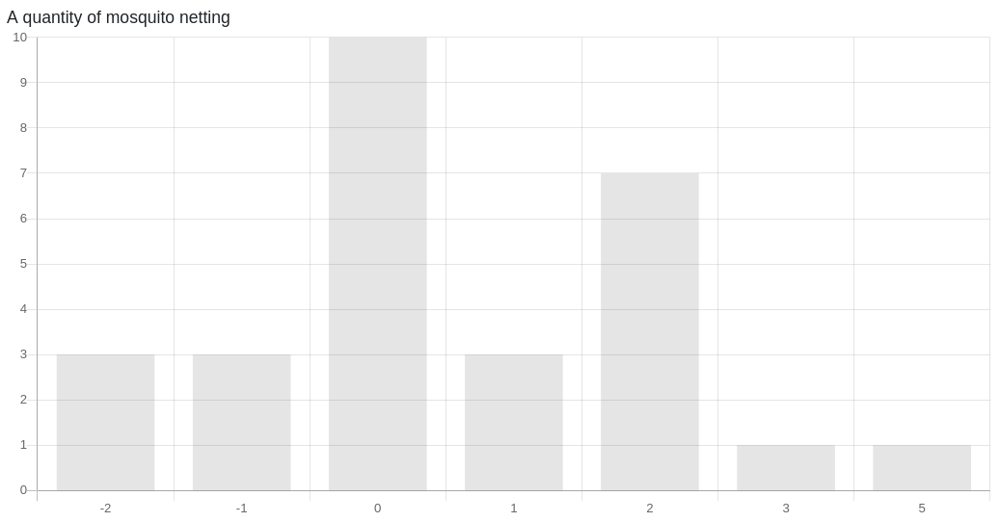
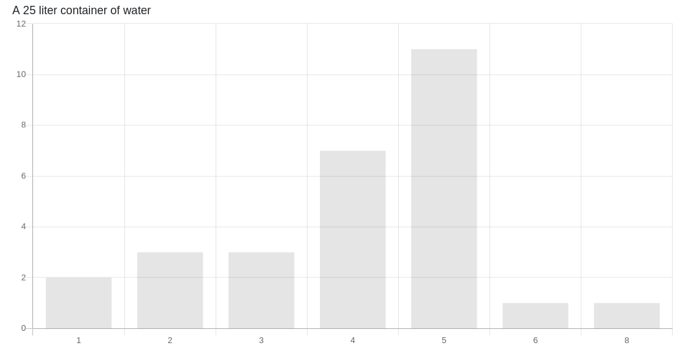
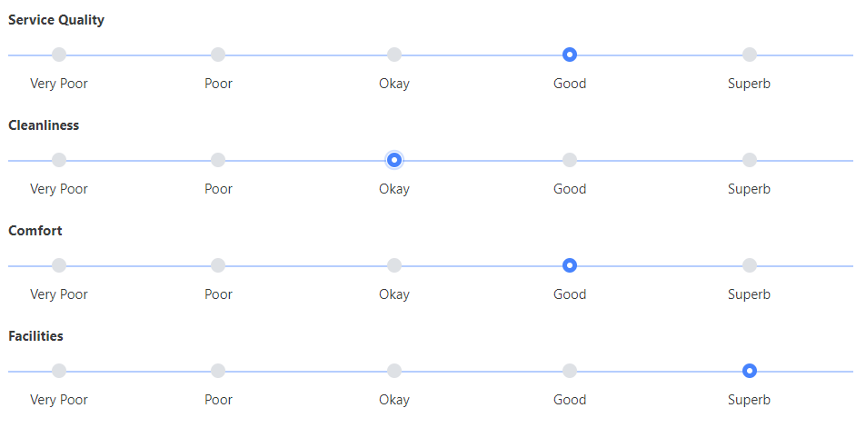
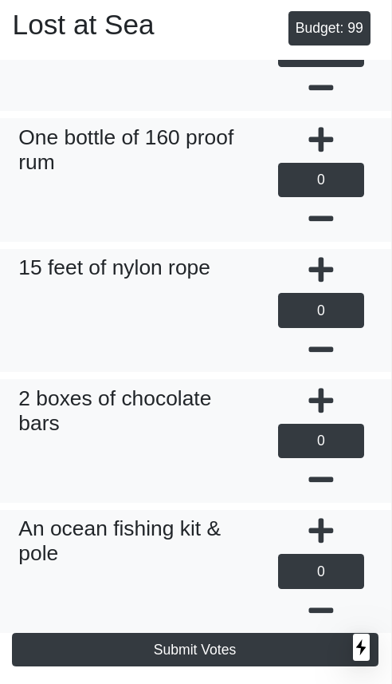

In a series of unfortunate events, you and your friends are left stranded in the middle of the Atlantic ocean. Together, you have managed to salvage some items from the wreck. As a group, your task is to agree on the importance of these items. Your decisions will determine if you get to walk away alive. The problem now is how do you decide on the importance?

This is a <a href="https://insight.typepad.co.uk/insight/2009/02/lost-at-sea-a-team-building-game.html">common game</a> used in leadership programs to test how people communicate and come to decisions in a group. Having learnt about quadratic voting recently, I've decided to put it to test - to see how effectively it can be used to make decisions as a group.

As an experiment, I cast 30 colleagues into the ocean. They were given 5 minutes to decide on their individual preference, another 10 minutes to get a consensus in small groups of 5 (using any method), and finally, another 5 minutes to come to a consensus as a whole using <a href="https://qv.geek.sg/">a quadratic voting app</a>.

  Severely dehydrated and barely alive

The results? They got rescued as a group, albeit severely dehydrated and barely alive.

One thing observed was that they made far better decision using quadratic voting (QV) as compared to other methods used for small group discussion. So what exactly is QV and how it beats other voting mechanisms?

## What is Quadratic Voting (QV)?

  Distribution of votes on individual items

Quadratic voting is a collective decision-making procedure where individuals purchase votes to express their preferences. Each voter is allotted a budget of vote credits. Voters are allowed to cast multiple votes, negative votes or even not vote on each item. The cost of votes, in terms of vote credits, is the squared number of votes. For instance, it will cost 1 credit for 1 vote, 25 credits for 5 votes or 81 credits for -9 votes.

As simple as the mechanism sound, it allows voters to:

- express their preference intensity
- exercise moderation
- perform tradeoffs

This allows quadratic voting to achieve the greatest possible good for the greatest number of group members

## Expression of Preference Intensity

  Keeping yourself cleanly shaven when stranded is important

In the case of the shaving mirror, we can observe that most voters do not have an opinion (0 votes). They might not know that a simple mirror can generate five to seven million candlepower of light. The reflected sunbeam can even be seen beyond the horizon!

However, there are a few candidates who strongly believe that the mirror is important and gave it 4 votes. Without those 3 voters, the shaving mirror will be ranked even further down the chart.

With the ability to cast multiple votes on a single candidate, it allows voters to indicate their preference intensity on a single subject, or save the credit if they do not have an opinion! This helps solve the problem of majority-rule as a small group of voters think minorities or experts, who share the same strong view on a single issue can tip the scale.

## Moderated preference

  We don't have any idea what to do with a mosquito netting in the middle of the ocean, or do we?

In the exercise, we observed that while a person can vote up to 9 votes on a single candidate, none of them exercised the option. Voters will likely not vote (or just have +1 or -1 votes) if they do not have an opinion on a candidate. In the case of mosquito netting, we can see that a third of the voters did not express an opinion on its importance.

While QV allowed voters to express their preference intensity, it also encourages voters to exercise moderation. With each vote being much more expensive than the last, voters quickly realised that they have to exercise moderation - even if one had some grand idea of using mosquito netting to get the group out of their plight.

## Perform tradeoffs

With the budget as a global constraint, QV forces voters to make important tradeoffs when voting. This allows them to spend fewer credits on issues they care little about and exponentially more on those that they do.

In the above experiment, it's observed that everyone voted for the container of water. In fact, as a whole, the voters spent 528 credits on that item alone. In contrast, the voters only spent 80 credits on deciding the importance of mosquito netting.

  If everything is important than what is more important?

Comparing with other voting mechanisms like the Likert scale, a usual suspect for feedback forms, QV forces voters to make tradeoffs between subjects he cares the most about and those that are not so that you don't have to.

## Using Quadratic Voting

Quadratic voting does not have to be used only for life and death situations or national elections. Here's some to get you started:

- Choosing the best time to meet for a group of friends
- Choosing the best team-bonding activities for your colleagues
- Choosing the best idea for hackathon

## Online Quadratic Voting Application

While the concept behind QV is novel and well thought out, using QV doesn't have to be complex.

  Free quadratic voting tool!

Before the experiment, I've made an online QV app to allow my colleagues to participate in the voting without worrying about the math behind it. If you like to try out QV to decide your next group outing activities, feel free to head to <a href="https://qv.geek.sg/">qv.geek.sg</a> to create your first QV election!

[Create my first Quadratic Vote](https://qv.geek.sg/)

---

\*P.s. The app is open source. Feel free to contribute or fork a copy for yourself. <a href="/contact">Drop me a note</a> if you have feature requests.

- https://github.com/yehjxraymond/qv-app
- https://github.com/yehjxraymond/qv-api
