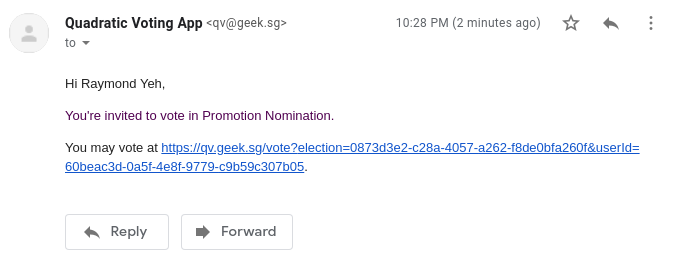
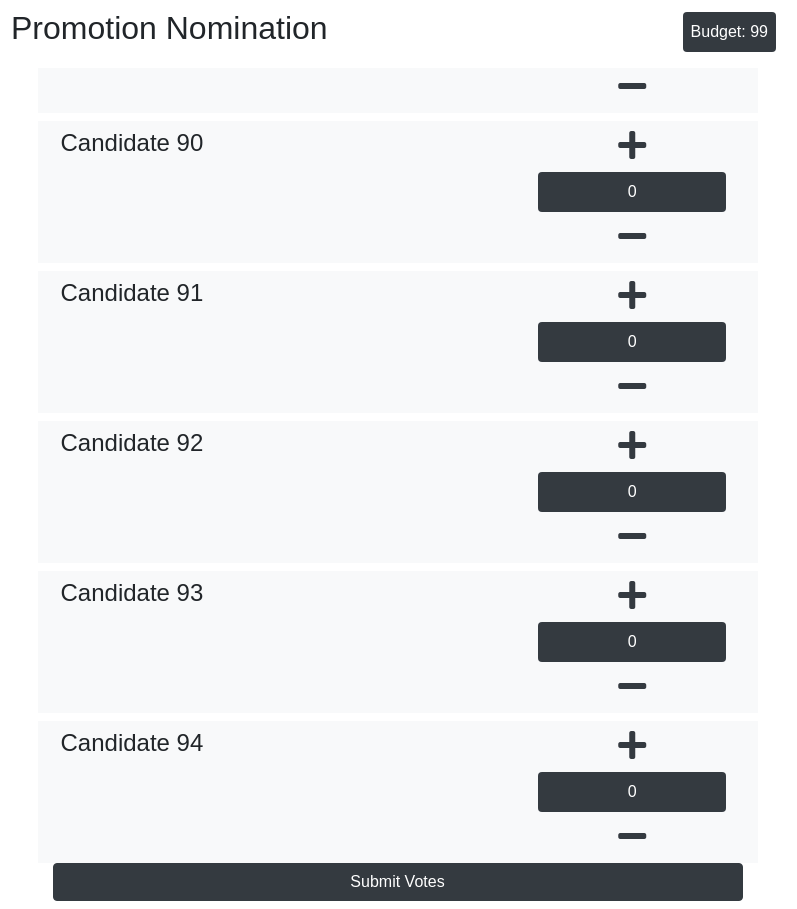

When was the last time you looked at a colleague at work being promoted and you ask “How in the world did this person get promoted?”.

In a workplace where promotion are decided solely by upper management, it is hard for the management to decide who are the workers who truly deserves to be promoted. In a large enough organisation, it is impossible for the leaders to interact with and observe the performance of every worker enough to decide which workers should be promoted. The last thing the leaders want is to promote someone in the team who does not have the desired behavior or values of the team or organisation.

For such reason, the Agile Consulting & Engineering (ACE) team within the Government Digital Services (GDS) division in GovTech makes use of a peer promotion nomination scheme.

With over 100 staffs in various different squads of different size, it is impossible for one person to decide who is more deserving of a promotion than another. However, during each promotion nomination cycle the team must agree on list of staff to be submitted for nomination for promotion.

During each promotion nomination cycle, the team will run an election where all eligible voters will be able to vote on who they will like to nominate for promotion in the upcoming cycle based on the following guiding principles & election mechanics:

### The Guiding Principles

1. **Myth**: A responsible, competent and hardworking peer who performs at current level should be promoted.

**Truth**: We should only promote people who can perform at a higher grade. Promoting someone who is responsible, competent and hardworking person, yet unable to take on *increased responsibilities* at higher grade causes Peter’s Principle. Let’s not sabo your peer by promoting him/her to incompetence. See <https://en.wikipedia.org/wiki/Peter_principle.>

Promotion means *increased expectation* and *additional responsibilities.* Unlike merit increment and bonuses, promotion is not a reward but a responsibility to bear, in the service of the team.

2. **Myth**: You need to be promoted before you take on that *additional* responsibility

**Truth**: When you consistently perform above your current grade, your peers know you are ready to be promoted.

**Ask**: Who’s taking on more responsibilities than others of similar grade? Who is already performing at a higher grade?

3. **Myth:** Anyone can be promoted as long as he is good at his work, regardless of his/her behavior.

**Truth**: Promotion sends a very strong signal about the desired behavior from the team. So let’s **NOT** promote the wrong behavior.

**Ask**: If people emulate his/her behavior, will the team be better or worse off?

### The Election Mechanics

The election will be ran using quadratic voting. In quadratic voting, voters are given a set of credits, in our case 99 credits. Voters are free to choose how they will like to allocate the credits to vote for different candidates. Voters may choose to allocate **more than one vote**, or even **negative votes** to an individual.

The voting credits consumed will be proportional to the number of vote a candidate is allocated. For instance:

* +1 vote on a candidate will consume 1 credit
* +2 vote on a candidate will consume 4 credits
* +5 vote on a candidate will consume 25 credits
* \-1 vote on a candidate will consume 1 credit
* \-2 vote on a candidate will consume 4 credits

This voting mechanism will allow voters to **express their preference intensity** by varying votes on different candidates as well as to **perform trade-offs** while allocating limited resources across the large number candidates.

The quadratic scale on the cost of vote also **encourages moderation** for the voters. To illustrate that, adding one more vote to someone already with 8 votes will cost additional 17 credits (9² -8² = 17), essentially trading 17 times of +1 votes for that.

For more information on quadratic voting, you may read the article [Quadratic Voting for Group Consensus](https://geek.sg/blog/quadratic-voting-group-consensus/).

### **The Election Runner**

The election will be run on the [online quadratic voting application](https://qv.geek.sg/) which is an instance of the open source application with the following source code:

* Front-end — <https://github.com/yehjxraymond/qv-app>
* Back-end — <https://github.com/yehjxraymond/qv-api>

The election will be set to a private election with E2E encryption on the votes to ensure that only the election runner, our director, may see the votes.

Voters will receive an email from qv\[at]geek\[dot]sg with an unique link for them to vote on the election.

The link in the email will allow the voter to view the list of all the candidates and allow the voter to increase or decrease votes on candidates by clicking on either the plus (+) or minus (-) button. The remaining credits available to be converted to votes is available on the top right of the page.

Once the votes are submitted, the results is encrypted on the voter’s client application and sent to the server to be decoded by the election runner client. The voters will no longer be able to vote with the same link so he/she will need to exercise caution in not clicking on “Submit Votes” before the entire vote is ready to be submitted.

The election will run for **one week** to allow all voters to submit their votes. The director will then collate the results from the application for discussion with the various team leads from different team before a final list is confirmed.

- - -

P.s. After two weeks, the election results will be permanently deleted, no one will have access to the data after that.