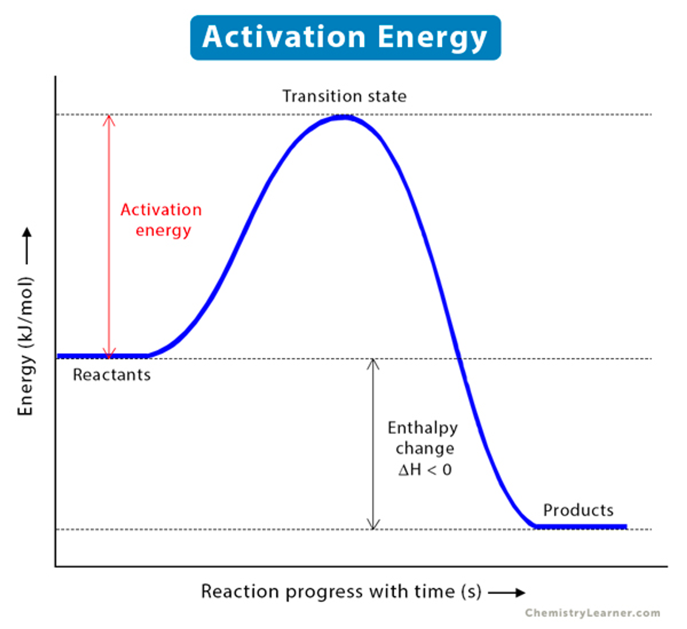
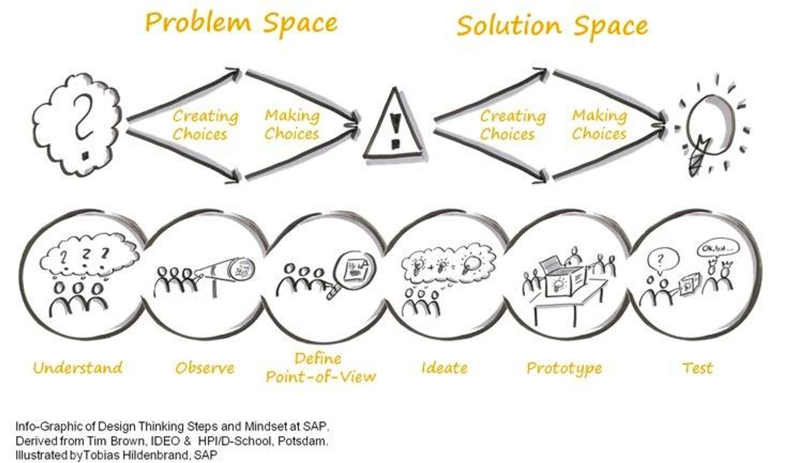

Working with incredibly talented people is a blessing because you're constantly surrounded by new and exciting ideas. However, the downside is that these ideas can sometimes pull you in different directions.

I recently spoke with a friend who used to be a startup founder, and he mentioned that managing a company with a staff size of 10-30 people can be quite complex. Everyone has their own unique ideas and passions for being there, but if not managed properly, these ideas can cause the company to pull apart from within.

This problem isn't exclusive to startups, but also applies to any reasonably sized, high-growth teams in various environments. Managers in these environments are faced with the challenge of balancing making sure everyone's voices are heard and respected while also ensuring the team is aligned on executing their original plans.

So, as a member of a high-performing team, how can you make sure your ideas are heard? 

The answer is simple: don't sell your idea, sell the problem instead!

## Break down “ideas” into “problems” first

Very often I get the question “Can we build xyz?”.

The answer is usually “Yes, it can be built”. If someone can literally build a spaceship to send people to space, I don’t see why most things cannot be built.

However, the question I have is "Why do we want to build xyz?”

Deep down, these are the questions I have:

* What is the problem this idea is trying to solve?
* Why is the problem worth solving?
* Is this the best way to solve that problem?

It's important to not just focus on the feasibility of an idea, but also on the problem it's trying to solve and whether or not it's the best solution for that problem.

## What makes good problem?

Having good problems is crucial, and it's often more than half the battle won.

A perfect solution to a non-existent problem is pointless, whereas a half-baked solution to a significant problem can make a real impact.

One way to determine if your problem is real and important, and therefore, making your idea more compelling, is to ask the following questions:

* Who is already complaining about the problem?
* How painful is the problem?
* Who is already looking for solutions (even better if they are patching together workarounds and half-baked solutions) to the problem?

Let’s understand why the answers to these questions matters a lot:

**“Who is already complaining about the problem?”**

Knowing the people who are already complaining about the problem can indicate that your problem is not imaginary. To answer this question well, research how many people are facing the issue at hand and how likely it is that more users will face the issue.

**“How painful is the problem?”**

Understanding how painful the problem is to the user will give you an indication of how much value you can potentially extract. If people find the problem to be more of an annoyance or an itch to scratch, they are unlikely to invest much time or energy to make it go away. Conversely, if the problem is extremely painful for them, they would be more willing to part ways with their time, energy, and money to make it go away.

**“Who is already looking for solutions”**

Humans complain about everything, but just because you complain about something does not mean you will take action about it. We all have limited bandwidth, so we tend to find solutions to problems only when the issue becomes more significant.

For instance, I used to complain about cleaning the floor, but I still did it. However, when my daughter arrived, it became impossible to find time to do so. That's the moment when I went ahead and researched, eventually buying a robo-vacuum to get the job done instead.

> In Chemistry, this is known as the activation energy

To figure if people are willing to expand energy to have their problem solved you need to search for users who has the problem and are already searching for a solution.

## Why good problem matters?

When you have an idea that you want to implement, it's likely that it will consume resources (time, money, energy, etc.) to implement it. Your manager will likely be thinking about the return on investment (ROI) when looking at it. If you can help them understand that it is an important problem, then it's half the battle won.

As a manager, they want to have answers to the questions above because it helps them understand the immediate benefits and potential long-term benefits. The TAM SAM SOM model is often used to understand how valuable the "investment" will be in different time scales.

Knowing these numbers can help your manager prioritise problems that has the highest ROI and in the nearest timescale.

## Next Steps

Knowing that business decisions are likely made based on the evaluation of ROI, and that having a good problem can help catch the attention of decision-makers, the next step is to get buy-ins on the problem.

Again, avoid jumping into the solution yet because once you have identified a problem and refined it, it is likely that there is more than one solution to the problem.

Remember “Is the the best solution to the problem?”?

For that part of the process, I suggest reading up [about design thinking](https://medium.com/good-design/visualizing-the-4-essentials-of-design-thinking-17fe5c191c22).

## On **asymmetrical** bets

A footnote here in case you have been asking “What if my solution solves a problem that may not already have answers to the questions above but I believe with my whole heart that it’s gonna be big?”.

Chances are, you can do better at understanding the problem space first. Again, look out for who is already searching for a solution for the problem and look hard. If there isn’t one it’s likely that the problem isn’t big enough to begin with.

In extremely rare occasions, there are legitimate ideas which the rule of thumb does not apply. In those circumstances, you will want to position your “idea” as a bet with asymmetrical returns. That is, for each dollar spent there is a long tail chance that it can have 100x or even 1000x return.