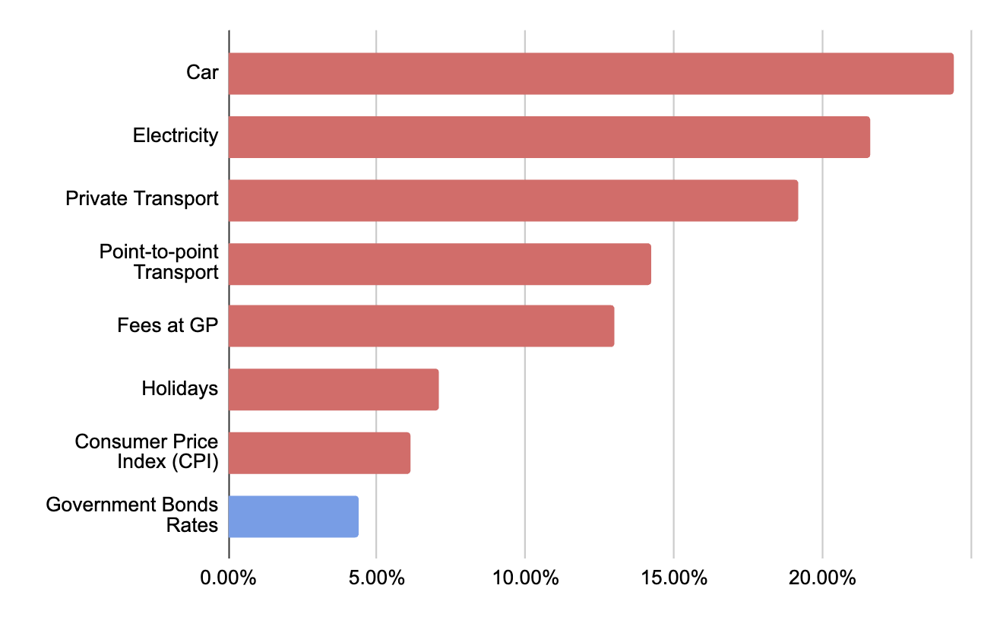

Singapore Government Securities (SGS) bonds are often a go-to investment choice for Singaporeans due to their low-risk nature and the assurance of returns. In 2022, the rates on these bonds ranged from 0.5% to 4.4%, offering a seemingly steady investment. However, even these 'risk-free' investments carry hidden risks, the most significant of which is inflation.

## **Inflation: The Stealthy Erosion of Your Investment**

Inflation is the rate at which the average price of goods and services increases over time. When inflation outpaces your bond's return rate, the real value of your investment diminishes.

In 2022, the Consumer Price Index (CPI) in Singapore rose by 6.1% \[1]. The CPI measures the average price changes over time of a fixed basket of consumption goods and services commonly purchased by the resident households and is widely used as a consumer inflation measure.

> Returns on Singapore Government Securities Returns vs Inflation by Categories (2022)

While this might appear as a mere statistic, its impact on our day-to-day lives is far-reaching. Let's take a closer look at some categories \[2] that saw a significant price increase in 2022, and are of particular concern to Singaporeans:

1. **Electricity**: Utilities, including electricity, saw an inflation rate of 13.5%, with electricity costs rising by a significant 21.6%.
2. **Healthcare**: Fees at General Practitioners (GP) Clinics escalated by 13.0%, increasing the burden of healthcare costs for many Singaporeans.
3. **Private Transport**: Private transport, especially cars, witnessed an inflation rate of 19.2%. The cost of cars alone rose by 24.4%.
4. **Point-to-point Transport Services**: The cost of services such as Grab and Gojek increased by 14.2%, impacting those who rely on these services for daily commute.
5. **Holidays**: Package tours, a popular choice for Singaporean travellers, saw an inflation rate of 7.1%, making holidays more expensive.

So, if you had invested in a government bond yielding a 2% return in 2022, the increasing costs in these significant areas of expenditure would mean your returns could not keep up. Therefore, despite a nominal gain from your bond investment, your real purchasing power would have declined.

## **Opportunity Cost: Missing Out on Higher Returns**

Playing it safe with low-risk, low-return investments such as government bonds also brings with it an opportunity cost. By opting for these bonds, you could be missing out on higher returns offered by other riskier investments like equities or real estate. While these investments carry more risk, they also have the potential to outstrip inflation and provide superior returns over time.

## **Navigating Through Your Investment Journey**

Understanding the impacts of inflation is key to making sound investment decisions. While government bonds offer safety, they are not immune to the impacts of inflation and opportunity costs.

As investors, it is crucial to have a diversified investment portfolio to spread risk and potentially yield higher returns. It is equally essential to stay informed about economic trends and understand how they can impact your investments.

While the 'risk-free' rate might seem a safe choice, it's crucial to remember that it's not entirely free of risk. By understanding these risks and staying informed about the economy, you can make better decisions, secure your financial future, and ensure that your investments truly work for you.

If you are a huge fan of government securities, you may want to check out low cost ETFs, such as those offered by Vanguard, or to increase the amount of equities in your portfolio or to check out private credit deals \[3], to increase returns on debt-based instruments.

- - -

\[1] Singapore has an interactive site to help you better understand CPI. Visit it at <https://www.singstat.gov.sg/modules/infographics/consumer-price-index>.

\[2] Figures obtained from monthly report on CPI published by Singstats at <https://www.singstat.gov.sg/whats-new/latest-news/cpi-highlights>

\[3] I've reported on some of the best private credit deals for June 2022 at <https://bluejay.notion.site/Private-Credit-Opportunities-Jun-2023-d6a8ddeb23294e3ebbdb1c6a551db5f5?pvs=4>