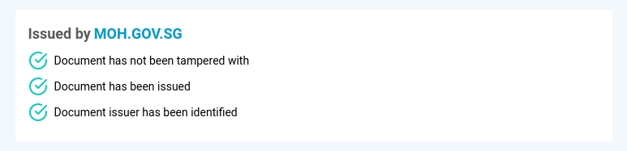
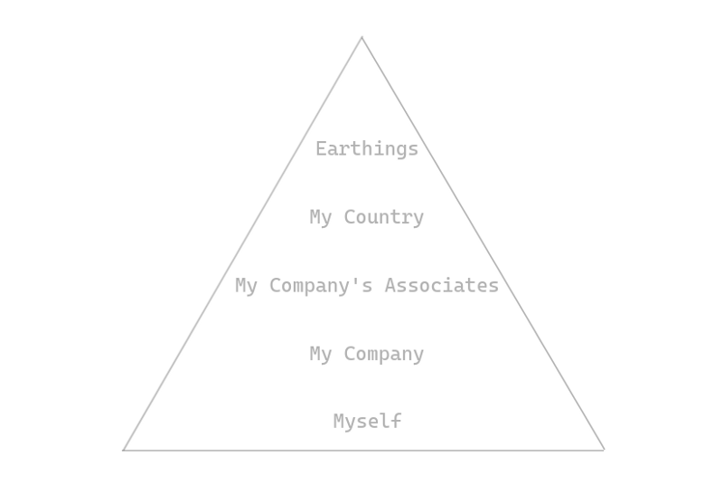

- - -

Self-Sovereign Identity (SSI) platforms are emerging from the decentralization movement citing how they will replace the traditional Public Key Infrastructure (PKI) model where Certificate Authorities (CAs) are in charge of controlling the identities, but that will not be the case unless our society becomes more egalitarian. Until then, a hybrid of centralized and decentralized identity systems that are localized shall prevail.

The innovation of SSI ends at where users are allowed to generate their identifier which is often the public key of an asymmetric key pair. An example of such an identifier is `did:ethr:0x63b4f3e3fa4e438698ce330e365e831f7ccd1ef4` using the Ethereum address as a self-managed decentralized identifier.

But that identifier is not useful!

How does one know to trust `did:ethr:0x63b4f3e3fa4e438698ce330e365e831f7ccd1ef4` or `did:ethr:0xd858ba2179b471140235fc70c2c87c4a9716b00b` more, or at all?

### The Catch-22 of SSI

The solution to the trust problem is often “If `did:ethr:0x63b4f3e3fa4e438698ce330e365e831f7ccd1ef4` has verifiable credentials from another trusted entity, you can trust it”.

The only problem was that `did:ethr:0x63b4f3e3fa4e438698ce330e365e831f7ccd1ef4` presented tons of verifiable credentials from many entities with identifiers as enigmatic as itself:

* `did:ethr:0x46bD9C0d0bc4264f795baCA1Fd958F37A2BC4F27` issued a bank statement to said entity
* `did:ethr:0x3829cef9502eec6cdbd12010939ef7400a51b3bf` issued an alcohol license to said entity
* `did:ethr:0x1d7B8F194Ca98f596851Ac5F3481C63dc53bb4E7` issued a chamber of commerce membership to said entity

Now, you just have to verify if:

* `did:ethr:0x46bD9C0d0bc4264f795baCA1Fd958F37A2BC4F27` is a trusted bank?
* `did:ethr:0x3829cef9502eec6cdbd12010939ef7400a51b3bf` is a trusted government organization?
* `did:ethr:0x1d7B8F194Ca98f596851Ac5F3481C63dc53bb4E7` is a trusted chamber of commerce?

Easy right?

### The Case for an Oracle

As seen above, without more information from the external world, there is no way to knowing if `did:ethr:0x63b4f3e3fa4e438698ce330e365e831f7ccd1ef4` is a business, least to say a trustworthy one, amongst many other questions.

One approach to breaking out of the Catch-22 situation is to leverage existing real-world identifiers that are not self-sovereign but yet allowing users to prove the translation of the two identifiers.

An example of such implementation is binding an SSI identifier (such as an Ethereum address) to a domain name on the [OpenAttestation](https://www.openattestation.com/) protocol. The protocol [binds a DID to a domain name in a two-way fashion](https://www.openattestation.com/docs/advanced/identity-proofs). As such, the receiver of a verifiable credential will immediately know who the issuer is without figuring out who is `did:ethr:0x63b4f3e3fa4e438698ce330e365e831f7ccd1ef4`.

While this approach translates the identifier from something enigmatic like a DID to a domain name, it doesn't solve the problem of “should I trust this entity?”.

Also, what if I don’t recognize the domain?

### Why do we Trust?

To understand if I can trust `did:ethr:0x63b4f3e3fa4e438698ce330e365e831f7ccd1ef4`, which is claiming to be an alcohol importer in Singapore, I’ll likely ask myself the following questions:

* Do I know the people in the company personally?
* Has my company done business with it before? Was the business legit? Did it pay up on time the last round? Did my colleagues or company have a record of past business dealings with them before?
* Does this business have the necessary license to trade? Are they in any of the trade associations my company is in? Can I look up their records with the association or its members?
* Is this company registered as a business entity in Singapore? Can I recover my debt or sue them if there is a dispute? Can I look up their business profile with the corporate regulatory authorities in my country?

In the example above, it will likely suffice if I have done business with the entity before and there are records to show.

When thinking about if one should trust an entity with something one would start by asking the most personal question first. In each set of questions, one tries to find if the entity is trustworthy enough within the locality or should more information be provided?

Generally, this means I trust something that is more “local” to me! I would:

* Trust a friend over complete stranger
* Trust a company I've done business with over another which I haven't
* Trust a company in the same network as I am over another which isn't
* Trust a company in the same country as I am (for litigation purpose) over another which isn't
* Trust a fellow earthling over an alien

With that, we can see that it is insufficient to only have a completely decentralized identity platform that generally operates at the “Earthlings” locale.

### What’s Next

As the decentralization movement prevails and we move towards using more SSI identifiers, new opportunities will present to companies to provide localized identity resolution services for SSI. Examples are like:

* Integrating existing CRM and SASS product to recognize and use SSI
* KYC companies to provide data and services for looking up SSI
* Trade associations, accreditation, certification bodies to provide SSI resolution service to the public or members
* Nationwide SSI registry for corporate regulatory authorities to allow the public to resolve SSI to registered companies
* Other global identifiers (other than DNS) to resolve to and from SSI

This will yet create another opportunity for standardization of the methods to resolve SSI once more of such services are around.

In the time being, [TradeTrust website](https://tradetrust.io/) provides a reference where it allows viewers of verifiable credentials to make use of localized identity resolvers through their [identifier resolution specifications](https://github.com/Open-Attestation/adr/blob/master/identifier_resolution_api.md).

- - -

Like what you read? Subscribe to [my mailing list](https://geek.us2.list-manage.com/subscribe?u=bfcc21792349f4f0eaff4a2a3&id=694896a0df).