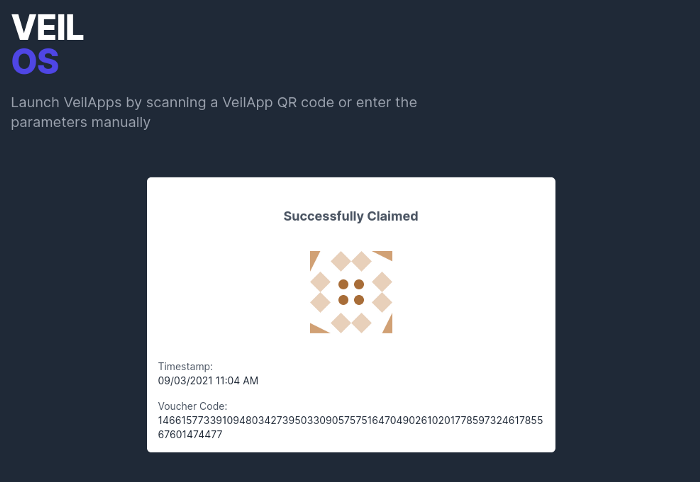

Following the discussion on how Zero-knowledge Proof (ZKP) can be used in the field of civic technologies (CivicTech) and specifically how it can be used by different NGOs to coordinate food distribution to the food insecured, I’ve embarked on creating a demo application to showcase how it can be done as part of my [fellowship with RadicalXChange Foundation](https://www.radicalxchange.org/fellowship/).

VeilOS is the result of a few weeks of work to achieve the following through a proof-of-concept implementation:

1. Showcase the application of ZKP in the different use cases
2. Uncover any technical & non-technical limitations to ZKP or privacy preserving applications
3. Put a dent in the universe (academics & politicians I’m looking at you)

The application is currently incomplete and is a work-in-progress. Expect massive changes as research are being conducted.

## Vouchers

Voucher is the first application being launched on [VeilOS](https://veilos.io). Once users have been added to a known group, they can generate and publish a *voucher* for a given topic, along with an optional *message*.

The voucher will satisfy 3 constraints:

1. Only users in the group will be able to generate valid voucher.
2. Each user may only generate and publish at most one voucher per topic.
3. The identity of the user is hidden.

## User Journey

In this example, we simulate a situation where a government agency has added citizens who are identified as food insecured into a group. Citizens in that group can now generate a *voucher* every day to exchange for packed meals.

Organisations distributing these packed meals can launch the application by targeting the food insecured group, setting the topic as the program name appended with the date and adding the organisation name as the message.

Once the application has been launched, a QR code will be generated to be scanned by the beneficiary.

The beneficiary simply launches their application (initialized with the identity registered with the group) and scans the QR code to be taken to the voucher generation page.

Upon clicking on confirm, the voucher will be generated and submitted to VeilOS for verification. Once verification has been completed, the beneficiary will receive a confirmation that the voucher has been successfully claimed, along with an unique code to the voucher.

At the same time, the organisation distributing the packed food will also be able to see that there is a new voucher generated with the same unique code and can now proceed to distribute the packed food to the beneficiary.

In this example, the VeilOS application ensures:

1. Citizens not in the group may not abuse the system to collect packed meals meant for those who really needs it
2. Beneficiaries may only collect at most one packed meal a day
3. Beneficiaries’ identity (and histories of collections) are hidden from everyone (including the government agency)

## Show Me the Proofs

### Identity of users are protected

While each beneficiary will register with the government agency with their identity card showing their public identity (in this case `5250887317885314878170299310585808682203354203924329162758682586025860956143`) during registration, these identifiers are never published on the generated voucher.

Instead, ZKP is used to ensure that the constraints were enforced and the voucher is valid. Since the entire voucher is also publicly available, anyone may validate the validity of the voucher.

Since valid vouchers may only be generated by those in the group, the vouchers also serve as solid audit records for the distributing organisation who are accountable to donors and regulatory organisations.

### One voucher per topic

Suppose that the beneficiary attempts to generate more than one voucher for a given topic (even with different message), the submission will easily be voided and an error message will be returned.

This is achieved by comparing the `nullifier` value of the vouchers as the nullifier value is deterministically derived from the beneficiary’s identity and the topic.

### Only available to beneficiaries in the group

I should probably work on the error message, but you get the point…

Finally, should anyone else other than the beneficiaries attempt to generate a voucher, they will fail to generate a valid `proof` for the voucher.

## Other Use Cases

### Organisation Whistleblowing

> Identity Group: Foreign Workers Employed in Singapore\
> Topic: Whistleblowing_2020Q1\
> Message: Unserviced equipments at site #1234

Since the application does not reveal the identity of the voucher generator other than the fact that he is a member of a group, it can be used for different whistleblowing schemes.

Discussed in a previous memo, this can be used for cases like:

* Companies creating a whistleblowing scheme to allow anyone to surface important information to mangement confidentially.
* Foreign workers in Singapore whistleblowing on their employer to agencies like Ministry of Manpower on workplace safety or workplace grievances.

### Elections

> Identity Group: Citizens of US\
> Topic: US_PRESIDENTIAL_ELECTION_2020\
> Message: Joe Biden

Similarly, the message on the voucher can also be used to signal support for a candidate in an election or a proposal on a referendum.

Use cases that are similar:

* Peer promotion nomination within a company
* Award nomination within a company or community

### Credit Card Privileges

> Identity Group: Citibank PremierMiles Card Holders\
> Topic: AIRPORT_LOUNGE_ACCESS_2020_P1\
> Message: SATS Premier Lounge

The vouchers can also be used to coordinate privileges of credit card (or any privilege card or membership card) holder. In the example above, credit card holders can generate vouchers in exchange for lounge access without sharing their identity with the lounge operators. In addition, credit card companies can easily enforce the limits on number of lounge access (and therefore their liabilities) across multiple lounge operators.

This can also give rise to more interesting product offerings by these companies. For instance the credit card company can allow their priority customers to claim one “expensive” birthday treat (think a dinner, or spa, or activities) across all the companies they partner with, without sharing information of these card holders with the partners.

### Rationing

> Identity Group: Citizens of Singapore\
> Topic: MASK_COLLECTION_ROUND_3\
> Message: Hougang CC

Finally, as the name *voucher* suggest, it can be used to exchange for goods & services that are rationed. Some potential use cases:

* Mask distribution to citizens of a nation (such as [Temasek mask distribution for Singapore](https://www.straitstimes.com/singapore/latest-free-mask-distribution-by-temasek-kicks-off))
* Vouchers or subsidies for certain goods & services (such as the [SingapoRediscovers Voucher to support local tourism businesses](https://singaporediscovers.life.gov.sg/))
* Rationing of highly-demanded public goods (such as [sports facility booking slots](https://www.straitstimes.com/sport/sportsg-to-limit-facility-bookings-to-curb-profiteering))

Other than conventional goods & services, the voucher can be used to exchange for the rights to use e-services to limit registration to a known group of people to prevent [sybil attack](https://en.wikipedia.org/wiki/Sybil_attack) and frauds.

For instance P2P selling platforms (such as Craigslist or Carousell) can allow users to exchange a voucher to register for an account on their platform:

> Identity Group: Citizens of Singapore\
> Topic: CAROUSELL_ACCOUNT\
> Message: <username>

This will enforce that a user is a citizen of Singapore and that he may only possess at most one account without revealing more information such as name, age, personal ID, etc.

## Try it for yourself

> The application currently only runs on Firefox browser. Other browsers will throw an error `Maximum call stack size exceeded` .

If you would like to try VeilOS out right now, you may assume the identity of any of the users in the identity group `9436b3a9-e1c6–4214–8398-e5036c220995`.

One hundred identities are generated and inserted into that group. You may import any of the identities below to start playing with VeilOS:

`["8627ec100eaa0708d98596f8177cb8019dfe45880ebdb2acd8c5e3479a7f296d","c8324bf5a24d745bebe19c17804c811bf192ad3863f4f28cf12e5e555a0423","d51f8dfbf45f32707b6c937e5e44dcacc8379139cadeb78183ffac3871590b"]
`

`["b1dc417154ce705d5154149e0761e4fae23ea35b57ee7837a21fd9f7a86d7d49","6ac46c54f5321af93f2e0cdc323e6bb82558f6a578fb94ac7533d72b8af486","9037f4721af3fd1e84ca786d0858edf78d6c3adbbccf794170cc09b7d78b41"]
`

`["841c0f10254a5b2709d608ab6572114d5d02082b52940578ab66102b56ade662","bd12046b58392888925be6ba3c6686a7f40596146bd3e5866683215593057","b987394343c1c92b5de45a2e7e9e4b68ad99f5d2ca99c8b804caae09906bdd"]
`

`["ee75466ae2f33e9e01b7522bce593bf2a2936dafcb67ee9fc0e987f59505465e","ba5a1e11bac13b1ff768d4ca150538dc9ac708150c74ee9f37dd7dde3986e4","bf68083685682c962d77f9be60638b3c4f6d0c135c3eca3605b72bb4dc0458"]
`

`["6d689be1ba8b7fc5d4a6d9f1a163490d47b035e7c7b639398f196089a1972a1f","62a92d1dd8fba3309b7c2e37eb0232f17d2693322dded6f382847de412b122","e821486ec65bef9b5cf93a9585c0d4a288605e12c7c77df7d1f90bf26851f0"]
`

\*You will be able to create your own identity group, generate your own identity and add identities to your own group when more features are rolled out.

## What’s Next

The current application is still undergoing development and here are some interesting feature that is in the pipeline:

* Identity group management & access control
* Voting app
* Quadratic voting app
* Live demo
* Ethereum smart contract for identity group management

## Feedback

If you have feedback on the application or would like to contribute to it’s development, feel free to contact me [here](https://geek.sg/contact/).