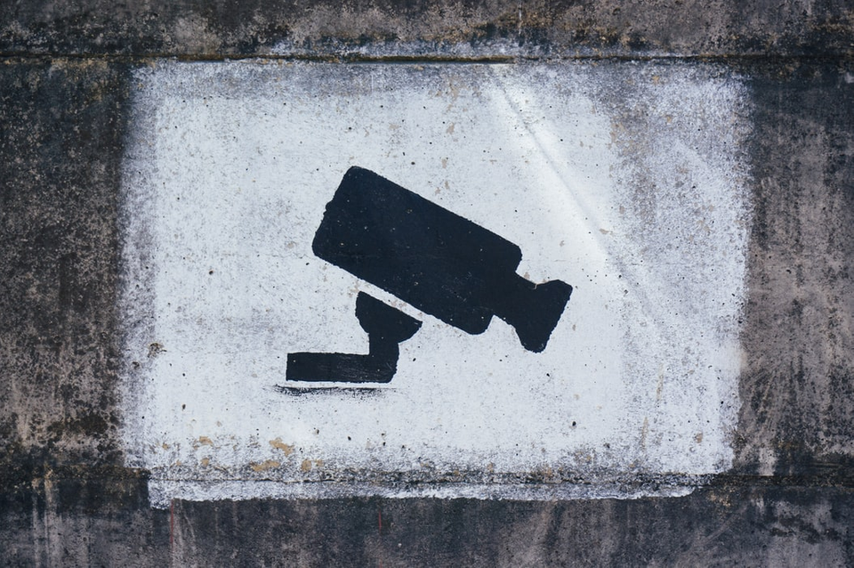

You feel a sense of disgust when your mum or spouse looking into your phone, but why is it that it’s alright for internet companies or your country to do the same?

What is it that makes us feel repulsive when your parent looks into your phone?

The answer is simple.

You didn’t wanted to be judged - because you do not share the same opinions as your parents.

Perhaps you didn’t want them to know that you are dating, for fear that they might influence you in your ability to make decisions on who to date.

Perhaps you think that they may not see beyond the full body tattoo of your boyfriend into his beautiful heart.

Perhaps you didn’t want them to know that you’ve quit your nine-to-five job because you utterly hate who you are and would rater be a part time barista to tide through the difficult time you had with yourself.

It’s time to acknowledge that we are all different. Different from our parents, our siblings, our spouse, what society thinks of us, and even what our children thinks of us.

### We are all different

We are unique individuals with differing moral values and perspectives, even if the law of the land is the same. We disagree on our approach and stance towards topics like religions, polity, gender inclusion, sex positivity, use of drugs, abortion, etc.

Let’s talk about something controversial, prostitution.

The law of the land will have an opinion on prostitution. In Germany, prostitution is legal. In Singapore prostitution is legal in specific zones. In Japan and US, it’s illegal.

While the law is clear, the society’s interpretation of the law and what is “generally acceptable” may be different.

In Japan, while prostitution is illegal, loopholes, liberal interpretations and a loose enforcement of the law have allowed the Japanese sex industry to prosper. In Singapore, the traditional values still prevail and infidelity is frowned upon.

While you live in these countries and you know what does the country says about prostitution, you have your own opinion on it whether it should be legal or if it’s moral.

The dissonance of your perspective with your peers and nation applies to every other topics like legalization of same-sex marriage, classification, punishments and use of drugs in clinical settings, ideal form of governance, taxes, universal basic income, etc.

And those opinions ultimately shape how you think of your government…

### To think, gather & act

Edward Snowden remarked that “Arguing that you don’t care about the right to privacy because you have nothing to hide is no different than saying you don’t care about free speech because you have nothing to say”.

I’ll add that “Arguing that you don’t care about the right to free speech because you have nothing to say is no different than saying you don’t care about the rights to your own thoughts and opinion because you are not opinionated”.

Living in politically stable countries, we forget that there were time that people were persecuted because of their differences in beliefs. We do not have to look back into history to the likes of Nazi Party to relief such experience. Simply look towards the east [where civilians were killed for their demand for a return to democracy in Myanmar](https://www.channelnewsasia.com/news/asia/myanmar-protests-continue-a-day-after-more-than-100-killed-14510698).

Keeping your privy parents away from your phone to allow you to form independent opinions about your sexuality, interests, career and choice of partner. Couple that freedom to think with the freedom to gather and to act, you can go forth to lead a life that you truly owned and forged.

So if we expect the freedom of choice from our parents, why is it that we give up our agency to internet companies and governments?

Why is it okay for Facebook & Instagram to tell me what I should like, do, buy [or even think](https://www.nytimes.com/2018/03/17/us/politics/cambridge-analytica-trump-campaign.html) based on data I shared, content I interacted with, or even private conversations. Why is it okay for your government to decide where to draw the line between fake news and possible intelligence, and [prosecute people who could potentially be honest whistle-blowers](https://www.ncbi.nlm.nih.gov/pmc/articles/PMC7445730/)?

To give up privacy is not simply surrendering your ability to act independently and make your own free choices. It is also maintaining a blind faith that no one, individuals, society, or governments, will wield your information as a weapon against [you and your family and friends](https://www.radicalxchange.org/concepts/intersectional-social-identity/) in the future.

### Designing privacy-respecting applications

As we move discussions and governance online, we face the dilemma between authenticating users in an online space and providing (and proving) anonymity to said user to create a safe online space.

I’m currently working on a deliberation platform which allows for fully anonymous voting, whistleblowing & opinion soliciting from a known list of participants using Zero-knowledge proof (ZKP). The [application is a proof-of-concept](https://geek.sg/blog/veilos-preview-of-privacy-preserving-application-engine) for my tenure as a RadicalXChange Foundation Fellow.

My hypothesis is that the platform will be useful in scenarios like board meetings, city council meetings or even day to day operations in large companies where whistle-blowing schemes are in place or for award nominations voting.

If you know of any board members, council members or HR leaders who cares about privacy, I would like to get in touch with them to learn more about their challenges. You could either drop me their names on [this contact form](https://geek.sg/contact/) or send me an introduction email at ray\[at]geek\[dot]sg.