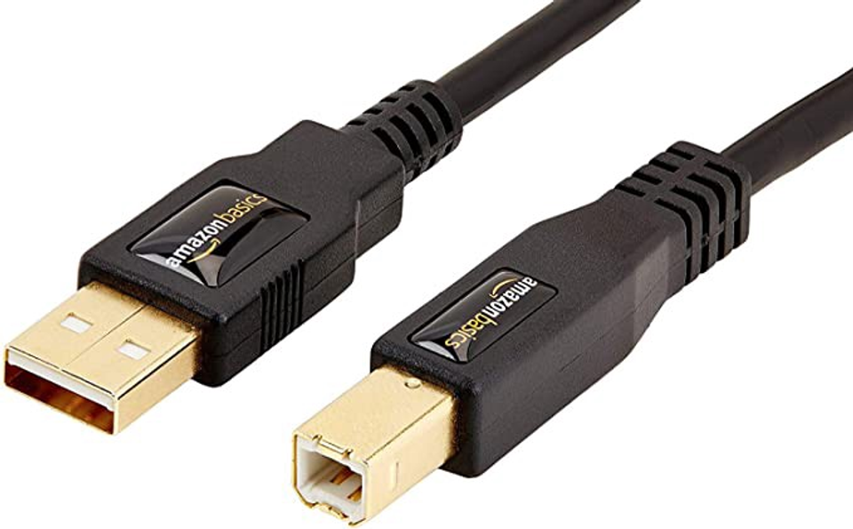
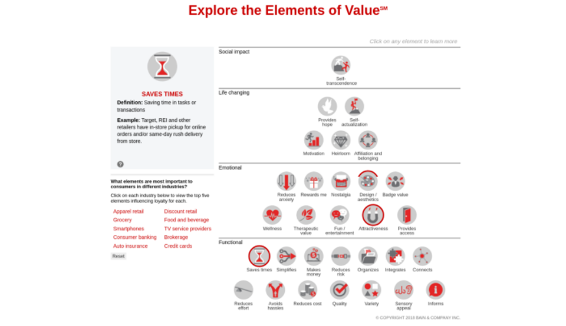

For the nth time this month I heard someone said “Client X has asked for the product to be compliant to Y standards”. And for the nth time, I asked “Why”. For the nth time, there was no good answer to that question.

I tried explaining that adopting the standard will not benefit the customers in any way at this point in time, especially if the standards has not gained wide adoption — non-production usage does not count. Because it has becoming a recurrent issue, I even wrote a [memo](https://www.notion.so/What-s-in-W3C-Compatibility-67292e1483a3418a9d3f00014606cee0) to describe how standards will not sell our product.

“Standards alignment” at this point in time is just another “feature”. And this “feature” is a distraction.

To understand how a feature request can be a distraction to the product team, allow me to take you on a fictitious, and very ridiculous, story…

You are a indie printer manufacturing company.

Over the past 5 years you have spent countless R&D dollars producing the world most efficient home printer. One that prints hundreds of pages a minute without warming up and it comes with cheap ink refills.

Due to limited budgets, you can only manufacture 100 units of this printer to be distributed by a single retailer. When the first shipment of the printer reached the retailer, you were so confident that these printers will fly off the shelves.

Since the first day the product was shipped you waited for the cheque.

And you waited.

And waited.

The cheque didn’t come. Worried about the capital to fund your next batch of printers to be manufactured, you visit the retailer. Entering the shop, you found your printers shelved in a dark corner of the shop. You walked up to one of the salesperson and asked them why the printers did not sell.

He replied “The customers were excited about the products. Most of them were here because they were looking for a printer to print their children’s homework and their work documents. They knew the pain of having a printer taking forever to warm up, printing lots of junks, and simply taking forever to print a page. They loved this printer!”.

> The only problem was that this printer was not using a standard printer cable.

Then he continued: “The only problem was that this printer was not using a standard printer cable.”

“While your cables connects to their computer fine with the USB end, the customers have not seen the other end before. It’s a non-standard cable!”

> AB Cable by [Amazon.com](https://www.amazon.com/AmazonBasics-USB-2-0-Cable-Male/dp/B00NH11KIK)

You thought you have heard enough of how ridiculous that sound but the salesman continued: “They thought it will be good if your cables could be used for other printers in the future…”

Thinking hard about how ridiculous that sounded, you know there’s only three possibilities here:

# This first is that your printer sucks.

For some reason, your printers is not delivering the wow factor you initially thought they would.

The customers could not express what was missing, and they found the most convenient reason to say no to you — and that happened to be a non-compliant cable you provided with the printer.

The cable was simply a distraction for something more problematic.

If this is the case, it is likely you have to go back to the drawing board and really start asking what does the users want, and actually ask them. When you do, make sure you follow up with a series of “why”s to understand what they truly desire.

# The second possibility is that the salesman sucks.

The printer you’ve created is the first in the world to actually does it job well, there is no reason why it should under-perform.

It is possible that the product is left with someone who is unable to sell it.

Perhaps the sales person is getting a fatter cheque selling another printer? Perhaps he is also in the business of selling AB cables? Or maybe he is just plain incompetent? We won’t know.

# The third possibility is that the customer is simply not looking for a printer.

To the customer who is in the shop looking to buy a fridge, the printer is simply a solution looking for a problem.

In this case, the “customer” is not your target. Forget that he even suggested the cable and be glad that he didn’t ask if your printer can keep his veggies fresh for 2 weeks.

In the 3 possibilities where your printer did not sell, only one involves a substandard product, and the problem is likely nothing to do with the new feature request.

When buying a printer, consumers are likely looking for something that help them save time, reduce cost, reduce effort and reduce risk — things of value.

You don’t want a feature to become a distraction from delivering true value to your customers.

Rather than designing your products around features, try designing them around value.

Elements of Value by [Bain.com](https://media.bain.com/elements-of-value/)

For that I’ll suggest reading the [elements of value](https://hbr.org/2016/09/the-elements-of-value) or try out this [interactive version of elements of value](https://media.bain.com/elements-of-value/#).